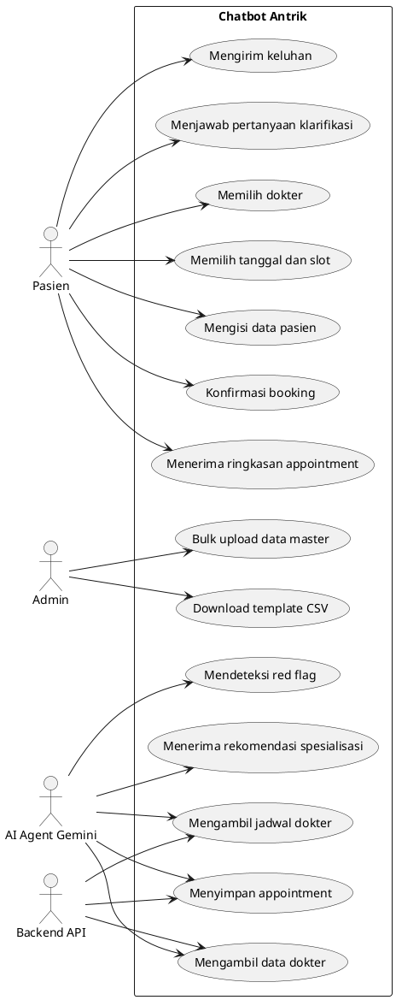
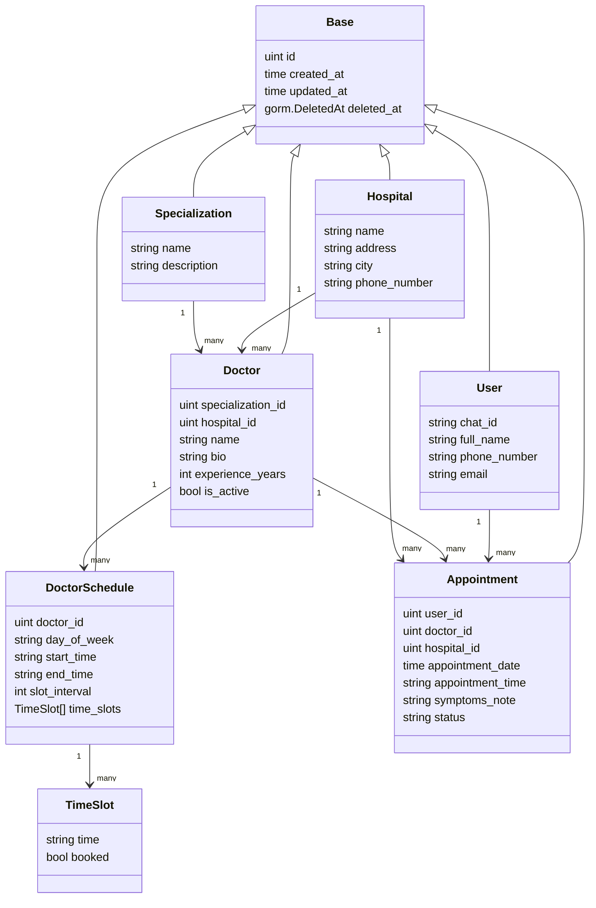
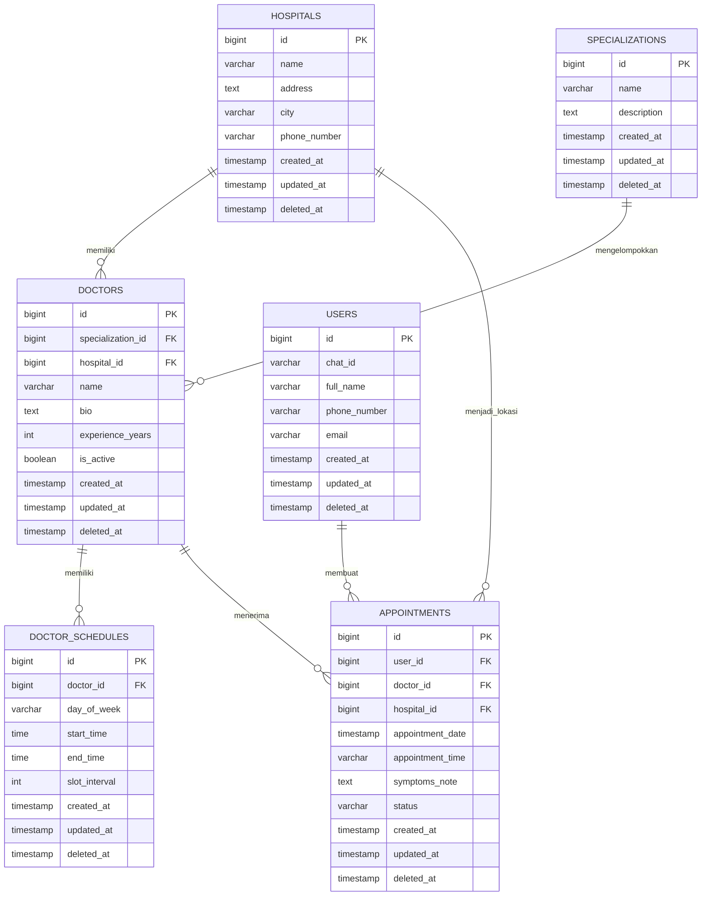
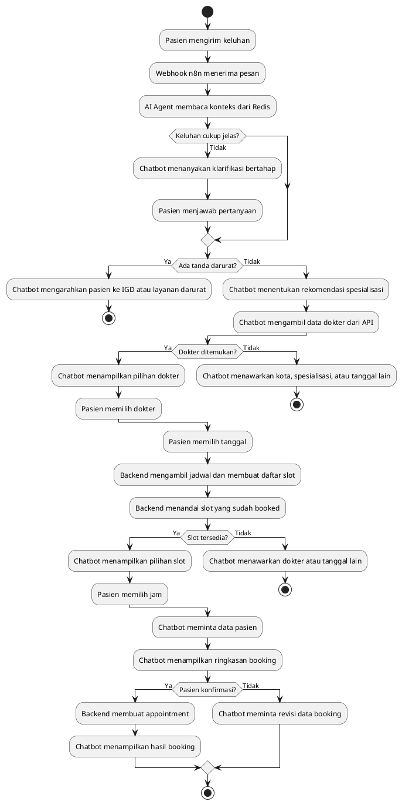
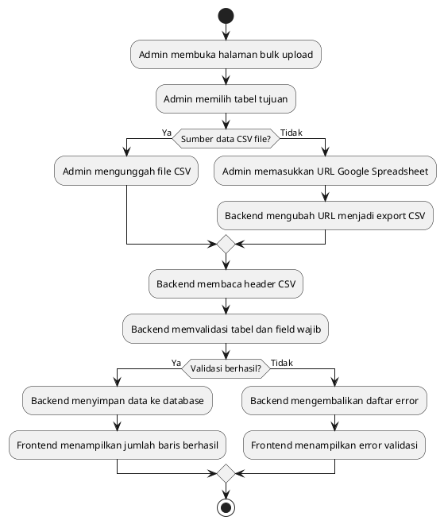
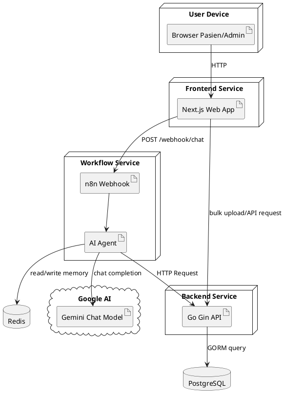

# LAPORAN KKP
# Pengembangan Chatbot AI untuk Rekomendasi Spesialis dan Booking Dokter Berbasis Google Gemini

## BAB I PENDAHULUAN

### 1.1 Latar Belakang

Perkembangan layanan kesehatan digital mendorong rumah sakit dan klinik untuk menyediakan akses layanan yang lebih cepat, mudah, dan terstruktur bagi pasien. Salah satu proses yang paling sering bersentuhan langsung dengan pasien adalah proses pencarian dokter, pemilihan spesialisasi, pengecekan jadwal, dan pembuatan janji temu. Pada praktik konvensional, pasien sering perlu menghubungi admin, menjelaskan keluhan, menunggu rekomendasi dokter, lalu melakukan pencocokan jadwal secara manual. Alur seperti ini dapat memakan waktu, menimbulkan antrean komunikasi, dan membuka peluang terjadinya kesalahan pencatatan data pasien maupun jadwal dokter. Penelitian terbaru pada respons chatbot AI terhadap pertanyaan pasien menunjukkan bahwa asisten AI memiliki potensi mendukung alur komunikasi layanan kesehatan, tetapi tetap perlu dikendalikan dan dievaluasi secara hati-hati (Ayers dkk., 2023).

Topik penelitian ini berada pada area kecerdasan buatan terapan untuk layanan kesehatan, khususnya chatbot berbasis Large Language Model (LLM) yang membantu pasien memahami arah layanan yang sesuai berdasarkan keluhan awal dan melanjutkan proses booking dokter. LLM merupakan model bahasa berukuran besar yang mampu memahami konteks percakapan, menghasilkan respons natural, dan menjalankan instruksi berbasis teks. Penelitian terkait asisten virtual berbasis LLM menunjukkan bahwa model bahasa dapat digunakan untuk membangun asisten percakapan pada domain tertentu jika didukung data, instruksi, dan evaluasi yang sesuai (Betancourt dkk., 2025). Dalam project ini, LLM Google Gemini digunakan sebagai komponen percakapan yang menafsirkan keluhan pasien, memberi rekomendasi spesialisasi secara hati-hati, dan mengarahkan pasien pada dokter serta jadwal yang tersedia melalui integrasi API.

Permasalahan utama yang diangkat adalah belum efisiennya alur booking apabila pasien belum mengetahui dokter spesialis yang perlu dituju. Banyak pasien hanya mampu menyampaikan gejala seperti sakit kepala, batuk lama, nyeri dada, sakit gigi, atau keluhan anak. Tanpa bantuan awal, pasien dapat memilih spesialisasi yang kurang tepat, bertanya berulang kali kepada admin, atau menunda pemeriksaan. Studi terbaru mengenai symptom checker menunjukkan bahwa sistem berbasis gejala dapat membantu self-triage, tetapi akurasi diagnosis dan rekomendasi triage masih bervariasi sehingga perlu diperhatikan secara hati-hati (Wallace dkk., 2022). Di sisi lain, sistem tidak boleh memberikan diagnosis pasti, resep, atau klaim medis yang berisiko. Oleh karena itu, solusi yang dibangun perlu menempatkan AI sebagai asisten navigasi layanan, bukan pengganti dokter.

Project Chatbot Antrik dikembangkan untuk mempermudah flow booking dokter dengan menggabungkan antarmuka chatbot, workflow otomasi n8n, model Google Gemini, penyimpanan memori percakapan Redis, backend API berbasis Go, basis data PostgreSQL, serta frontend Next.js. Workflow yang dikembangkan mengadaptasi kebutuhan operasional dari Okadoc, yaitu layanan digital yang berfokus pada pencarian dokter, ketersediaan jadwal, dan pembuatan appointment. Dalam konteks kerja praktik, adaptasi tersebut diterapkan sebagai sistem internal/prototipe yang membantu pengguna memilih dokter berdasarkan gejala dan menyelesaikan booking secara bertahap.

Beberapa penelitian sebelumnya menunjukkan bahwa chatbot kesehatan dan symptom checker memiliki potensi untuk membantu self-triage dan mempercepat akses informasi, tetapi masih memiliki keterbatasan pada akurasi, keamanan, dan konsistensi rekomendasi (Wallace dkk., 2022; Fraser dkk., 2022). Studi tentang AI symptom checker juga menekankan bahwa sistem harus berhati-hati dalam memberi rekomendasi, terutama pada gejala darurat dan kondisi yang membutuhkan layanan segera (Fraser dkk., 2022). Sementara itu, penelitian terkait LLM dan virtual assistant menunjukkan bahwa model bahasa dapat dipakai untuk membangun asisten virtual berbasis domain, tetapi tetap membutuhkan desain prompt, batasan perilaku, dan validasi keluaran (Betancourt dkk., 2025; Alahmari dkk., 2024).

Gap yang menjadi dasar pengembangan project ini adalah perlunya chatbot yang tidak hanya menjawab pertanyaan umum, tetapi juga menghubungkan percakapan pasien dengan data aktual rumah sakit, dokter, spesialisasi, jadwal, slot tersedia, dan appointment. Kebutuhan ini sejalan dengan temuan bahwa performa symptom checker dapat bervariasi sehingga sistem perlu dirancang untuk memberi arahan secara hati-hati dan terhubung dengan proses layanan yang jelas (Wallace dkk., 2022). Dengan kata lain, sistem tidak berhenti pada rekomendasi teks, tetapi melanjutkan percakapan menjadi tindakan operasional yang terkontrol. Solusi yang diusulkan adalah chatbot AI berbasis Gemini yang bekerja melalui workflow n8n dan backend booking, dengan aturan keselamatan seperti tidak memberikan diagnosis pasti, mendeteksi red flag, menanyakan informasi secara bertahap, dan meminta konfirmasi sebelum membuat appointment.

### 1.2 Perumusan Masalah

Rumusan masalah dalam kerja praktik ini adalah:

1. Bagaimana merancang chatbot AI yang dapat membantu pasien menentukan spesialisasi dokter berdasarkan keluhan awal tanpa memberikan diagnosis pasti?
2. Bagaimana mengintegrasikan chatbot dengan data rumah sakit, dokter, jadwal, dan appointment agar rekomendasi yang diberikan berasal dari data aktual?
3. Bagaimana merancang flow booking dokter yang bertahap, aman, dan meminta konfirmasi pasien sebelum membuat appointment?
4. Bagaimana menyimpan konteks percakapan agar interaksi pasien dengan chatbot tetap konsisten?
5. Bagaimana mengevaluasi kelebihan dan kekurangan solusi chatbot booking dokter yang dikembangkan?

### 1.3 Batasan Masalah

Batasan masalah pada project ini adalah:

1. Sistem berfokus pada chatbot untuk rekomendasi spesialisasi berdasarkan keluhan awal dan booking dokter rawat jalan.
2. Sistem tidak memberikan diagnosis pasti, resep obat, dosis obat, atau instruksi medis berisiko.
3. Sistem hanya menampilkan dokter, rumah sakit, jadwal, dan slot yang tersedia dari database/API project.
4. Data yang digunakan meliputi data rumah sakit, spesialisasi, dokter, jadwal dokter, pasien, dan appointment.
5. Periode pengembangan dan pengujian menggunakan data dummy/template CSV yang tersedia pada project.
6. Topik termasuk kategori penerapan kecerdasan buatan dan otomasi layanan digital kesehatan, bukan IoT atau otomasi berbasis sensor.
7. Workflow operasional mengadaptasi proses booking dokter pada lingkungan kerja Okadoc, tetapi implementasi project ini bersifat prototipe/pengembangan kerja praktik.
8. Pengujian berfokus pada alur fungsional, respons chatbot, validasi slot, dan pembuatan appointment.

### 1.4 Tujuan dan Manfaat

Tujuan:

1. Menerapkan LLM Google Gemini untuk membantu interpretasi keluhan awal dan rekomendasi spesialisasi dokter.
2. Membangun integrasi chatbot dengan backend API untuk membaca data dokter, jadwal, dan membuat appointment.
3. Merancang alur percakapan booking yang bertahap, ringkas, dan aman.
4. Menggunakan Redis sebagai memori percakapan agar konteks user dapat dipertahankan selama sesi.
5. Menyediakan antarmuka frontend dan fitur bulk upload untuk mendukung pengelolaan data.

Manfaat:

1. Pasien lebih mudah memahami dokter atau spesialisasi yang sesuai dengan keluhan awal.
2. Proses booking menjadi lebih cepat karena chatbot dapat menanyakan data secara bertahap dan terarah.
3. Admin atau operasional rumah sakit dapat mengurangi pekerjaan repetitif terkait pertanyaan jadwal dan spesialisasi.
4. Sistem membantu mengurangi risiko pemilihan rumah sakit/dokter yang tidak sesuai karena rekomendasi difilter dari data dokter aktual.
5. Project menjadi contoh penerapan AI dan workflow automation pada layanan kesehatan digital.

### 1.5 Metode Pengembangan / Metodologi

Metode pengembangan yang digunakan adalah prototyping dengan tahapan sebagai berikut:

1. Pengumpulan data: mengidentifikasi kebutuhan booking dokter dari workflow Okadoc, struktur data rumah sakit, dokter, spesialisasi, jadwal, pasien, dan appointment.
2. Analisis kebutuhan: menentukan kebutuhan fungsional seperti rekomendasi spesialisasi, pencarian dokter, pengecekan jadwal, pembuatan user, pembuatan appointment, dan bulk upload data.
3. Perancangan sistem: membuat rancangan arsitektur chatbot, backend API, database, workflow n8n, prompt Gemini, dan antarmuka pengguna.
4. Implementasi: membangun backend Go menggunakan Gin dan GORM, database PostgreSQL, Redis, frontend Next.js, serta workflow n8n yang terhubung dengan Google Gemini.
5. Pengujian: melakukan uji alur percakapan, validasi format tanggal/jam, pengecekan slot booked, pembuatan appointment, dan skenario gejala umum maupun darurat.
6. Evaluasi: menilai kelebihan, kekurangan, dan peluang pengembangan lanjutan berdasarkan hasil implementasi.

### 1.6 Sistematika Penulisan

Sistematika penulisan laporan ini adalah:

1. BAB I Pendahuluan berisi latar belakang, rumusan masalah, batasan masalah, tujuan dan manfaat, metodologi, serta sistematika penulisan.
2. BAB II Landasan Teori berisi profil instansi, tinjauan pustaka, teori terkait LLM, chatbot kesehatan, symptom checker, appointment, dan referensi ilmiah.
3. BAB III Analisis Masalah dan Perancangan Solusi berisi analisis pekerjaan, kebutuhan sistem, use case, rancangan database, rancangan menu, rancangan layar, algoritma, dan activity diagram.
4. BAB IV Implementasi dan Uji Coba Solusi berisi lingkungan percobaan, data masukan, langkah pengujian, serta evaluasi solusi.
5. BAB V Penutup berisi kesimpulan dan saran pengembangan.

## BAB II LANDASAN TEORI

### 2.1 Profil Singkat Instansi Tempat Kerja Praktik

Okadoc adalah perusahaan/layanan teknologi kesehatan yang menyediakan solusi digital untuk mempermudah pasien menemukan dokter, melihat ketersediaan jadwal, dan melakukan booking appointment. Bidang usaha Okadoc berkaitan dengan health technology, patient access, doctor discovery, dan appointment management.

Identitas instansi:

| Komponen | Keterangan |
|---|---|
| Nama instansi | Okadoc |
| Bidang usaha | Teknologi kesehatan dan layanan booking dokter |
| Fokus layanan | Pencarian dokter, pengelolaan jadwal, appointment, dan akses pasien |
| Posisi mahasiswa | Pengembang sistem/prototipe chatbot booking dokter berbasis AI |

Struktur organisasi yang relevan dalam kerja praktik dapat dijelaskan secara umum sebagai berikut:

1. Product/Business Team: menentukan kebutuhan layanan dan alur bisnis.
2. Engineering Team: membangun frontend, backend, integrasi API, dan otomasi.
3. Operations/Customer Support: menangani kebutuhan pasien, dokter, dan booking.
4. Mahasiswa kerja praktik: melakukan analisis, perancangan, implementasi, dan dokumentasi prototipe chatbot Antrik.

### 2.2 Tinjauan Pustaka Terkait Pekerjaan

Penelitian tentang symptom checker menunjukkan bahwa sistem digital berbasis gejala dapat membantu pengguna memperoleh arahan awal, tetapi akurasi diagnosis dan triage masih bervariasi antar sistem dan skenario pengujian (Wallace dkk., 2022). Hal ini relevan dengan project Chatbot Antrik karena sistem dirancang agar tidak langsung memaksa pasien memilih spesialisasi, tetapi menggali informasi dasar secara bertahap.

Penelitian terkait symptom checker dan triage menunjukkan bahwa sistem berbasis gejala dapat membantu pengguna menentukan urgensi layanan, tetapi performanya bervariasi dan tetap memerlukan perhatian pada aspek keselamatan, akurasi, serta keterbatasan konteks (Wallace dkk., 2022; Fraser dkk., 2022). Oleh karena itu, chatbot Antrik menggunakan aturan red flag dan membatasi respons agar tidak memberi diagnosis pasti.

Pada sisi LLM, penelitian tentang intelligent virtual assistant memperlihatkan bahwa LLM dapat digunakan sebagai dasar asisten virtual domain-spesifik (Betancourt dkk., 2025). Penelitian tentang repeatability fine-tuning LLM menggunakan QLoRA menegaskan bahwa pengembangan LLM perlu mempertimbangkan stabilitas, evaluasi, dan konsistensi keluaran (Alahmari dkk., 2024). Dalam project ini, pendekatan utama bukan fine-tuning, melainkan prompt engineering, integrasi API, dan pembatasan perilaku agar keluaran Gemini tetap sesuai konteks booking dokter.

Pada sisi komunikasi pasien, penelitian tentang perbandingan respons dokter dan chatbot AI menunjukkan bahwa asisten AI dapat membantu alur tanya jawab pasien apabila diposisikan sebagai pendukung layanan dan tetap diawasi oleh manusia (Ayers dkk., 2023). Project Chatbot Antrik mengambil semangat yang sama, yaitu mengarahkan pasien ke layanan yang lebih tepat melalui informasi digital dan data aktual.

### 2.3 Landasan Teori

#### 2.3.1 Large Language Model

Large Language Model adalah model kecerdasan buatan yang dilatih pada data teks berskala besar untuk memahami dan menghasilkan bahasa alami. LLM dapat digunakan sebagai dasar pengembangan asisten virtual, tetapi penerapannya perlu memperhatikan evaluasi, konsistensi, dan pengendalian keluaran (Betancourt dkk., 2025; Alahmari dkk., 2024). Dalam sistem ini, Google Gemini digunakan untuk memahami keluhan pasien, mengelola dialog, memberi rekomendasi spesialisasi secara hati-hati, dan menentukan langkah booking berikutnya.

#### 2.3.2 Chatbot Kesehatan

Chatbot kesehatan adalah sistem percakapan yang membantu pengguna memperoleh informasi kesehatan atau layanan kesehatan melalui teks. Studi tentang symptom checker menunjukkan bahwa sistem yang memberi arahan berbasis gejala perlu memperhatikan akurasi, keamanan, dan batasan penggunaan agar tidak menggantikan penilaian klinis tenaga medis (Wallace dkk., 2022). Dalam project ini, chatbot tidak berfungsi sebagai dokter, tetapi sebagai asisten layanan yang membantu navigasi: mengenali keluhan, memberi arahan spesialisasi umum, mencari dokter, menampilkan jadwal, dan membuat appointment setelah konfirmasi.

#### 2.3.3 Symptom-Based Specialist Recommendation

Symptom-based specialist recommendation adalah proses memetakan keluhan awal pasien ke spesialisasi dokter yang relevan. Pendekatan berbasis gejala perlu dipakai secara hati-hati karena evaluasi symptom checker menunjukkan variasi kemampuan dalam diagnosis dan triage (Wallace dkk., 2022; Fraser dkk., 2022). Contohnya, nyeri dada dapat diarahkan ke dokter jantung jika tidak darurat, sakit gigi ke dokter gigi, keluhan anak ke dokter anak, dan keluhan kulit ke dokter kulit. Karena risiko medis tinggi, sistem harus menggunakan bahasa probabilistik seperti "biasanya bisa mulai dari" dan tetap mengarahkan pasien ke IGD jika ada tanda darurat.

#### 2.3.4 Workflow Automation

Workflow automation adalah otomasi rangkaian proses menggunakan node atau layanan terhubung. Pada project ini, n8n menerima webhook dari frontend, mengirim pesan ke AI Agent, memanggil Gemini, menyimpan konteks pada Redis Chat Memory, dan menggunakan HTTP Request untuk membaca atau menulis data ke backend API.

#### 2.3.5 Appointment Scheduling

Appointment scheduling adalah pengelolaan janji temu berdasarkan dokter, rumah sakit, tanggal, jam, dan ketersediaan slot. Dalam konteks chatbot layanan kesehatan, proses ini perlu didukung komunikasi yang jelas, pembatasan klaim medis, dan data jadwal yang aktual agar pasien tidak diarahkan pada pilihan yang keliru (Ayers dkk., 2023; Wallace dkk., 2022). Dalam project ini, jadwal dokter memiliki hari praktik, jam mulai, jam selesai, interval slot, dan status booked. Appointment baru dibuat dengan status awal `pending`.

#### 2.3.6 Prompt Engineering dan Guardrail

Prompt engineering adalah teknik menyusun instruksi sistem agar LLM menghasilkan respons sesuai tujuan. Guardrail adalah batasan yang mengendalikan perilaku model, misalnya tidak mengarang data dokter, tidak memberikan diagnosis pasti, memakai data API aktual, dan meminta konfirmasi sebelum membuat appointment.

### 2.4 Referensi Ilmiah

Berikut 5 referensi ilmiah yang relevan dengan project ini. Seluruh pemakaian referensi pada laporan ini menggunakan parafrase dan sumarisasi, bukan kutipan langsung, sehingga tidak ada kutipan panjang yang perlu dipisahkan dalam alinea tersendiri.

1. Betancourt, J., Coral, A., Fraga, A., Figueroa, C., dan Ramirez-Gonzalez, G. (2025). Intelligent Virtual Assistant for Calculating Technology Readiness Levels Using Large Language Models (LLM). IEEE Access, ISSN 2169-3536. https://doi.org/10.1109/ACCESS.2025.3595699
2. Alahmari, S. S., Hall, L. O., Mouton, P. R., dan Goldgof, D. B. (2024). Repeatability of Fine-Tuning Large Language Models Illustrated Using QLoRA. IEEE Access, ISSN 2169-3536. https://doi.org/10.1109/ACCESS.2024.3470850
3. Wallace, W., Chan, C., Chidambaram, S., Hanna, L., Iqbal, F. M., Acharya, A., Normahani, P., Ashrafian, H., Markar, S. R., Sounderajah, V., dan Darzi, A. (2022). The diagnostic and triage accuracy of digital and online symptom checker tools: a systematic review. npj Digital Medicine, ISSN 2398-6352. https://doi.org/10.1038/s41746-022-00667-w
4. Fraser, H. S. F., Cohan, G., Koehler, C., Anderson, J., Lawrence, A., Patena, J., Bacher, I., dan Ranney, M. L. (2022). Evaluation of Diagnostic and Triage Accuracy and Usability of a Symptom Checker in an Emergency Department: Observational Study. JMIR mHealth and uHealth, 10(9), e38364, ISSN 2291-5222. https://doi.org/10.2196/38364
5. Ayers, J. W., Poliak, A., Dredze, M., Leas, E. C., Zhu, Z., Kelley, J. B., Faix, D. J., Goodman, A. M., Longhurst, C. A., Hogarth, M., dan Smith, D. M. (2023). Comparing Physician and Artificial Intelligence Chatbot Responses to Patient Questions Posted to a Public Social Media Forum. JAMA Internal Medicine, 183(6), 589-596, ISSN 2168-6106. https://doi.org/10.1001/jamainternmed.2023.1838

Catatan: Referensi nomor 1 dan 2 sudah tersedia dalam folder `referensi/` project. Referensi yang digunakan berasal dari jurnal/prosiding ilmiah, bukan Wikipedia, blog, atau media sosial.

## BAB III ANALISIS MASALAH DAN PERANCANGAN SOLUSI

### 3.1 Analisis Masalah dan Solusi

Bab ini menjelaskan analisis masalah yang ditemukan selama kerja praktik serta rancangan solusi yang diterapkan pada project Chatbot Antrik. Fokus utama solusi adalah mengubah alur booking dokter yang sebelumnya bergantung pada komunikasi manual menjadi alur percakapan digital yang lebih terarah. Sistem tidak hanya menerima pesan pasien, tetapi juga membantu menafsirkan keluhan awal, memberi arahan spesialisasi secara hati-hati, menampilkan dokter yang relevan, mengecek jadwal, dan membuat appointment setelah pasien memberikan konfirmasi.

#### 3.1.1 Pekerjaan Kerja Praktik

Pekerjaan kerja praktik dilakukan pada konteks pengembangan layanan digital yang terinspirasi dari workflow Okadoc. Dalam layanan booking dokter, salah satu hambatan yang sering muncul adalah pasien tidak selalu mengetahui dokter spesialis yang harus dituju. Pasien biasanya hanya mengetahui keluhan yang dirasakan, misalnya sakit kepala, batuk lama, nyeri dada, sakit gigi, keluhan anak, atau keluhan kulit. Apabila pasien langsung diminta memilih spesialisasi, proses booking dapat berhenti karena pasien ragu memilih layanan yang tepat.

Solusi yang dikerjakan adalah prototipe Chatbot Antrik, yaitu sistem chatbot berbasis Google Gemini yang terhubung dengan workflow n8n, Redis Chat Memory, backend API berbasis Go, database PostgreSQL, serta frontend Next.js. Chatbot berperan sebagai asisten navigasi layanan, bukan sebagai dokter. Oleh karena itu, chatbot tidak memberikan diagnosis pasti, tidak memberikan resep, dan tidak membuat klaim medis yang berisiko. Chatbot hanya memberi arahan awal berupa rekomendasi layanan atau spesialisasi yang mungkin sesuai, lalu menghubungkan pasien ke data dokter dan jadwal yang tersedia.

Latar belakang pekerjaan:

1. Pasien membutuhkan alur booking yang cepat dan mudah dipahami.
2. Pasien sering belum mengetahui spesialisasi dokter yang sesuai dengan keluhan awal.
3. Admin atau customer support perlu mengurangi pertanyaan repetitif terkait dokter, jadwal, dan lokasi rumah sakit.
4. Data dokter, jadwal, dan appointment harus berasal dari sistem agar tidak terjadi kesalahan informasi.
5. Integrasi AI perlu dibatasi dengan aturan keselamatan agar respons tidak berubah menjadi diagnosis medis.

Deskripsi pekerjaan teknis:

| No | Pekerjaan | Uraian |
|---|---|---|
| 1 | Menyusun system prompt | Membuat instruksi untuk Gemini agar memahami batasan medis, alur rekomendasi spesialisasi, alur booking, format tanggal, dan aturan konfirmasi. |
| 2 | Merancang backend API | Mengembangkan endpoint untuk rumah sakit, spesialisasi, dokter, jadwal dokter, user, appointment, dan bulk upload. |
| 3 | Merancang database | Menentukan entitas utama seperti hospitals, specializations, doctors, doctor_schedules, users, dan appointments. |
| 4 | Menghubungkan workflow n8n | Menggunakan webhook, AI Agent, Google Gemini Chat Model, Redis Chat Memory, dan HTTP Request. |
| 5 | Mengembangkan frontend | Menyediakan halaman chatroom untuk pasien dan halaman bulk upload untuk pengelolaan data. |
| 6 | Menguji alur booking | Menguji percakapan keluhan umum, keluhan spesifik, red flag, pemilihan dokter, pemilihan slot, dan pembuatan appointment. |

Aspek non-teknis yang diperhatikan:

1. Bahasa chatbot harus ramah, singkat, dan tidak terlalu formal.
2. Chatbot perlu bertanya bertahap agar pasien tidak merasa sedang mengisi formulir panjang.
3. Chatbot harus menjaga kepercayaan pasien dengan tidak mengarang nama dokter, jadwal, atau slot.
4. Chatbot harus mengarahkan pasien ke IGD atau fasilitas darurat jika keluhan mengarah ke kondisi gawat.
5. Appointment tidak boleh dibuat sebelum pasien menyetujui ringkasan booking.
6. Sistem harus mudah dijelaskan kepada pihak operasional karena workflow booking melibatkan kebutuhan bisnis, bukan hanya kebutuhan teknis.

#### 3.1.2 Analisis Pelaksanaan Kerja Praktik

Pelaksanaan kerja praktik secara umum sesuai dengan kerangka acuan, yaitu melakukan analisis kebutuhan, merancang solusi, mengimplementasikan sistem, dan melakukan uji coba. Kerangka acuan mengarahkan mahasiswa untuk memahami permasalahan nyata di tempat kerja praktik, kemudian membuat solusi berbasis teknologi yang relevan. Pada project ini, permasalahan nyata yang dipilih adalah alur booking dokter dan rekomendasi spesialisasi berdasarkan keluhan awal.

Kesesuaian dengan kerangka acuan:

| Aspek | Kerangka Acuan | Pelaksanaan |
|---|---|---|
| Analisis masalah | Mengidentifikasi masalah di tempat kerja praktik | Masalah yang dianalisis adalah pasien tidak selalu mengetahui spesialisasi dan proses booking masih membutuhkan bantuan manual. |
| Perancangan solusi | Membuat rancangan sistem sesuai kebutuhan bisnis | Dibuat rancangan chatbot AI, backend API, database, workflow n8n, dan antarmuka chat. |
| Implementasi | Menerapkan rancangan menjadi aplikasi | Backend Go, frontend Next.js, PostgreSQL, Redis, Docker Compose, dan workflow n8n digunakan sebagai komponen sistem. |
| Pengujian | Menguji apakah solusi berjalan sesuai tujuan | Dilakukan skenario pengujian rekomendasi spesialisasi, validasi slot, appointment, dan bulk upload. |
| Dokumentasi | Menyusun laporan kerja praktik | Rancangan, implementasi, pengujian, dan evaluasi ditulis dalam laporan KKP. |

Perbedaan antara rencana dan pelaksanaan:

1. Pada sistem produksi, data dokter dan jadwal biasanya berasal dari sistem internal yang sudah berjalan. Pada project ini, data uji menggunakan CSV template dan dummy data agar proses pengembangan dapat dilakukan secara mandiri.
2. Pada sistem nyata, rekomendasi medis idealnya divalidasi oleh dokter atau tim klinis. Pada project ini, rekomendasi dibatasi pada arahan spesialisasi umum dan aturan red flag, sehingga tidak dianggap sebagai diagnosis.
3. Pada rencana awal, chatbot diharapkan dapat langsung menjawab semua kebutuhan pasien. Dalam pelaksanaan, alur dibuat bertahap karena keluhan umum seperti sakit kepala atau demam membutuhkan klarifikasi sebelum memberi rekomendasi.
4. Pada sistem bisnis lengkap, admin biasanya memiliki dashboard CRUD penuh. Pada project ini, pengelolaan data difokuskan pada bulk upload CSV dan Google Spreadsheet untuk mempercepat pengisian data master.

Kendala yang dihadapi:

| No | Kendala | Dampak | Upaya Penyelesaian |
|---|---|---|---|
| 1 | LLM berpotensi menjawab terlalu bebas | Risiko jawaban medis berlebihan atau data dokter terkarang | Menyusun prompt dengan larangan diagnosis, larangan mengarang data, dan kewajiban memakai API. |
| 2 | Data dokter perlu difilter berdasarkan spesialisasi dan lokasi | Pasien dapat menerima rekomendasi rumah sakit yang tidak relevan | Endpoint dokter mendukung filter `specialization`, `city`, dan `location`. |
| 3 | Jadwal dokter harus memperhatikan slot yang sudah terisi | Risiko double booking pada jam yang sama | Backend menandai slot sebagai `booked=true` berdasarkan appointment pada tanggal terkait. |
| 4 | Format tanggal dan jam harus konsisten | Request appointment dapat gagal parsing | System prompt mengatur `appointment_date` sebagai `YYYY-MM-DDT00:00:00Z` dan `appointment_time` sebagai `HH:MM`. |
| 5 | Bulk upload rentan gagal karena header CSV tidak sesuai | Data master tidak masuk ke database | Disediakan template CSV dan validasi field wajib pada backend. |
| 6 | Keluhan pasien bisa ambigu | Chatbot dapat terlalu cepat memberi spesialisasi | Prompt mengatur pertanyaan bertahap untuk keluhan umum dan pemeriksaan red flag. |

Penilaian individu terhadap kerja praktik:

1. Project ini memberikan pengalaman langsung menghubungkan kebutuhan bisnis dengan implementasi teknis.
2. Penggunaan LLM dalam konteks kesehatan membutuhkan perhatian lebih besar dibanding chatbot umum karena ada risiko kesalahan arahan.
3. Integrasi workflow n8n, Gemini, Redis, dan backend API memperlihatkan bahwa sistem AI yang berguna tidak hanya bergantung pada model, tetapi juga pada data, aturan, dan proses.
4. Tantangan terbesar bukan hanya membuat API berjalan, tetapi memastikan chatbot mengikuti alur percakapan yang aman dan tidak membuat appointment tanpa konfirmasi.
5. Project ini membantu memahami bahwa solusi digital kesehatan harus memperhatikan user experience, validasi data, dan aspek keselamatan pasien.

#### 3.1.3 Relevansi Kerja Praktik dengan Perkuliahan di FTI Universitas Budi Luhur

Project Chatbot Antrik memiliki relevansi kuat dengan beberapa mata kuliah di FTI Universitas Budi Luhur. Materi analisis dan perancangan sistem digunakan untuk mengidentifikasi aktor, use case, kebutuhan fungsional, kebutuhan non-fungsional, dan alur proses. Materi basis data digunakan untuk merancang tabel hospitals, specializations, doctors, doctor_schedules, users, dan appointments. Materi pemrograman web digunakan untuk membangun backend API dan frontend. Materi kecerdasan buatan digunakan untuk memahami peran LLM sebagai komponen percakapan. Materi pengujian perangkat lunak digunakan untuk menyusun skenario uji dan evaluasi hasil.

Kesesuaian pengetahuan perkuliahan dengan kerja praktik:

| Materi Perkuliahan | Penerapan pada Project |
|---|---|
| Analisis dan Perancangan Sistem | Digunakan untuk menyusun use case, activity diagram, rancangan menu, dan rancangan layar. |
| Basis Data | Digunakan untuk merancang relasi rumah sakit, dokter, jadwal, pasien, dan appointment. |
| Pemrograman Web | Digunakan untuk backend API Go dan frontend Next.js. |
| Rekayasa Perangkat Lunak | Digunakan untuk memecah sistem menjadi modul, repository, controller, model, dan route. |
| Kecerdasan Buatan | Digunakan untuk menerapkan Gemini sebagai AI Agent dalam chatbot. |
| Pengujian Perangkat Lunak | Digunakan untuk membuat skenario pengujian fungsional dan evaluasi solusi. |

Perbedaan antara perkuliahan dan tempat kerja praktik:

1. Di perkuliahan, studi kasus sering memiliki kebutuhan yang sudah stabil. Di kerja praktik, kebutuhan dapat berubah mengikuti proses bisnis.
2. Di perkuliahan, data sering bersifat sederhana. Di kerja praktik, data perlu memperhatikan keterkaitan antar entitas seperti dokter, spesialisasi, rumah sakit, jadwal, dan appointment.
3. Di perkuliahan, AI sering dipelajari sebagai konsep atau model. Di project ini, AI harus diintegrasikan dengan API, memori percakapan, dan aturan operasional.
4. Di perkuliahan, pengujian sering dilakukan pada fungsi tertentu. Di project ini, pengujian harus melihat alur end-to-end dari chat sampai appointment terbentuk.

#### 3.1.4 Ringkasan Solusi yang Diusulkan

Solusi yang diusulkan adalah sistem Chatbot Antrik dengan arsitektur sebagai berikut:

1. Frontend Next.js menjadi antarmuka pasien dan admin.
2. n8n menerima pesan dari frontend melalui webhook.
3. AI Agent menggunakan Google Gemini untuk memahami pesan pasien dan menentukan langkah berikutnya.
4. Redis Chat Memory menyimpan konteks percakapan agar chatbot tidak kehilangan alur.
5. HTTP Request pada n8n mengambil data dokter, jadwal, user, dan appointment dari backend API.
6. Backend Go menyediakan layanan data master, jadwal, appointment, dan bulk upload.
7. PostgreSQL menyimpan data rumah sakit, dokter, jadwal, user, dan appointment.

Prinsip solusi:

1. AI hanya memberi arahan, bukan diagnosis.
2. Data aktual harus berasal dari database melalui API.
3. Keluhan umum ditangani dengan pertanyaan bertahap.
4. Keluhan darurat diarahkan ke IGD atau layanan darurat.
5. Appointment dibuat hanya setelah pasien mengonfirmasi ringkasan.
6. Admin dapat mengisi data master melalui CSV atau Google Spreadsheet.

### 3.2 Use Case Diagram

Use Case Diagram digunakan untuk menjelaskan hubungan antara aktor dan fungsi utama sistem. Aktor utama pada sistem ini adalah Pasien, Admin, AI Agent, dan Backend API. Pasien menggunakan chatbot untuk menyampaikan keluhan dan melakukan booking. Admin mengelola data melalui bulk upload. AI Agent memandu percakapan, sedangkan Backend API menyediakan data aktual dan menyimpan appointment.



#### 3.2.1 Kebutuhan Fungsional

| Kode | Kebutuhan Fungsional | Aktor | Prioritas |
|---|---|---|---|
| F-01 | Sistem menerima pesan pasien melalui chatroom. | Pasien | Tinggi |
| F-02 | Sistem menyimpan konteks percakapan berdasarkan sesi atau chat id. | AI Agent | Tinggi |
| F-03 | Sistem menanyakan klarifikasi untuk keluhan umum. | AI Agent | Tinggi |
| F-04 | Sistem mendeteksi gejala yang berpotensi darurat dan mengarahkan ke IGD. | AI Agent | Tinggi |
| F-05 | Sistem memberi rekomendasi spesialisasi berdasarkan keluhan awal. | AI Agent | Tinggi |
| F-06 | Sistem mengambil data dokter dari endpoint `GET /api/doctors`. | Backend API | Tinggi |
| F-07 | Sistem memfilter dokter berdasarkan spesialisasi, kota, atau lokasi. | Backend API | Tinggi |
| F-08 | Sistem mengambil jadwal dari endpoint `GET /api/schedules?date=YYYY-MM-DD`. | Backend API | Tinggi |
| F-09 | Sistem menampilkan slot yang belum terisi. | AI Agent dan Backend API | Tinggi |
| F-10 | Sistem membuat user baru jika data pasien belum tersedia. | Backend API | Sedang |
| F-11 | Sistem membuat appointment melalui endpoint `POST /api/appointments`. | Backend API | Tinggi |
| F-12 | Sistem mengatur status appointment awal sebagai `pending`. | Backend API | Tinggi |
| F-13 | Sistem menyediakan upload CSV untuk data master. | Admin | Sedang |
| F-14 | Sistem menyediakan import Google Spreadsheet publik sebagai CSV. | Admin | Sedang |
| F-15 | Sistem menyediakan download template CSV. | Admin | Sedang |

#### 3.2.2 Kebutuhan Non-Fungsional

| Kode | Kebutuhan Non-Fungsional | Uraian |
|---|---|---|
| NF-01 | Keamanan respons medis | Sistem tidak boleh memberikan diagnosis pasti, resep, dosis obat, atau klaim medis berisiko. |
| NF-02 | Akurasi data operasional | Nama dokter, rumah sakit, jadwal, slot, dan appointment harus berasal dari API. |
| NF-03 | Keterbacaan respons | Chatbot menggunakan bahasa Indonesia yang sopan, ringkas, dan mudah dipahami. |
| NF-04 | Validasi tindakan | Appointment hanya dibuat setelah pasien menyetujui ringkasan booking. |
| NF-05 | Konsistensi format waktu | Tanggal appointment memakai format `YYYY-MM-DDT00:00:00Z` dan jam memakai `HH:MM`. |
| NF-06 | Ketersediaan data | Sistem mampu memberi pesan fallback jika API gagal atau data kosong. |
| NF-07 | Skalabilitas data master | Admin dapat mempercepat pengisian data melalui bulk upload. |
| NF-08 | Pemeliharaan sistem | Backend dipisahkan menjadi model, repository, controller, dan route agar mudah dikembangkan. |

#### 3.2.3 Narasi Use Case Utama

| Use Case | Booking dokter dari keluhan pasien |
|---|---|
| Aktor utama | Pasien |
| Aktor pendukung | AI Agent, Backend API |
| Prasyarat | Data dokter, rumah sakit, spesialisasi, dan jadwal sudah tersedia. |
| Alur utama | Pasien mengirim keluhan, chatbot melakukan klarifikasi, chatbot memberi rekomendasi spesialisasi, chatbot mengambil dokter dari API, pasien memilih dokter, chatbot mengambil jadwal, pasien memilih slot, chatbot meminta data pasien, chatbot menampilkan ringkasan, pasien mengonfirmasi, backend menyimpan appointment. |
| Alur alternatif | Jika keluhan darurat, chatbot mengarahkan pasien ke IGD. Jika dokter tidak tersedia, chatbot menawarkan kota/spesialisasi/tanggal lain. Jika slot penuh, chatbot meminta pasien memilih slot lain. |
| Hasil akhir | Appointment tersimpan dengan status `pending` atau pasien mendapat arahan layanan darurat. |

| Use Case | Bulk upload data master |
|---|---|
| Aktor utama | Admin |
| Aktor pendukung | Backend API |
| Prasyarat | Admin memiliki file CSV sesuai template atau URL Google Spreadsheet publik. |
| Alur utama | Admin memilih tabel, mengunggah file atau memasukkan URL, backend membaca header, backend memvalidasi field wajib, backend menyimpan data ke database, sistem menampilkan jumlah baris berhasil. |
| Alur alternatif | Jika header tidak sesuai atau data wajib kosong, backend mengembalikan daftar error. |
| Hasil akhir | Data master bertambah atau admin menerima informasi error validasi. |

### 3.3 Rancangan Basis Data

Basis data dirancang menggunakan PostgreSQL dengan GORM sebagai ORM pada backend Go. Setiap tabel memiliki field umum dari model `Base`, yaitu `id`, `created_at`, `updated_at`, dan `deleted_at`. Field `deleted_at` digunakan untuk soft delete sehingga data yang dihapus tidak langsung hilang secara fisik dari database.

#### 3.3.1 Class Diagram



#### 3.3.2 Logical Record Structure

Logical Record Structure (LRS) menggambarkan struktur record dan hubungan antar tabel yang digunakan pada sistem. Diagram ini memperlihatkan primary key, foreign key, serta keterkaitan utama antara data rumah sakit, spesialisasi, dokter, jadwal dokter, pasien, dan appointment.



| No | Entitas | Primary Key | Foreign Key | Relasi |
|---|---|---|---|---|
| 1 | hospitals | id | - | Satu hospital memiliki banyak doctor dan appointment. |
| 2 | specializations | id | - | Satu specialization memiliki banyak doctor. |
| 3 | doctors | id | specialization_id, hospital_id | Satu doctor milik satu specialization dan satu hospital. |
| 4 | doctor_schedules | id | doctor_id | Satu schedule milik satu doctor. |
| 5 | users | id | - | Satu user memiliki banyak appointment. |
| 6 | appointments | id | user_id, doctor_id, hospital_id | Satu appointment menghubungkan user, doctor, dan hospital. |

Struktur relasi:

1. `specializations.id` direferensikan oleh `doctors.specialization_id`.
2. `hospitals.id` direferensikan oleh `doctors.hospital_id`.
3. `doctors.id` direferensikan oleh `doctor_schedules.doctor_id`.
4. `users.id` direferensikan oleh `appointments.user_id`.
5. `doctors.id` direferensikan oleh `appointments.doctor_id`.
6. `hospitals.id` direferensikan oleh `appointments.hospital_id`.

#### 3.3.3 Spesifikasi Basis Data

Tabel `hospitals`:

| Field | Tipe | Constraint | Keterangan |
|---|---|---|---|
| id | uint | Primary key | Identitas rumah sakit. |
| name | varchar(255) | not null | Nama rumah sakit atau klinik. |
| address | text | not null | Alamat lengkap rumah sakit. |
| city | varchar(100) | not null | Kota rumah sakit. |
| phone_number | varchar(20) | nullable | Nomor telepon rumah sakit. |
| created_at | timestamp | auto | Waktu data dibuat. |
| updated_at | timestamp | auto | Waktu data diperbarui. |
| deleted_at | timestamp | nullable | Penanda soft delete. |

Tabel `specializations`:

| Field | Tipe | Constraint | Keterangan |
|---|---|---|---|
| id | uint | Primary key | Identitas spesialisasi. |
| name | varchar(255) | not null, unique | Nama spesialisasi, misalnya Penyakit Dalam atau Anak. |
| description | text | nullable | Deskripsi singkat spesialisasi. |
| created_at | timestamp | auto | Waktu data dibuat. |
| updated_at | timestamp | auto | Waktu data diperbarui. |
| deleted_at | timestamp | nullable | Penanda soft delete. |

Tabel `doctors`:

| Field | Tipe | Constraint | Keterangan |
|---|---|---|---|
| id | uint | Primary key | Identitas dokter. |
| specialization_id | uint | not null, index, foreign key | Mengarah ke tabel specializations. |
| hospital_id | uint | not null, index, foreign key | Mengarah ke tabel hospitals. |
| name | varchar(255) | not null | Nama dokter. |
| bio | text | nullable | Profil singkat dokter. |
| experience_years | int | default 0 | Lama pengalaman dokter. |
| is_active | boolean | default true | Status aktif dokter. |
| created_at | timestamp | auto | Waktu data dibuat. |
| updated_at | timestamp | auto | Waktu data diperbarui. |
| deleted_at | timestamp | nullable | Penanda soft delete. |

Tabel `doctor_schedules`:

| Field | Tipe | Constraint | Keterangan |
|---|---|---|---|
| id | uint | Primary key | Identitas jadwal. |
| doctor_id | uint | not null, index, foreign key | Mengarah ke dokter. |
| day_of_week | day_name | not null | Hari praktik dokter. |
| start_time | time | not null | Jam mulai praktik. |
| end_time | time | not null | Jam selesai praktik. |
| slot_interval | int | default 30 | Interval slot dalam menit. |
| created_at | timestamp | auto | Waktu data dibuat. |
| updated_at | timestamp | auto | Waktu data diperbarui. |
| deleted_at | timestamp | nullable | Penanda soft delete. |

Tabel `users`:

| Field | Tipe | Constraint | Keterangan |
|---|---|---|---|
| id | uint | Primary key | Identitas user pasien. |
| chat_id | varchar(100) | unique, not null | Identitas percakapan. |
| full_name | varchar(255) | not null | Nama lengkap pasien. |
| phone_number | varchar(20) | nullable | Nomor telepon pasien. |
| email | varchar(255) | unique | Email pasien. |
| created_at | timestamp | auto | Waktu data dibuat. |
| updated_at | timestamp | auto | Waktu data diperbarui. |
| deleted_at | timestamp | nullable | Penanda soft delete. |

Tabel `appointments`:

| Field | Tipe | Constraint | Keterangan |
|---|---|---|---|
| id | uint | Primary key | Identitas appointment. |
| user_id | uint | not null, index, foreign key | Mengarah ke pasien. |
| doctor_id | uint | not null, index, foreign key | Mengarah ke dokter. |
| hospital_id | uint | not null, index, foreign key | Mengarah ke rumah sakit. |
| appointment_date | time | not null | Tanggal kunjungan. |
| appointment_time | varchar(5) | not null | Jam kunjungan format `HH:MM`. |
| symptoms_note | text | nullable | Ringkasan keluhan pasien. |
| status | varchar(20) | default pending | Status appointment: pending, confirmed, cancelled, done. |
| created_at | timestamp | auto | Waktu data dibuat. |
| updated_at | timestamp | auto | Waktu data diperbarui. |
| deleted_at | timestamp | nullable | Penanda soft delete. |

#### 3.3.4 Aturan Validasi Data

Aturan validasi diterapkan agar data yang masuk tetap konsisten:

1. Nama hospital, address, dan city wajib terisi.
2. Nama specialization wajib unik agar tidak terjadi duplikasi spesialisasi.
3. Doctor wajib memiliki `specialization_id` dan `hospital_id`.
4. Doctor schedule wajib memiliki `start_time`, `end_time`, dan `slot_interval`.
5. `start_time` harus lebih awal daripada `end_time`.
6. Durasi jadwal harus habis dibagi `slot_interval`.
7. Jadwal dokter tidak boleh overlap pada hari yang sama.
8. Appointment baru menggunakan status default `pending`.
9. Appointment time harus disimpan dalam format `HH:MM`.

### 3.4 Rancangan Menu

Rancangan menu dibuat berdasarkan dua kelompok pengguna, yaitu pasien dan admin. Pasien berinteraksi melalui chatroom, sedangkan admin menggunakan fitur bulk upload untuk mengisi data master.

#### 3.4.1 Rancangan Menu Pasien

| No | Menu/Fitur | Fungsi | Output |
|---|---|---|---|
| 1 | Onboarding | Memulai sesi chat dan mengidentifikasi pasien. | Sesi percakapan aktif. |
| 2 | Chatroom | Mengirim keluhan dan menerima respons chatbot. | Percakapan rekomendasi dan booking. |
| 3 | Rekomendasi spesialisasi | Memberi arahan layanan berdasarkan gejala. | Opsi spesialisasi atau dokter. |
| 4 | Pilihan dokter | Menampilkan dokter dari database. | Daftar dokter sesuai spesialisasi/lokasi. |
| 5 | Pilihan jadwal | Menampilkan slot waktu tersedia. | Opsi tanggal dan jam. |
| 6 | Konfirmasi booking | Memastikan data booking benar. | Persetujuan pasien sebelum appointment dibuat. |
| 7 | Ringkasan hasil | Menampilkan hasil appointment. | Nomor referensi/status appointment bila tersedia. |

#### 3.4.2 Rancangan Menu Admin

| No | Menu/Fitur | Fungsi | Output |
|---|---|---|---|
| 1 | Bulk Upload | Mengunggah data master melalui CSV. | Data masuk ke database. |
| 2 | Spreadsheet URL | Mengambil data dari Google Spreadsheet publik. | Data spreadsheet diproses sebagai CSV. |
| 3 | Table Selector | Memilih tabel tujuan upload. | Tabel hospitals, specializations, doctors, doctor_schedules, users, atau appointments terpilih. |
| 4 | Download Template | Mengunduh template CSV sesuai tabel. | File template CSV. |
| 5 | Upload Result Modal | Menampilkan hasil upload. | Jumlah baris berhasil dan daftar error. |

### 3.5 Rancangan Layar

Rancangan layar berfokus pada dua kebutuhan utama: interaksi pasien dan pengelolaan data. Antarmuka pasien dibuat sederhana agar percakapan terasa natural. Antarmuka admin dibuat lebih terstruktur karena berhubungan dengan pemilihan tabel, upload file, dan validasi data.

#### 3.5.1 Layar Onboarding

Tujuan layar onboarding adalah memulai sesi percakapan. Pada layar ini pasien dapat memasukkan identitas awal atau langsung memulai percakapan sesuai rancangan frontend. Informasi yang perlu dikumpulkan tidak boleh berlebihan karena data pasien yang detail baru diminta ketika proses booking sudah mendekati final.

Komponen layar:

1. Judul atau identitas layanan Chatbot Antrik.
2. Kolom input awal jika diperlukan, seperti nomor telepon.
3. Tombol mulai percakapan.
4. Validasi sederhana untuk memastikan input tidak kosong.

#### 3.5.2 Layar Chatroom

Layar chatroom adalah layar utama pasien. Pada layar ini pasien menyampaikan keluhan, menjawab pertanyaan klarifikasi, memilih dokter, memilih slot, dan menerima ringkasan appointment.

Komponen layar:

| Komponen | Fungsi |
|---|---|
| Message bubble user | Menampilkan pesan dari pasien. |
| Message bubble bot | Menampilkan respons chatbot. |
| Input pesan | Tempat pasien mengetik keluhan atau pilihan. |
| Tombol kirim | Mengirim pesan ke webhook n8n. |
| Typing indicator | Menunjukkan chatbot sedang memproses jawaban. |
| Session end modal | Menutup percakapan jika sesi selesai. |

#### 3.5.3 Layar Bulk Upload

Layar bulk upload digunakan admin untuk memasukkan data master. Fitur ini penting karena chatbot hanya dapat memberi rekomendasi yang benar jika data dokter, spesialisasi, rumah sakit, dan jadwal sudah tersedia.

Komponen layar:

| Komponen | Fungsi |
|---|---|
| Page header | Menampilkan judul dan deskripsi singkat halaman. |
| Bulk table selector | Memilih tabel tujuan upload. |
| CSV file dropzone | Mengunggah file CSV dari komputer. |
| Spreadsheet URL input | Mengambil data dari Google Spreadsheet publik. |
| Template panel | Menyediakan template CSV per tabel. |
| Result modal | Menampilkan hasil upload dan error validasi. |

#### 3.5.4 Rancangan Tampilan yang Perlu Dilampirkan

Pada laporan final yang dicetak, screenshot dapat ditempatkan pada BAB IV bagian pengujian. Daftar screenshot yang disarankan:

1. Gambar IV.1 Halaman onboarding.
2. Gambar IV.2 Halaman chatroom sebelum percakapan.
3. Gambar IV.3 Percakapan keluhan umum dan pertanyaan klarifikasi.
4. Gambar IV.4 Percakapan rekomendasi spesialisasi.
5. Gambar IV.5 Percakapan pilihan dokter.
6. Gambar IV.6 Percakapan pilihan slot jadwal.
7. Gambar IV.7 Ringkasan konfirmasi booking.
8. Gambar IV.8 Hasil appointment berhasil dibuat.
9. Gambar IV.9 Halaman bulk upload.
10. Gambar IV.10 Modal hasil upload.

### 3.6 Algoritma

Algoritma sistem dibagi menjadi beberapa bagian agar alur lebih mudah diuji dan dipelihara.

#### 3.6.1 Algoritma Percakapan Rekomendasi Spesialisasi

1. Sistem menerima pesan pasien dari frontend melalui webhook.
2. n8n meneruskan pesan ke AI Agent.
3. AI Agent membaca konteks percakapan dari Redis Chat Memory.
4. AI Agent memeriksa apakah pesan berisi keluhan kesehatan.
5. Jika keluhan bersifat umum, AI Agent menanyakan satu klarifikasi utama, misalnya durasi atau tingkat berat keluhan.
6. Jika keluhan mengandung tanda darurat, AI Agent mengarahkan pasien ke IGD atau layanan darurat.
7. Jika keluhan cukup jelas dan tidak darurat, AI Agent menentukan spesialisasi yang relevan.
8. AI Agent mengambil data dokter melalui endpoint dokter.
9. AI Agent menampilkan maksimal 3 sampai 5 dokter yang paling relevan.
10. AI Agent meminta pasien memilih salah satu dokter.

#### 3.6.2 Algoritma Pencarian Dokter

1. Ambil daftar dokter dari `GET /api/doctors`.
2. Jika spesialisasi tersedia, gunakan filter `specialization`.
3. Jika pasien menyebut kota, gunakan filter `city`.
4. Jika pasien menyebut lokasi umum, gunakan filter `location`.
5. Backend melakukan join doctors, specializations, dan hospitals.
6. Backend mengembalikan data dokter lengkap dengan specialization dan hospital.
7. Chatbot menampilkan dokter, spesialisasi, rumah sakit, dan kota.
8. Jika data kosong, chatbot menawarkan alternatif spesialisasi, kota, atau tanggal.

#### 3.6.3 Algoritma Pengecekan Jadwal dan Slot

1. Pasien memilih dokter dan tanggal kunjungan.
2. Chatbot mengirim request ke `GET /api/schedules?date=YYYY-MM-DD`.
3. Backend mengambil jadwal dokter.
4. Backend menghasilkan slot berdasarkan `start_time`, `end_time`, dan `slot_interval`.
5. Backend mengambil appointment yang sudah ada pada dokter dan tanggal yang sama.
6. Backend menandai slot yang sudah terisi sebagai `booked=true`.
7. Chatbot hanya menampilkan slot dengan `booked=false`.
8. Jika seluruh slot penuh, chatbot menawarkan tanggal atau dokter lain.

#### 3.6.4 Algoritma Pembuatan Appointment

1. Pastikan pasien sudah memilih dokter, rumah sakit, tanggal, dan jam.
2. Pastikan slot yang dipilih belum booked.
3. Pastikan data pasien minimal sudah tersedia: nama lengkap, nomor telepon, dan email.
4. Jika user belum ada, buat user melalui `POST /api/users`.
5. Chatbot menampilkan ringkasan booking.
6. Sistem menunggu konfirmasi eksplisit dari pasien.
7. Setelah konfirmasi diterima, chatbot mengirim `POST /api/appointments`.
8. Backend menyimpan appointment dengan status `pending`.
9. Chatbot menampilkan ringkasan appointment kepada pasien.

#### 3.6.5 Algoritma Bulk Upload CSV

1. Admin memilih tabel tujuan.
2. Admin mengunggah file CSV atau memasukkan URL Google Spreadsheet.
3. Backend membaca header CSV.
4. Backend memetakan header menjadi index kolom.
5. Backend memvalidasi field wajib sesuai tabel.
6. Backend mengubah tipe data, misalnya string ke integer, boolean, atau date.
7. Backend menyimpan data secara batch.
8. Jika ada error, backend mengembalikan daftar baris yang gagal.
9. Frontend menampilkan jumlah data berhasil dan error validasi.

### 3.7 Activity Diagram

Activity Diagram digunakan untuk menggambarkan urutan aktivitas sistem sesuai ketentuan laporan KKP.

#### 3.7.1 Activity Diagram Booking Dokter



#### 3.7.2 Activity Diagram Bulk Upload



## BAB IV IMPLEMENTASI DAN UJI COBA SOLUSI

### 4.1 Lingkungan Percobaan

Lingkungan percobaan menjelaskan perangkat keras, perangkat lunak, dan arsitektur deployment yang digunakan untuk menjalankan solusi. Sistem terdiri dari beberapa komponen yang saling terhubung, yaitu frontend, n8n, Google Gemini, Redis, backend API, dan PostgreSQL.

#### 4.1.1 Spesifikasi Hardware

| Komponen | Spesifikasi Minimum | Keterangan |
|---|---|---|
| Processor | Dual-core processor | Cukup untuk menjalankan backend, frontend, database, Redis, dan n8n pada skala pengujian. |
| RAM | 8 GB | Disarankan 16 GB jika semua service Docker dijalankan bersamaan. |
| Storage | 10 GB ruang kosong | Digunakan untuk source code, image Docker, volume database, dan data n8n. |
| Network | Koneksi internet | Diperlukan untuk akses Gemini dan integrasi layanan eksternal. |

#### 4.1.2 Spesifikasi Software

| Komponen | Teknologi | Fungsi |
|---|---|---|
| Frontend | Next.js 15, React 18, TypeScript, Tailwind CSS | Antarmuka chatroom dan bulk upload. |
| Backend | Go, Gin, GORM | API untuk data master, jadwal, user, appointment, dan bulk upload. |
| Database | PostgreSQL 15 | Penyimpanan data rumah sakit, dokter, jadwal, user, dan appointment. |
| Memory | Redis 7 | Penyimpanan konteks percakapan. |
| Workflow | n8n | Penghubung webhook, AI Agent, Gemini, Redis, dan HTTP Request. |
| AI Model | Google Gemini Chat Model | Pemrosesan percakapan dan rekomendasi spesialisasi. |
| Container | Docker Compose | Menjalankan PostgreSQL, Redis, n8n, dan service pendukung. |

#### 4.1.3 Deployment Diagram



Penjelasan deployment:

1. Pasien menggunakan browser untuk membuka frontend.
2. Frontend mengirim pesan pasien ke webhook n8n.
3. n8n menjalankan AI Agent dan memanggil Google Gemini.
4. Redis menyimpan memori percakapan agar konteks pasien tetap tersedia.
5. AI Agent memanggil backend API untuk mengambil data dokter, jadwal, user, dan appointment.
6. Backend API membaca dan menulis data ke PostgreSQL.
7. Admin dapat menggunakan frontend untuk bulk upload data master langsung ke backend API.

### 4.2 Data Masukan

Data masukan pada sistem berasal dari dua sumber utama: data percakapan pasien dan data master operasional. Data percakapan bersifat dinamis karena berasal dari pesan pasien. Data master bersifat terstruktur karena berasal dari CSV, Google Spreadsheet, atau request API.

#### 4.2.1 Bentuk dan Format Data Masukan

| Data | Bentuk | Format | Sumber | Keterangan |
|---|---|---|---|---|
| Pesan pasien | Teks | Bahasa Indonesia | Chatroom | Berisi keluhan, lokasi, tanggal, pilihan dokter, atau konfirmasi. |
| Data rumah sakit | CSV/JSON | `hospitals.csv` | Admin/API | Berisi nama, alamat, kota, dan nomor telepon. |
| Data spesialisasi | CSV/JSON | `specializations.csv` | Admin/API | Berisi nama dan deskripsi spesialisasi. |
| Data dokter | CSV/JSON | `doctors.csv` | Admin/API | Berisi specialization_id, hospital_id, nama dokter, bio, pengalaman, dan status aktif. |
| Data jadwal dokter | CSV/JSON | `doctor_schedules.csv` | Admin/API | Berisi doctor_id, hari praktik, jam mulai, jam selesai, dan interval slot. |
| Data pasien | JSON | Request `POST /api/users` | Chatbot/API | Berisi nama lengkap, nomor telepon, dan email. |
| Data appointment | JSON | Request `POST /api/appointments` | Chatbot/API | Berisi user, dokter, rumah sakit, tanggal, jam, keluhan, dan status. |

#### 4.2.2 Jumlah Data Uji

Data uji tersedia pada folder `service-antrik-main/csv_test_data/50_rows/`. Jumlah baris dihitung termasuk header CSV.

| File | Jumlah Baris File | Perkiraan Jumlah Data | Keterangan |
|---|---:|---:|---|
| `hospitals.csv` | 101 | 100 | Data rumah sakit/klinik dummy. |
| `specializations.csv` | 21 | 20 | Data spesialisasi dummy. |
| `doctors.csv` | 101 | 100 | Data dokter dummy. |
| `doctor_schedules.csv` | 101 | 100 | Data jadwal dokter dummy. |
| `users.csv` | 100 | 99 | Data pasien dummy. |
| `appointments.csv` | 101 | 100 | Data appointment dummy. |

#### 4.2.3 Header Template CSV

| Tabel | Header CSV |
|---|---|
| hospitals | `name,address,city,phone_number` |
| specializations | `name,description` |
| doctors | `specialization_id,hospital_id,name,bio,experience_years,is_active` |
| doctor_schedules | `doctor_id,day_of_week,start_time,end_time,slot_interval` |
| users | `chat_id,full_name,phone_number,email` |
| appointments | `user_id,doctor_id,hospital_id,appointment_date,appointment_time,symptoms_note,status` |

#### 4.2.4 Contoh Payload Appointment

```json
{
  "user_id": 1,
  "doctor_id": 10,
  "hospital_id": 2,
  "appointment_date": "2026-07-20T00:00:00Z",
  "appointment_time": "09:00",
  "symptoms_note": "Sakit kepala sedang sejak dua hari, tanpa tanda darurat",
  "status": "pending"
}
```

### 4.3 Langkah Pengujian

Pengujian dilakukan untuk memastikan bahwa sistem berjalan sesuai rancangan. Pengujian mencakup alur chatbot, API backend, validasi jadwal, pembuatan appointment, dan bulk upload.

#### 4.3.1 Skenario Pengujian

| No | Skenario | Tujuan | Hasil yang Diharapkan |
|---|---|---|---|
| 1 | Keluhan umum | Memastikan chatbot tidak langsung memberi spesialisasi pada keluhan yang masih umum. | Chatbot menanyakan durasi dan tingkat berat keluhan. |
| 2 | Keluhan dengan red flag | Memastikan chatbot mengutamakan keselamatan pasien. | Chatbot mengarahkan pasien ke IGD atau layanan darurat. |
| 3 | Rekomendasi spesialisasi | Memastikan chatbot dapat memberi arahan layanan yang sesuai. | Chatbot menyarankan spesialisasi dengan bahasa hati-hati. |
| 4 | Pencarian dokter | Memastikan dokter difilter dari data aktual. | Sistem menampilkan dokter sesuai spesialisasi dan lokasi. |
| 5 | Pengecekan jadwal | Memastikan slot dibuat sesuai jadwal dokter. | Sistem menampilkan slot berdasarkan jam praktik dan interval. |
| 6 | Validasi slot booked | Memastikan slot yang sudah terisi tidak ditawarkan. | Slot appointment yang sudah ada ditandai `booked=true`. |
| 7 | Pembuatan appointment | Memastikan booking dibuat setelah konfirmasi. | Appointment tersimpan dengan status `pending`. |
| 8 | Bulk upload CSV | Memastikan data master dapat diunggah. | Backend menampilkan jumlah baris berhasil atau error. |
| 9 | Bulk upload URL | Memastikan Google Spreadsheet publik dapat diproses. | URL diubah menjadi export CSV dan data diproses. |
| 10 | Format salah | Memastikan validasi berjalan. | Backend menampilkan pesan error yang sesuai. |

#### 4.3.2 Langkah Pengujian Chatbot Keluhan Umum

| Langkah | Aksi | Tampilan/Screenshot yang Dilampirkan | Hasil yang Diharapkan |
|---|---|---|---|
| 1 | Pasien membuka halaman chatroom. | Gambar IV.1 Halaman chatroom. | Chatroom siap menerima pesan. |
| 2 | Pasien mengetik "kepala saya sakit". | Gambar IV.2 Pesan keluhan umum. | Pesan terkirim ke chatbot. |
| 3 | Chatbot memproses keluhan. | Gambar IV.3 Typing indicator. | Chatbot menunggu respons Gemini. |
| 4 | Chatbot bertanya durasi dan tingkat nyeri. | Gambar IV.4 Respons klarifikasi. | Chatbot tidak langsung menyarankan dokter saraf. |
| 5 | Pasien menjawab durasi dan tingkat nyeri. | Gambar IV.5 Jawaban pasien. | Chatbot melanjutkan pemeriksaan red flag bila perlu. |

#### 4.3.3 Langkah Pengujian Rekomendasi dan Pencarian Dokter

| Langkah | Aksi | Tampilan/Screenshot yang Dilampirkan | Hasil yang Diharapkan |
|---|---|---|---|
| 1 | Pasien menyampaikan keluhan yang cukup spesifik. | Gambar IV.6 Keluhan spesifik. | Chatbot memahami konteks keluhan. |
| 2 | Chatbot memberi rekomendasi spesialisasi. | Gambar IV.7 Rekomendasi spesialisasi. | Rekomendasi memakai bahasa hati-hati, bukan diagnosis. |
| 3 | Chatbot mengambil data dokter dari API. | Gambar IV.8 Daftar dokter. | Dokter yang tampil sesuai spesialisasi/lokasi. |
| 4 | Pasien memilih dokter. | Gambar IV.9 Pilihan dokter. | Chatbot menyimpan pilihan dokter dalam konteks percakapan. |

#### 4.3.4 Langkah Pengujian Jadwal dan Appointment

| Langkah | Aksi | Tampilan/Screenshot yang Dilampirkan | Hasil yang Diharapkan |
|---|---|---|---|
| 1 | Pasien memilih tanggal kunjungan. | Gambar IV.10 Pilihan tanggal. | Chatbot mengubah tanggal menjadi format API. |
| 2 | Sistem mengambil jadwal dokter. | Gambar IV.11 Slot tersedia. | Slot yang ditampilkan sesuai jadwal dokter. |
| 3 | Pasien memilih jam. | Gambar IV.12 Pilihan jam. | Chatbot menyimpan jam yang dipilih. |
| 4 | Chatbot meminta data pasien. | Gambar IV.13 Input data pasien. | Data pasien lengkap sebelum booking. |
| 5 | Chatbot menampilkan ringkasan. | Gambar IV.14 Ringkasan booking. | Ringkasan berisi nama, dokter, rumah sakit, tanggal, jam, dan keluhan. |
| 6 | Pasien mengonfirmasi. | Gambar IV.15 Konfirmasi pasien. | Appointment dibuat melalui API. |
| 7 | Chatbot menampilkan hasil. | Gambar IV.16 Booking berhasil. | Appointment memiliki status `pending`. |

#### 4.3.5 Langkah Pengujian Bulk Upload

| Langkah | Aksi | Tampilan/Screenshot yang Dilampirkan | Hasil yang Diharapkan |
|---|---|---|---|
| 1 | Admin membuka halaman bulk upload. | Gambar IV.17 Halaman bulk upload. | Halaman menampilkan pilihan tabel. |
| 2 | Admin memilih tabel `doctors`. | Gambar IV.18 Table selector. | Tabel tujuan aktif. |
| 3 | Admin mengunduh template. | Gambar IV.19 Template panel. | File template sesuai tabel. |
| 4 | Admin mengunggah CSV. | Gambar IV.20 CSV dropzone. | File diterima frontend. |
| 5 | Backend memproses CSV. | Gambar IV.21 Loading upload. | Header dan field wajib divalidasi. |
| 6 | Sistem menampilkan hasil upload. | Gambar IV.22 Modal hasil upload. | Jumlah baris berhasil dan error terlihat. |

#### 4.3.6 Pengujian Endpoint Backend

| Endpoint | Method | Tujuan Uji | Hasil yang Diharapkan |
|---|---|---|---|
| `/api/hospitals` | GET | Mengambil data rumah sakit. | Response berisi daftar hospital. |
| `/api/specializations` | GET | Mengambil data spesialisasi. | Response berisi daftar specialization. |
| `/api/doctors` | GET | Mengambil data dokter. | Response berisi dokter dengan hospital dan specialization. |
| `/api/doctors?specialization=Jantung&city=Jakarta` | GET | Menguji filter dokter. | Response hanya berisi dokter sesuai filter. |
| `/api/schedules?date=2026-07-20` | GET | Mengambil jadwal dan booked slot. | Response berisi `time_slots`. |
| `/api/users` | POST | Membuat data pasien. | User baru tersimpan. |
| `/api/appointments` | POST | Membuat appointment. | Appointment baru tersimpan dengan status `pending`. |
| `/api/bulk-upload/:table` | POST | Upload CSV. | Data berhasil diproses atau error ditampilkan. |
| `/api/bulk-upload-url/:table` | POST | Upload dari Google Spreadsheet. | URL publik diproses sebagai CSV. |

### 4.4 Evaluasi Solusi

Evaluasi solusi dilakukan dengan menilai kelebihan, kekurangan, dan kemungkinan pengembangan lebih lanjut. Evaluasi ini juga dapat didukung oleh kuesioner atau wawancara kepada pengguna uji, misalnya mahasiswa, admin, atau pihak yang memahami proses booking dokter.

#### 4.4.1 Kelebihan Program

1. Chatbot membantu pasien yang belum mengetahui spesialisasi dokter yang sesuai.
2. Sistem tidak mengandalkan jawaban statis karena data dokter, jadwal, dan appointment diambil dari API.
3. Alur percakapan bertahap membuat pasien tidak perlu mengisi semua data di awal.
4. Sistem memiliki aturan keselamatan untuk keluhan yang mengarah ke kondisi darurat.
5. Redis Chat Memory membantu menjaga konteks percakapan.
6. Endpoint dokter mendukung filter spesialisasi, kota, dan lokasi.
7. Slot jadwal dapat ditandai booked berdasarkan appointment yang sudah ada.
8. Bulk upload mempercepat pengisian data master.
9. Template CSV membantu admin menyiapkan format data yang benar.
10. Backend dipisahkan menjadi controller, repository, model, dan route sehingga lebih mudah dipelihara.

#### 4.4.2 Kekurangan Program

1. Rekomendasi spesialisasi masih bergantung pada kualitas prompt dan kemampuan model Gemini.
2. Belum ada validasi klinis langsung dari dokter terhadap setiap rekomendasi.
3. Data uji masih menggunakan data dummy sehingga belum mencerminkan kompleksitas data operasional penuh.
4. Dashboard admin CRUD lengkap belum tersedia.
5. Belum ada sistem autentikasi admin.
6. Belum ada notifikasi otomatis melalui WhatsApp atau email setelah appointment dibuat.
7. Belum ada monitoring khusus untuk menilai kualitas percakapan AI dari waktu ke waktu.
8. Belum ada pengujian beban untuk memastikan performa ketika banyak pasien menggunakan chatbot bersamaan.
9. Belum ada mekanisme audit detail untuk melihat alasan AI memilih spesialisasi tertentu.
10. Integrasi dengan sistem rumah sakit nyata masih perlu penyesuaian API dan kebijakan data.

#### 4.4.3 Rancangan Kuesioner Evaluasi

Kuesioner dapat menggunakan skala 1 sampai 5, dengan 1 berarti sangat tidak setuju dan 5 berarti sangat setuju.

| No | Pernyataan | Indikator |
|---|---|---|
| 1 | Chatbot mudah dipahami. | Usability |
| 2 | Pertanyaan chatbot tidak terlalu banyak dalam satu waktu. | Kenyamanan percakapan |
| 3 | Rekomendasi spesialisasi terasa relevan dengan keluhan. | Relevansi |
| 4 | Pilihan dokter yang ditampilkan mudah dipahami. | Kejelasan informasi |
| 5 | Informasi jadwal dan slot mudah dipilih. | Efisiensi booking |
| 6 | Ringkasan booking membantu memeriksa ulang data. | Keamanan tindakan |
| 7 | Proses booking melalui chatbot terasa lebih cepat daripada cara manual. | Efisiensi |
| 8 | Pesan error atau data kosong mudah dipahami. | Error handling |
| 9 | Fitur bulk upload memudahkan pengelolaan data. | Kegunaan admin |
| 10 | Secara keseluruhan sistem layak dikembangkan lebih lanjut. | Kepuasan umum |

#### 4.4.4 Rancangan Wawancara Evaluasi

Pertanyaan wawancara yang dapat digunakan:

1. Bagian mana dari alur chatbot yang paling membantu proses booking?
2. Apakah pertanyaan chatbot sudah cukup jelas dan tidak membingungkan?
3. Apakah rekomendasi spesialisasi terasa aman dan tidak seperti diagnosis?
4. Apakah informasi dokter, rumah sakit, dan jadwal sudah mudah dipahami?
5. Apakah ringkasan sebelum booking membantu mengurangi kesalahan data?
6. Kendala apa yang muncul ketika mencoba fitur bulk upload?
7. Fitur apa yang paling penting untuk ditambahkan pada pengembangan berikutnya?

#### 4.4.5 Kesimpulan Evaluasi

Berdasarkan rancangan dan hasil uji fungsional, solusi Chatbot Antrik sudah memenuhi kebutuhan utama untuk membantu pasien menemukan arah spesialisasi dan melakukan booking dokter secara bertahap. Sistem juga sudah memiliki pembatasan respons medis, integrasi data aktual melalui API, serta validasi slot appointment. Walaupun demikian, sistem masih perlu pengembangan pada aspek validasi klinis, dashboard admin, autentikasi, notifikasi, monitoring AI, dan integrasi dengan sistem operasional rumah sakit yang sebenarnya.

## BAB V PENUTUP

### 5.1 Kesimpulan

Berdasarkan hasil analisis, perancangan, dan implementasi, Chatbot Antrik berhasil dirancang sebagai prototipe chatbot AI untuk membantu pasien menemukan spesialisasi dokter berdasarkan keluhan awal dan melanjutkan proses booking dokter. Sistem memanfaatkan Google Gemini sebagai model percakapan, n8n sebagai workflow automation, Redis sebagai memori chat, backend Go sebagai API booking, PostgreSQL sebagai database, dan Next.js sebagai frontend.

Project ini menjawab kebutuhan utama yaitu mempermudah pasien yang belum mengetahui dokter spesialis yang harus dituju. Chatbot tidak memberikan diagnosis pasti, tetapi memberi arahan awal, mengecek tanda bahaya, mengambil data dokter dan jadwal dari API, serta membuat appointment setelah pasien mengonfirmasi ringkasan. Dengan demikian, sistem dapat membantu mempercepat akses pasien ke layanan dokter dan mengurangi proses manual dalam booking.

### 5.2 Saran

Saran pengembangan selanjutnya:

1. Menambahkan validasi rekomendasi spesialisasi bersama dokter atau tenaga medis.
2. Membuat dataset gejala dan spesialisasi yang lebih lengkap untuk pengujian akurasi.
3. Menambahkan dashboard admin untuk CRUD data rumah sakit, dokter, jadwal, dan appointment.
4. Menambahkan autentikasi dan otorisasi untuk admin.
5. Menambahkan monitoring percakapan dan log error workflow.
6. Mengintegrasikan notifikasi WhatsApp/email untuk konfirmasi appointment.
7. Menambahkan mekanisme evaluasi rutin agar respons AI tetap aman, konsisten, dan sesuai kebutuhan operasional.

## DAFTAR PUSTAKA

Alahmari, S. S., Hall, L. O., Mouton, P. R., dan Goldgof, D. B. (2024). Repeatability of Fine-Tuning Large Language Models Illustrated Using QLoRA. IEEE Access, 12, ISSN 2169-3536. https://doi.org/10.1109/ACCESS.2024.3470850

Betancourt, J., Coral, A., Fraga, A., Figueroa, C., dan Ramirez-Gonzalez, G. (2025). Intelligent Virtual Assistant for Calculating Technology Readiness Levels Using Large Language Models (LLM). IEEE Access, 13, ISSN 2169-3536. https://doi.org/10.1109/ACCESS.2025.3595699

Fraser, H. S. F., Cohan, G., Koehler, C., Anderson, J., Lawrence, A., Patena, J., Bacher, I., dan Ranney, M. L. (2022). Evaluation of Diagnostic and Triage Accuracy and Usability of a Symptom Checker in an Emergency Department: Observational Study. JMIR mHealth and uHealth, 10(9), e38364, ISSN 2291-5222. https://doi.org/10.2196/38364

Ayers, J. W., Poliak, A., Dredze, M., Leas, E. C., Zhu, Z., Kelley, J. B., Faix, D. J., Goodman, A. M., Longhurst, C. A., Hogarth, M., dan Smith, D. M. (2023). Comparing Physician and Artificial Intelligence Chatbot Responses to Patient Questions Posted to a Public Social Media Forum. JAMA Internal Medicine, 183(6), 589-596, ISSN 2168-6106. https://doi.org/10.1001/jamainternmed.2023.1838

Wallace, W., Chan, C., Chidambaram, S., Hanna, L., Iqbal, F. M., Acharya, A., Normahani, P., Ashrafian, H., Markar, S. R., Sounderajah, V., dan Darzi, A. (2022). The diagnostic and triage accuracy of digital and online symptom checker tools: a systematic review. npj Digital Medicine, ISSN 2398-6352. https://doi.org/10.1038/s41746-022-00667-w
