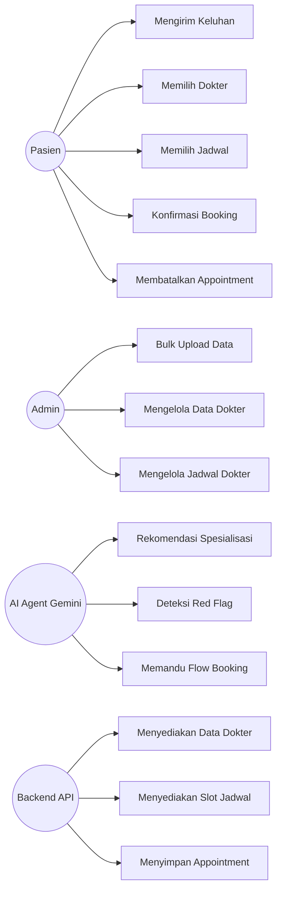
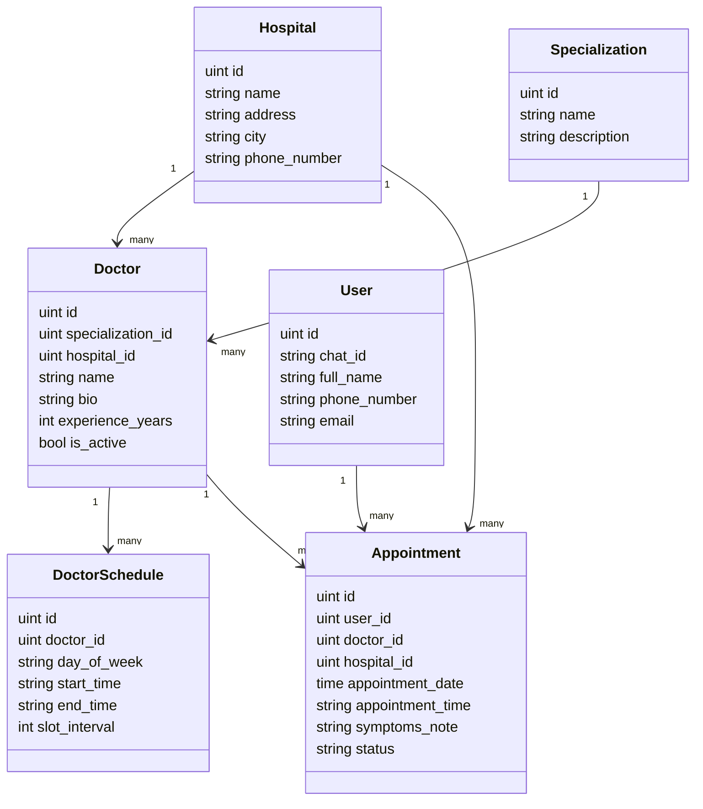
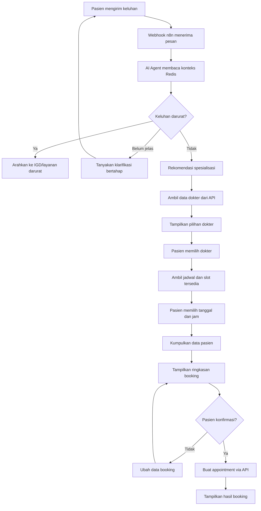
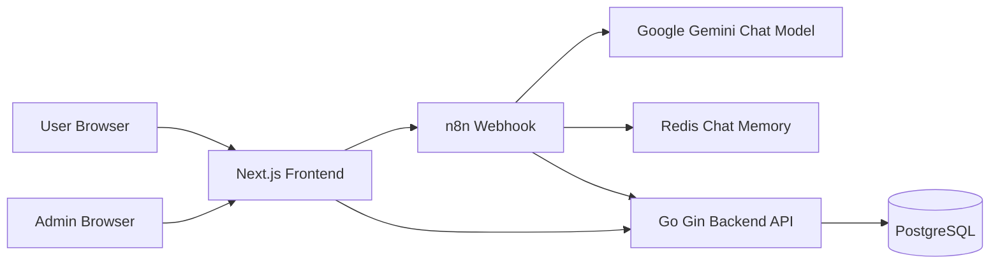

# LAPORAN KKP
# Pengembangan Chatbot AI untuk Rekomendasi Spesialis dan Booking Dokter Berbasis Google Gemini

## BAB I PENDAHULUAN

### 1.1 Latar Belakang

Perkembangan layanan kesehatan digital mendorong rumah sakit dan klinik untuk menyediakan akses layanan yang lebih cepat, mudah, dan terstruktur bagi pasien. Salah satu proses yang paling sering bersentuhan langsung dengan pasien adalah proses pencarian dokter, pemilihan spesialisasi, pengecekan jadwal, dan pembuatan janji temu. Pada praktik konvensional, pasien sering perlu menghubungi admin, menjelaskan keluhan, menunggu rekomendasi dokter, lalu melakukan pencocokan jadwal secara manual. Alur seperti ini dapat memakan waktu, menimbulkan antrean komunikasi, dan membuka peluang terjadinya kesalahan pencatatan data pasien maupun jadwal dokter. Penelitian terbaru pada respons chatbot AI terhadap pertanyaan pasien menunjukkan bahwa asisten AI memiliki potensi mendukung alur komunikasi layanan kesehatan, tetapi tetap perlu dikendalikan dan dievaluasi secara hati-hati (Ayers dkk., 2023).

Topik penelitian ini berada pada area kecerdasan buatan terapan untuk layanan kesehatan, khususnya chatbot berbasis Large Language Model (LLM) yang membantu pasien memahami arah layanan yang sesuai berdasarkan keluhan awal dan melanjutkan proses booking dokter. LLM merupakan model bahasa berukuran besar yang mampu memahami konteks percakapan, menghasilkan respons natural, dan menjalankan instruksi berbasis teks. Penelitian terkait asisten virtual berbasis LLM menunjukkan bahwa model bahasa dapat digunakan untuk membangun asisten percakapan pada domain tertentu jika didukung data, instruksi, dan evaluasi yang sesuai (Betancourt dkk., 2025). Dalam project ini, LLM Google Gemini digunakan sebagai komponen percakapan yang menafsirkan keluhan pasien, memberi rekomendasi spesialisasi secara hati-hati, dan mengarahkan pasien pada dokter serta jadwal yang tersedia melalui integrasi API.

Permasalahan utama yang diangkat adalah belum efisiennya alur booking apabila pasien belum mengetahui dokter spesialis yang perlu dituju. Banyak pasien hanya mampu menyampaikan gejala seperti sakit kepala, batuk lama, nyeri dada, sakit gigi, atau keluhan anak. Tanpa bantuan awal, pasien dapat memilih spesialisasi yang kurang tepat, bertanya berulang kali kepada admin, atau menunda pemeriksaan. Studi terbaru mengenai symptom checker menunjukkan bahwa sistem berbasis gejala dapat membantu self-triage, tetapi akurasi diagnosis dan rekomendasi triage masih bervariasi sehingga perlu diperhatikan secara hati-hati (Wallace dkk., 2022). Di sisi lain, sistem tidak boleh memberikan diagnosis pasti, resep, atau klaim medis yang berisiko. Oleh karena itu, solusi yang dibangun perlu menempatkan AI sebagai asisten navigasi layanan, bukan pengganti dokter.

Project Chatbot Antrik dikembangkan untuk mempermudah flow booking dokter dengan menggabungkan antarmuka chatbot, workflow otomasi n8n, model Google Gemini, penyimpanan memori percakapan Redis, backend API berbasis Go, basis data PostgreSQL, serta frontend Next.js. Workflow yang dikembangkan mengadaptasi kebutuhan operasional dari Okadoc, yaitu layanan digital yang berfokus pada pencarian dokter, ketersediaan jadwal, dan pembuatan appointment. Dalam konteks kerja praktik, adaptasi tersebut diterapkan sebagai sistem internal/prototipe yang membantu pengguna memilih dokter berdasarkan gejala dan menyelesaikan booking secara bertahap.

Beberapa penelitian sebelumnya menunjukkan bahwa chatbot kesehatan dan symptom checker memiliki potensi untuk membantu self-triage dan mempercepat akses informasi, tetapi masih memiliki keterbatasan pada akurasi, keamanan, dan konsistensi rekomendasi (Wallace dkk., 2022; Fraser dkk., 2022). Studi tentang AI symptom checker juga menekankan bahwa sistem harus berhati-hati dalam memberi rekomendasi, terutama pada gejala darurat dan kondisi yang membutuhkan layanan segera (Fraser dkk., 2022). Sementara itu, penelitian terkait LLM dan virtual assistant menunjukkan bahwa model bahasa dapat dipakai untuk membangun asisten virtual berbasis domain, tetapi tetap membutuhkan desain prompt, batasan perilaku, dan validasi keluaran (Betancourt dkk., 2025; Alahmari dkk., 2024).

Gap yang menjadi dasar pengembangan project ini adalah perlunya chatbot yang tidak hanya menjawab pertanyaan umum, tetapi juga menghubungkan percakapan pasien dengan data aktual rumah sakit, dokter, spesialisasi, jadwal, slot tersedia, dan appointment. Kebutuhan ini sejalan dengan temuan bahwa performa symptom checker dapat bervariasi sehingga sistem perlu dirancang untuk memberi arahan secara hati-hati dan terhubung dengan proses layanan yang jelas (Wallace dkk., 2022). Dengan kata lain, sistem tidak berhenti pada rekomendasi teks, tetapi melanjutkan percakapan menjadi tindakan operasional yang terkontrol. Solusi yang diusulkan adalah chatbot AI berbasis Gemini yang bekerja melalui workflow n8n dan backend booking, dengan aturan keselamatan seperti tidak memberikan diagnosis pasti, mendeteksi red flag, menanyakan informasi secara bertahap, dan meminta konfirmasi sebelum membuat appointment.

### 1.2 Perumusan Masalah

Rumusan masalah dalam kerja praktik ini adalah:

1. Bagaimana merancang chatbot AI yang dapat membantu pasien menentukan spesialisasi dokter berdasarkan keluhan awal tanpa memberikan diagnosis pasti?
2. Bagaimana mengintegrasikan chatbot dengan data rumah sakit, dokter, jadwal, dan appointment agar rekomendasi yang diberikan berasal dari data aktual?
3. Bagaimana merancang flow booking dokter yang bertahap, aman, dan meminta konfirmasi pasien sebelum membuat appointment?
4. Bagaimana menyimpan konteks percakapan agar interaksi pasien dengan chatbot tetap konsisten?
5. Bagaimana mengevaluasi kelebihan dan kekurangan solusi chatbot booking dokter yang dikembangkan?

### 1.3 Batasan Masalah

Batasan masalah pada project ini adalah:

1. Sistem berfokus pada chatbot untuk rekomendasi spesialisasi berdasarkan keluhan awal dan booking dokter rawat jalan.
2. Sistem tidak memberikan diagnosis pasti, resep obat, dosis obat, atau instruksi medis berisiko.
3. Sistem hanya menampilkan dokter, rumah sakit, jadwal, dan slot yang tersedia dari database/API project.
4. Data yang digunakan meliputi data rumah sakit, spesialisasi, dokter, jadwal dokter, pasien, dan appointment.
5. Periode pengembangan dan pengujian menggunakan data dummy/template CSV yang tersedia pada project.
6. Topik termasuk kategori penerapan kecerdasan buatan dan otomasi layanan digital kesehatan, bukan IoT atau otomasi berbasis sensor.
7. Workflow operasional mengadaptasi proses booking dokter pada lingkungan kerja Okadoc, tetapi implementasi project ini bersifat prototipe/pengembangan kerja praktik.
8. Pengujian berfokus pada alur fungsional, respons chatbot, validasi slot, dan pembuatan appointment.

### 1.4 Tujuan dan Manfaat

Tujuan:

1. Menerapkan LLM Google Gemini untuk membantu interpretasi keluhan awal dan rekomendasi spesialisasi dokter.
2. Membangun integrasi chatbot dengan backend API untuk membaca data dokter, jadwal, dan membuat appointment.
3. Merancang alur percakapan booking yang bertahap, ringkas, dan aman.
4. Menggunakan Redis sebagai memori percakapan agar konteks user dapat dipertahankan selama sesi.
5. Menyediakan antarmuka frontend dan fitur bulk upload untuk mendukung pengelolaan data.

Manfaat:

1. Pasien lebih mudah memahami dokter atau spesialisasi yang sesuai dengan keluhan awal.
2. Proses booking menjadi lebih cepat karena chatbot dapat menanyakan data secara bertahap dan terarah.
3. Admin atau operasional rumah sakit dapat mengurangi pekerjaan repetitif terkait pertanyaan jadwal dan spesialisasi.
4. Sistem membantu mengurangi risiko pemilihan rumah sakit/dokter yang tidak sesuai karena rekomendasi difilter dari data dokter aktual.
5. Project menjadi contoh penerapan AI dan workflow automation pada layanan kesehatan digital.

### 1.5 Metode Pengembangan / Metodologi

Metode pengembangan yang digunakan adalah prototyping dengan tahapan sebagai berikut:

1. Pengumpulan data: mengidentifikasi kebutuhan booking dokter dari workflow Okadoc, struktur data rumah sakit, dokter, spesialisasi, jadwal, pasien, dan appointment.
2. Analisis kebutuhan: menentukan kebutuhan fungsional seperti rekomendasi spesialisasi, pencarian dokter, pengecekan jadwal, pembuatan user, pembuatan appointment, dan bulk upload data.
3. Perancangan sistem: membuat rancangan arsitektur chatbot, backend API, database, workflow n8n, prompt Gemini, dan antarmuka pengguna.
4. Implementasi: membangun backend Go menggunakan Gin dan GORM, database PostgreSQL, Redis, frontend Next.js, serta workflow n8n yang terhubung dengan Google Gemini.
5. Pengujian: melakukan uji alur percakapan, validasi format tanggal/jam, pengecekan slot booked, pembuatan appointment, dan skenario gejala umum maupun darurat.
6. Evaluasi: menilai kelebihan, kekurangan, dan peluang pengembangan lanjutan berdasarkan hasil implementasi.

### 1.6 Sistematika Penulisan

Sistematika penulisan laporan ini adalah:

1. BAB I Pendahuluan berisi latar belakang, rumusan masalah, batasan masalah, tujuan dan manfaat, metodologi, serta sistematika penulisan.
2. BAB II Landasan Teori berisi profil instansi, tinjauan pustaka, teori terkait LLM, chatbot kesehatan, symptom checker, appointment, dan referensi ilmiah.
3. BAB III Analisis Masalah dan Perancangan Solusi berisi analisis pekerjaan, kebutuhan sistem, use case, rancangan database, rancangan menu, rancangan layar, algoritma, dan activity diagram.
4. BAB IV Implementasi dan Uji Coba Solusi berisi lingkungan percobaan, data masukan, langkah pengujian, serta evaluasi solusi.
5. BAB V Penutup berisi kesimpulan dan saran pengembangan.

## BAB II LANDASAN TEORI

### 2.1 Profil Singkat Instansi Tempat Kerja Praktik

Okadoc adalah perusahaan/layanan teknologi kesehatan yang menyediakan solusi digital untuk mempermudah pasien menemukan dokter, melihat ketersediaan jadwal, dan melakukan booking appointment. Bidang usaha Okadoc berkaitan dengan health technology, patient access, doctor discovery, dan appointment management.

Identitas instansi:

| Komponen | Keterangan |
|---|---|
| Nama instansi | Okadoc |
| Bidang usaha | Teknologi kesehatan dan layanan booking dokter |
| Fokus layanan | Pencarian dokter, pengelolaan jadwal, appointment, dan akses pasien |
| Posisi mahasiswa | Pengembang sistem/prototipe chatbot booking dokter berbasis AI |

Struktur organisasi yang relevan dalam kerja praktik dapat dijelaskan secara umum sebagai berikut:

1. Product/Business Team: menentukan kebutuhan layanan dan alur bisnis.
2. Engineering Team: membangun frontend, backend, integrasi API, dan otomasi.
3. Operations/Customer Support: menangani kebutuhan pasien, dokter, dan booking.
4. Mahasiswa kerja praktik: melakukan analisis, perancangan, implementasi, dan dokumentasi prototipe chatbot Antrik.

### 2.2 Tinjauan Pustaka Terkait Pekerjaan

Penelitian tentang symptom checker menunjukkan bahwa sistem digital berbasis gejala dapat membantu pengguna memperoleh arahan awal, tetapi akurasi diagnosis dan triage masih bervariasi antar sistem dan skenario pengujian (Wallace dkk., 2022). Hal ini relevan dengan project Chatbot Antrik karena sistem dirancang agar tidak langsung memaksa pasien memilih spesialisasi, tetapi menggali informasi dasar secara bertahap.

Penelitian terkait symptom checker dan triage menunjukkan bahwa sistem berbasis gejala dapat membantu pengguna menentukan urgensi layanan, tetapi performanya bervariasi dan tetap memerlukan perhatian pada aspek keselamatan, akurasi, serta keterbatasan konteks (Wallace dkk., 2022; Fraser dkk., 2022). Oleh karena itu, chatbot Antrik menggunakan aturan red flag dan membatasi respons agar tidak memberi diagnosis pasti.

Pada sisi LLM, penelitian tentang intelligent virtual assistant memperlihatkan bahwa LLM dapat digunakan sebagai dasar asisten virtual domain-spesifik (Betancourt dkk., 2025). Penelitian tentang repeatability fine-tuning LLM menggunakan QLoRA menegaskan bahwa pengembangan LLM perlu mempertimbangkan stabilitas, evaluasi, dan konsistensi keluaran (Alahmari dkk., 2024). Dalam project ini, pendekatan utama bukan fine-tuning, melainkan prompt engineering, integrasi API, dan pembatasan perilaku agar keluaran Gemini tetap sesuai konteks booking dokter.

Pada sisi komunikasi pasien, penelitian tentang perbandingan respons dokter dan chatbot AI menunjukkan bahwa asisten AI dapat membantu alur tanya jawab pasien apabila diposisikan sebagai pendukung layanan dan tetap diawasi oleh manusia (Ayers dkk., 2023). Project Chatbot Antrik mengambil semangat yang sama, yaitu mengarahkan pasien ke layanan yang lebih tepat melalui informasi digital dan data aktual.

### 2.3 Landasan Teori

#### 2.3.1 Large Language Model

Large Language Model adalah model kecerdasan buatan yang dilatih pada data teks berskala besar untuk memahami dan menghasilkan bahasa alami. LLM dapat digunakan sebagai dasar pengembangan asisten virtual, tetapi penerapannya perlu memperhatikan evaluasi, konsistensi, dan pengendalian keluaran (Betancourt dkk., 2025; Alahmari dkk., 2024). Dalam sistem ini, Google Gemini digunakan untuk memahami keluhan pasien, mengelola dialog, memberi rekomendasi spesialisasi secara hati-hati, dan menentukan langkah booking berikutnya.

#### 2.3.2 Chatbot Kesehatan

Chatbot kesehatan adalah sistem percakapan yang membantu pengguna memperoleh informasi kesehatan atau layanan kesehatan melalui teks. Studi tentang symptom checker menunjukkan bahwa sistem yang memberi arahan berbasis gejala perlu memperhatikan akurasi, keamanan, dan batasan penggunaan agar tidak menggantikan penilaian klinis tenaga medis (Wallace dkk., 2022). Dalam project ini, chatbot tidak berfungsi sebagai dokter, tetapi sebagai asisten layanan yang membantu navigasi: mengenali keluhan, memberi arahan spesialisasi umum, mencari dokter, menampilkan jadwal, dan membuat appointment setelah konfirmasi.

#### 2.3.3 Symptom-Based Specialist Recommendation

Symptom-based specialist recommendation adalah proses memetakan keluhan awal pasien ke spesialisasi dokter yang relevan. Pendekatan berbasis gejala perlu dipakai secara hati-hati karena evaluasi symptom checker menunjukkan variasi kemampuan dalam diagnosis dan triage (Wallace dkk., 2022; Fraser dkk., 2022). Contohnya, nyeri dada dapat diarahkan ke dokter jantung jika tidak darurat, sakit gigi ke dokter gigi, keluhan anak ke dokter anak, dan keluhan kulit ke dokter kulit. Karena risiko medis tinggi, sistem harus menggunakan bahasa probabilistik seperti "biasanya bisa mulai dari" dan tetap mengarahkan pasien ke IGD jika ada tanda darurat.

#### 2.3.4 Workflow Automation

Workflow automation adalah otomasi rangkaian proses menggunakan node atau layanan terhubung. Pada project ini, n8n menerima webhook dari frontend, mengirim pesan ke AI Agent, memanggil Gemini, menyimpan konteks pada Redis Chat Memory, dan menggunakan HTTP Request untuk membaca atau menulis data ke backend API.

#### 2.3.5 Appointment Scheduling

Appointment scheduling adalah pengelolaan janji temu berdasarkan dokter, rumah sakit, tanggal, jam, dan ketersediaan slot. Dalam konteks chatbot layanan kesehatan, proses ini perlu didukung komunikasi yang jelas, pembatasan klaim medis, dan data jadwal yang aktual agar pasien tidak diarahkan pada pilihan yang keliru (Ayers dkk., 2023; Wallace dkk., 2022). Dalam project ini, jadwal dokter memiliki hari praktik, jam mulai, jam selesai, interval slot, dan status booked. Appointment baru dibuat dengan status awal `pending`.

#### 2.3.6 Prompt Engineering dan Guardrail

Prompt engineering adalah teknik menyusun instruksi sistem agar LLM menghasilkan respons sesuai tujuan. Guardrail adalah batasan yang mengendalikan perilaku model, misalnya tidak mengarang data dokter, tidak memberikan diagnosis pasti, memakai data API aktual, dan meminta konfirmasi sebelum membuat appointment.

### 2.4 Referensi Ilmiah

Berikut 5 referensi ilmiah yang relevan dengan project ini. Seluruh pemakaian referensi pada laporan ini menggunakan parafrase dan sumarisasi, bukan kutipan langsung, sehingga tidak ada kutipan panjang yang perlu dipisahkan dalam alinea tersendiri.

1. Betancourt, J., Coral, A., Fraga, A., Figueroa, C., dan Ramirez-Gonzalez, G. (2025). Intelligent Virtual Assistant for Calculating Technology Readiness Levels Using Large Language Models (LLM). IEEE Access, ISSN 2169-3536. https://doi.org/10.1109/ACCESS.2025.3595699
2. Alahmari, S. S., Hall, L. O., Mouton, P. R., dan Goldgof, D. B. (2024). Repeatability of Fine-Tuning Large Language Models Illustrated Using QLoRA. IEEE Access, ISSN 2169-3536. https://doi.org/10.1109/ACCESS.2024.3470850
3. Wallace, W., Chan, C., Chidambaram, S., Hanna, L., Iqbal, F. M., Acharya, A., Normahani, P., Ashrafian, H., Markar, S. R., Sounderajah, V., dan Darzi, A. (2022). The diagnostic and triage accuracy of digital and online symptom checker tools: a systematic review. npj Digital Medicine, ISSN 2398-6352. https://doi.org/10.1038/s41746-022-00667-w
4. Fraser, H. S. F., Cohan, G., Koehler, C., Anderson, J., Lawrence, A., Patena, J., Bacher, I., dan Ranney, M. L. (2022). Evaluation of Diagnostic and Triage Accuracy and Usability of a Symptom Checker in an Emergency Department: Observational Study. JMIR mHealth and uHealth, 10(9), e38364, ISSN 2291-5222. https://doi.org/10.2196/38364
5. Ayers, J. W., Poliak, A., Dredze, M., Leas, E. C., Zhu, Z., Kelley, J. B., Faix, D. J., Goodman, A. M., Longhurst, C. A., Hogarth, M., dan Smith, D. M. (2023). Comparing Physician and Artificial Intelligence Chatbot Responses to Patient Questions Posted to a Public Social Media Forum. JAMA Internal Medicine, 183(6), 589-596, ISSN 2168-6106. https://doi.org/10.1001/jamainternmed.2023.1838

Catatan: Referensi nomor 1 dan 2 sudah tersedia dalam folder `referensi/` project. Referensi yang digunakan berasal dari jurnal/prosiding ilmiah, bukan Wikipedia, blog, atau media sosial.

## BAB III ANALISIS MASALAH DAN PERANCANGAN SOLUSI

### 3.1 Analisis Masalah dan Solusi

#### 3.1.1 Pekerjaan Kerja Praktik

Pekerjaan kerja praktik berfokus pada pengembangan prototipe Chatbot Antrik untuk mempermudah booking dokter. Latar belakang pekerjaan adalah kebutuhan agar pasien tidak perlu memahami daftar spesialisasi sejak awal. Pasien cukup menyampaikan keluhan, lalu chatbot membantu menentukan arah layanan, menampilkan dokter yang relevan, mengecek jadwal, dan membuat appointment.

Deskripsi pekerjaan:

1. Menyusun system prompt Gemini agar chatbot memahami batasan medis dan alur booking.
2. Membangun backend API untuk data rumah sakit, spesialisasi, dokter, jadwal, user, dan appointment.
3. Menghubungkan workflow n8n dengan Google Gemini, Redis, dan HTTP Request.
4. Membuat frontend chatroom untuk interaksi pasien.
5. Menambahkan fitur bulk upload CSV/Google Spreadsheet untuk pengisian data.

Aspek non-teknis:

1. Menyesuaikan alur chatbot dengan kebutuhan operasional booking.
2. Menghindari risiko klaim medis berlebihan.
3. Membuat bahasa chatbot ramah, ringkas, dan mudah dipahami pasien.
4. Menjaga agar perubahan data penting seperti appointment hanya dilakukan setelah konfirmasi.

#### 3.1.2 Analisis Pelaksanaan

Pelaksanaan kerja praktik sesuai dengan kerangka acuan karena project menggabungkan analisis kebutuhan, implementasi sistem, dan pengujian alur. Perbedaannya, beberapa bagian yang pada sistem produksi biasanya memerlukan integrasi penuh dengan sistem rumah sakit masih dilakukan menggunakan data dummy, CSV, dan database project.

Kendala yang dihadapi:

1. LLM dapat menghasilkan jawaban yang terlalu bebas apabila prompt tidak diberi batasan jelas.
2. Data dokter dan jadwal harus selalu diambil dari API agar tidak terjadi halusinasi.
3. Format tanggal dan jam perlu dibuat strict agar backend dapat memproses appointment.
4. Alur keluhan umum perlu dibuat bertahap agar user tidak dibebani terlalu banyak pertanyaan.

Upaya yang dilakukan:

1. Menyusun system prompt dengan aturan larangan diagnosis pasti, larangan mengarang data, dan aturan red flag.
2. Menggunakan endpoint `GET /api/doctors` sebagai sumber utama rekomendasi dokter berdasarkan spesialisasi dan rumah sakit.
3. Menetapkan format appointment date `YYYY-MM-DDT00:00:00Z` dan appointment time `HH:MM`.
4. Menambahkan aturan konfirmasi ringkasan sebelum membuat appointment.

#### 3.1.3 Relevansi dengan Perkuliahan di FTI Universitas Budi Luhur

Project ini relevan dengan materi perkuliahan seperti analisis dan perancangan sistem, basis data, rekayasa perangkat lunak, pemrograman web, kecerdasan buatan, dan pengujian perangkat lunak. Pengetahuan perkuliahan membantu dalam membuat model data, API, diagram, dan alur sistem. Perbedaannya, di tempat kerja praktik, kebutuhan sistem lebih dinamis karena harus mempertimbangkan workflow bisnis, pengalaman pengguna, keamanan respons AI, dan integrasi antar layanan.

### 3.2 Use Case Diagram

Kebutuhan fungsional:

1. Sistem menerima pesan pasien melalui chat.
2. Sistem menanyakan detail keluhan secara bertahap.
3. Sistem merekomendasikan spesialisasi yang relevan.
4. Sistem mengambil data dokter dan rumah sakit dari API.
5. Sistem mengecek slot jadwal berdasarkan tanggal.
6. Sistem membuat appointment setelah pasien mengonfirmasi ringkasan.
7. Sistem menyediakan upload data CSV/Google Spreadsheet untuk admin.

Kebutuhan non-fungsional:

1. Respons harus ringkas dan mudah dipahami.
2. Data dokter, jadwal, dan appointment harus berasal dari API.
3. Sistem harus mencegah halusinasi data.
4. Sistem harus menjaga keamanan medis dengan tidak memberi diagnosis pasti.
5. Sistem harus menangani error API dengan pesan yang jelas.

### 3.3 Rancangan Basis Data

#### 3.3.1 Class Diagram

#### 3.3.2 LRS

| Entitas | Relasi |
|---|---|
| hospitals | Memiliki banyak doctors dan appointments |
| specializations | Memiliki banyak doctors |
| doctors | Milik satu hospital dan satu specialization, memiliki banyak doctor_schedules dan appointments |
| doctor_schedules | Milik satu doctor |
| users | Memiliki banyak appointments |
| appointments | Milik satu user, doctor, dan hospital |

#### 3.3.3 Spesifikasi Basis Data

| Tabel | Field utama | Keterangan |
|---|---|---|
| hospitals | id, name, address, city, phone_number | Data rumah sakit/klinik |
| specializations | id, name, description | Data spesialisasi dokter |
| doctors | id, specialization_id, hospital_id, name, bio, experience_years, is_active | Data dokter |
| doctor_schedules | id, doctor_id, day_of_week, start_time, end_time, slot_interval | Jadwal praktik dokter |
| users | id, chat_id, full_name, phone_number, email | Data pasien |
| appointments | id, user_id, doctor_id, hospital_id, appointment_date, appointment_time, symptoms_note, status | Data booking janji temu |

### 3.4 Rancangan Menu

Menu pasien:

1. Onboarding chat.
2. Chatroom konsultasi awal dan booking.
3. Pilihan dokter.
4. Pilihan jadwal.
5. Konfirmasi appointment.
6. Ringkasan hasil booking.

Menu admin:

1. Bulk upload data.
2. Upload hospitals.
3. Upload specializations.
4. Upload doctors.
5. Upload doctor schedules.
6. Upload users.
7. Upload appointments.
8. Download template CSV.

### 3.5 Rancangan Layar

Rancangan layar utama:

1. Halaman onboarding: pasien memasukkan identitas awal seperti nomor telepon atau memulai sesi chat.
2. Halaman chatroom: pasien mengirim keluhan, menerima pertanyaan lanjutan, memilih dokter, dan memilih slot.
3. Komponen message bubble: menampilkan pesan user dan chatbot.
4. Typing indicator: memberi tanda bahwa chatbot sedang memproses.
5. Session end modal: menutup sesi percakapan.
6. Halaman bulk upload: admin memilih tabel, mengunggah CSV atau memasukkan URL Google Spreadsheet.
7. Modal hasil upload: menampilkan jumlah data berhasil masuk dan error validasi jika ada.

### 3.6 Algoritma

Algoritma rekomendasi dan booking:

1. Terima pesan pasien dari frontend melalui webhook.
2. Simpan atau baca konteks percakapan dari Redis.
3. Jika pesan berisi keluhan umum, tanyakan satu informasi penting seperti durasi atau tingkat nyeri.
4. Jika ditemukan red flag, arahkan pasien ke IGD atau layanan darurat.
5. Jika keluhan cukup jelas dan tidak darurat, rekomendasikan spesialisasi yang relevan.
6. Ambil data dokter dari `GET /api/doctors`.
7. Filter dokter berdasarkan spesialisasi dan kota jika pasien menyebut lokasi.
8. Tampilkan maksimal 3 sampai 5 pilihan dokter.
9. Setelah pasien memilih dokter, ambil jadwal dari `GET /api/schedules?date=YYYY-MM-DD`.
10. Tampilkan slot yang belum booked.
11. Kumpulkan data pasien: nama lengkap, nomor telepon, dan email.
12. Tampilkan ringkasan booking.
13. Jika pasien mengonfirmasi, kirim `POST /api/appointments`.
14. Tampilkan hasil booking dan status appointment.

### 3.7 Activity Diagram

## BAB IV IMPLEMENTASI DAN UJI COBA SOLUSI

### 4.1 Lingkungan Percobaan

Spesifikasi hardware yang digunakan:

| Komponen | Spesifikasi |
|---|---|
| Processor | Minimal dual-core processor |
| RAM | Minimal 8 GB |
| Storage | Minimal 10 GB ruang kosong |
| Koneksi | Internet untuk akses Gemini/n8n dan API eksternal jika diperlukan |

Spesifikasi software:

| Komponen | Teknologi |
|---|---|
| Frontend | Next.js 15, React 18, TypeScript, Tailwind CSS |
| Backend | Go, Gin, GORM |
| Database | PostgreSQL 15 |
| Memory | Redis 7 |
| Workflow automation | n8n |
| AI model | Google Gemini Chat Model |
| Container | Docker Compose |

Deployment diagram:

### 4.2 Data Masukan

Data masukan sistem meliputi:

| Data | Bentuk | Format | Keterangan |
|---|---|---|---|
| Pesan pasien | Teks chat | Bahasa Indonesia | Keluhan, lokasi, tanggal, pilihan dokter |
| Data rumah sakit | CSV/API | hospitals.csv | Nama, alamat, kota, nomor telepon |
| Data spesialisasi | CSV/API | specializations.csv | Nama dan deskripsi spesialisasi |
| Data dokter | CSV/API | doctors.csv | Nama dokter, spesialisasi, rumah sakit |
| Data jadwal dokter | CSV/API | doctor_schedules.csv | Hari praktik, jam mulai, jam selesai, interval slot |
| Data pasien | Chat/API | JSON | Nama, nomor telepon, email |
| Data appointment | Chat/API | JSON | user_id, doctor_id, hospital_id, tanggal, jam, keluhan, status |

Data uji tersedia pada folder `service-antrik-main/csv_test_data/50_rows/` dan template tersedia pada folder `service-antrik-main/csv_templates/`.

### 4.3 Langkah Pengujian

Skenario 1: rekomendasi spesialisasi berdasarkan keluhan umum.

1. Pasien mengirim pesan: "kepala saya sakit".
2. Chatbot menanyakan durasi dan tingkat nyeri.
3. Pasien menjawab informasi tambahan.
4. Chatbot mengecek red flag.
5. Jika tidak darurat, chatbot menyarankan Dokter Umum atau Penyakit Dalam.

Skenario 2: rekomendasi spesialis dan pencarian dokter.

1. Pasien mengirim pesan: "saya nyeri dada dan ingin periksa di Jakarta".
2. Chatbot menanyakan gejala bahaya jika diperlukan.
3. Jika tidak darurat, chatbot mengambil data dokter.
4. Sistem memfilter dokter spesialis Jantung dan Pembuluh Darah berdasarkan kota.
5. Chatbot menampilkan daftar dokter dan rumah sakit yang relevan.

Skenario 3: booking appointment.

1. Pasien memilih dokter.
2. Pasien memilih tanggal kunjungan.
3. Sistem mengambil jadwal sesuai tanggal.
4. Chatbot menampilkan slot yang belum booked.
5. Pasien memilih jam.
6. Chatbot meminta data pasien.
7. Chatbot menampilkan ringkasan.
8. Setelah pasien mengonfirmasi, sistem membuat appointment dengan status `pending`.

Skenario 4: validasi slot booked.

1. Sistem mengambil jadwal dengan query tanggal.
2. Backend menandai slot yang sudah memiliki appointment sebagai `booked=true`.
3. Chatbot hanya menawarkan slot dengan `booked=false`.
4. Jika semua slot penuh, chatbot menawarkan tanggal atau dokter lain.

Skenario 5: bulk upload data.

1. Admin membuka halaman bulk upload.
2. Admin memilih tabel tujuan.
3. Admin mengunggah CSV atau memasukkan URL Google Spreadsheet.
4. Backend membaca header dan isi CSV.
5. Sistem memasukkan data atau menampilkan error validasi.

Contoh tampilan yang perlu dilampirkan dalam laporan final kampus:

1. Screenshot halaman chatroom.
2. Screenshot percakapan rekomendasi spesialisasi.
3. Screenshot pilihan dokter dan slot.
4. Screenshot ringkasan konfirmasi booking.
5. Screenshot halaman bulk upload.
6. Screenshot hasil data appointment pada database/API.

### 4.4 Evaluasi Solusi

Kelebihan:

1. Chatbot membantu pasien yang belum mengetahui spesialisasi yang sesuai.
2. Sistem menggunakan data aktual dari API sehingga mengurangi risiko mengarang dokter atau jadwal.
3. Alur booking dilakukan bertahap sehingga lebih mudah diikuti.
4. Redis membantu menjaga konteks percakapan selama sesi berlangsung.
5. Bulk upload mempermudah pengisian data master.
6. Aturan red flag membantu menjaga keamanan respons untuk keluhan yang berpotensi darurat.

Kekurangan:

1. Rekomendasi spesialisasi masih bergantung pada kualitas prompt dan kemampuan model Gemini.
2. Belum terdapat validasi medis oleh dokter secara langsung pada setiap rekomendasi.
3. Data uji masih menggunakan data dummy/template sehingga belum mencerminkan kompleksitas operasional penuh.
4. Belum terdapat dashboard admin lengkap untuk CRUD seluruh data master.
5. Evaluasi akurasi rekomendasi belum menggunakan dataset gejala tervalidasi secara klinis.

Evaluasi melalui kuesioner/wawancara dapat dilakukan dengan indikator:

1. Kemudahan memahami jawaban chatbot.
2. Kecepatan menemukan dokter yang sesuai.
3. Kejelasan informasi jadwal dan slot.
4. Kepercayaan pengguna terhadap ringkasan booking.
5. Kepuasan terhadap alur percakapan.

## BAB V PENUTUP

### 5.1 Kesimpulan

Berdasarkan hasil analisis, perancangan, dan implementasi, Chatbot Antrik berhasil dirancang sebagai prototipe chatbot AI untuk membantu pasien menemukan spesialisasi dokter berdasarkan keluhan awal dan melanjutkan proses booking dokter. Sistem memanfaatkan Google Gemini sebagai model percakapan, n8n sebagai workflow automation, Redis sebagai memori chat, backend Go sebagai API booking, PostgreSQL sebagai database, dan Next.js sebagai frontend.

Project ini menjawab kebutuhan utama yaitu mempermudah pasien yang belum mengetahui dokter spesialis yang harus dituju. Chatbot tidak memberikan diagnosis pasti, tetapi memberi arahan awal, mengecek tanda bahaya, mengambil data dokter dan jadwal dari API, serta membuat appointment setelah pasien mengonfirmasi ringkasan. Dengan demikian, sistem dapat membantu mempercepat akses pasien ke layanan dokter dan mengurangi proses manual dalam booking.

### 5.2 Saran

Saran pengembangan selanjutnya:

1. Menambahkan validasi rekomendasi spesialisasi bersama dokter atau tenaga medis.
2. Membuat dataset gejala dan spesialisasi yang lebih lengkap untuk pengujian akurasi.
3. Menambahkan dashboard admin untuk CRUD data rumah sakit, dokter, jadwal, dan appointment.
4. Menambahkan autentikasi dan otorisasi untuk admin.
5. Menambahkan monitoring percakapan dan log error workflow.
6. Mengintegrasikan notifikasi WhatsApp/email untuk konfirmasi appointment.
7. Menambahkan mekanisme evaluasi rutin agar respons AI tetap aman, konsisten, dan sesuai kebutuhan operasional.

## DAFTAR PUSTAKA

Alahmari, S. S., Hall, L. O., Mouton, P. R., dan Goldgof, D. B. (2024). Repeatability of Fine-Tuning Large Language Models Illustrated Using QLoRA. IEEE Access, 12, ISSN 2169-3536. https://doi.org/10.1109/ACCESS.2024.3470850

Betancourt, J., Coral, A., Fraga, A., Figueroa, C., dan Ramirez-Gonzalez, G. (2025). Intelligent Virtual Assistant for Calculating Technology Readiness Levels Using Large Language Models (LLM). IEEE Access, 13, ISSN 2169-3536. https://doi.org/10.1109/ACCESS.2025.3595699

Fraser, H. S. F., Cohan, G., Koehler, C., Anderson, J., Lawrence, A., Patena, J., Bacher, I., dan Ranney, M. L. (2022). Evaluation of Diagnostic and Triage Accuracy and Usability of a Symptom Checker in an Emergency Department: Observational Study. JMIR mHealth and uHealth, 10(9), e38364, ISSN 2291-5222. https://doi.org/10.2196/38364

Ayers, J. W., Poliak, A., Dredze, M., Leas, E. C., Zhu, Z., Kelley, J. B., Faix, D. J., Goodman, A. M., Longhurst, C. A., Hogarth, M., dan Smith, D. M. (2023). Comparing Physician and Artificial Intelligence Chatbot Responses to Patient Questions Posted to a Public Social Media Forum. JAMA Internal Medicine, 183(6), 589-596, ISSN 2168-6106. https://doi.org/10.1001/jamainternmed.2023.1838

Wallace, W., Chan, C., Chidambaram, S., Hanna, L., Iqbal, F. M., Acharya, A., Normahani, P., Ashrafian, H., Markar, S. R., Sounderajah, V., dan Darzi, A. (2022). The diagnostic and triage accuracy of digital and online symptom checker tools: a systematic review. npj Digital Medicine, ISSN 2398-6352. https://doi.org/10.1038/s41746-022-00667-w
