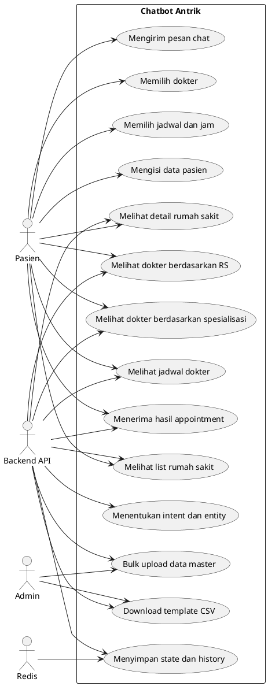
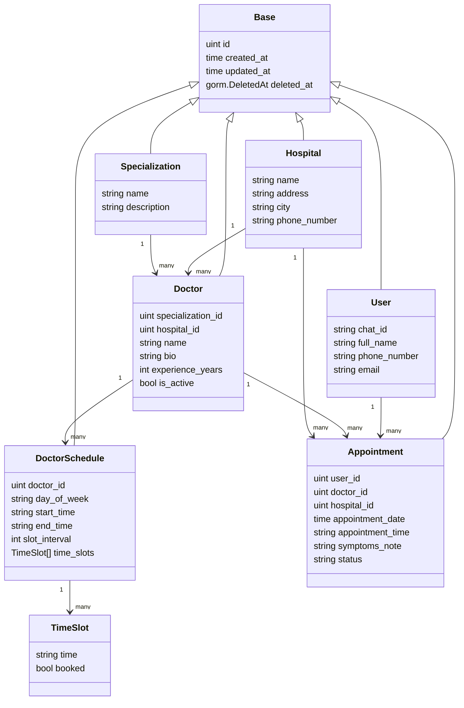
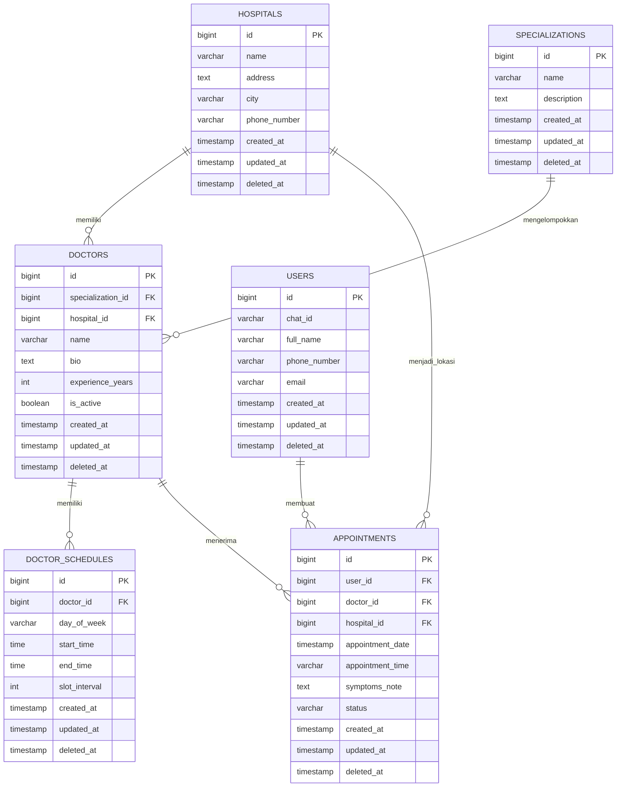
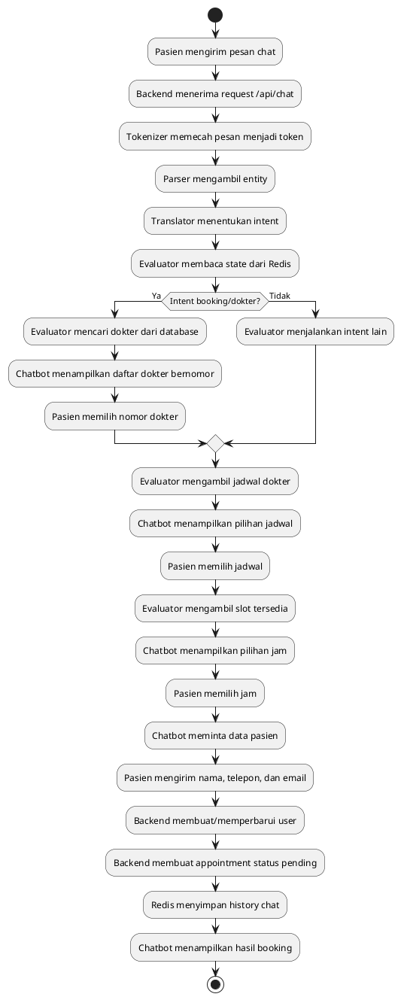
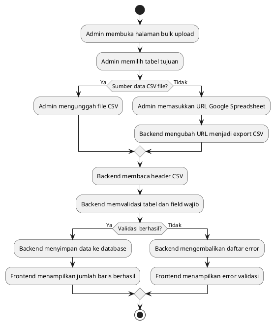
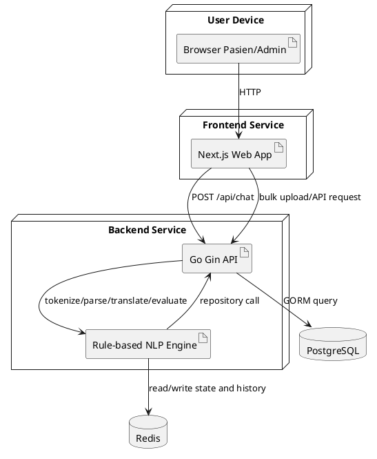

# LAPORAN KKP
# Pengembangan Chatbot Berbasis Natural Language Processing untuk Informasi Rumah Sakit dan Booking Dokter

## BAB I PENDAHULUAN

### 1.1 Latar Belakang

Perkembangan layanan kesehatan digital mendorong rumah sakit dan klinik untuk menyediakan akses layanan yang lebih cepat, mudah, dan terstruktur bagi pasien. Salah satu proses yang paling sering bersentuhan langsung dengan pasien adalah pencarian rumah sakit, pencarian dokter, pengecekan spesialisasi, pengecekan jadwal, dan pembuatan janji temu. Pada proses konvensional, pasien sering perlu bertanya kepada admin untuk mengetahui dokter yang tersedia, rumah sakit yang dituju, jadwal praktik, dan slot yang masih dapat dipilih. Alur seperti ini dapat memakan waktu, menimbulkan antrean komunikasi, dan membuka peluang terjadinya kesalahan pencatatan data pasien maupun jadwal dokter.

Topik kerja praktik ini berada pada area Natural Language Processing (NLP), khususnya pemrosesan teks bahasa Indonesia untuk mengubah pesan pasien menjadi intent dan entity yang dapat diproses oleh sistem booking. NLP berperan untuk memecah pesan menjadi token, membaca pola kalimat, mengambil entity seperti nama rumah sakit, kota, dokter, tanggal, dan jam, lalu menerjemahkannya menjadi intent seperti list rumah sakit, detail rumah sakit, pencarian dokter, pengecekan jadwal, dan booking dokter. Kajian NLP terbaru menunjukkan bahwa NLP digunakan untuk merepresentasikan dan menganalisis bahasa manusia secara komputasional pada berbagai aplikasi, termasuk question answering, information extraction, dan domain medis (Khurana dkk., 2023).

Project Chatbot Antrik dikembangkan untuk mempermudah alur pencarian informasi dan booking dokter dengan pendekatan rule-based NLP buatan sendiri. Sistem tidak menggunakan layanan workflow automation eksternal maupun model percakapan pihak ketiga untuk memproses chat. Sebagai gantinya, backend Go menyediakan satu endpoint chat yang menjalankan pipeline tokenizer, parser, translator, dan evaluator. Tokenizer menormalisasi pesan user, parser mengambil entity, translator menentukan intent, dan evaluator menjalankan aturan bisnis berdasarkan intent tersebut. Dengan pendekatan ini, proses pengambilan keputusan chatbot menjadi lebih deterministik, mudah diuji, dan mudah dijelaskan dalam laporan kerja praktik.

Revisi kebutuhan sistem membuat ruang lingkup project lebih fokus pada pemrosesan bahasa alami yang terkontrol. Chatbot tidak melakukan penilaian medis atau rekomendasi klinis. Chatbot hanya membantu navigasi layanan berdasarkan data yang tersedia, seperti menampilkan daftar rumah sakit berdasarkan kota, menampilkan detail atau lokasi rumah sakit, menampilkan dokter pada rumah sakit tertentu, menampilkan dokter berdasarkan spesialisasi yang disebutkan user, mengecek jadwal dokter pada tanggal tertentu, dan membuat appointment setelah pasien memilih dokter, jadwal, jam, serta mengisi data pasien.

Gap yang menjadi dasar pengembangan project ini adalah perlunya chatbot booking dokter yang dapat menerima bahasa alami sederhana, tetapi tetap menghasilkan aksi sistem yang terstruktur. Hal ini sejalan dengan penelitian intent recognition pada conversational AI yang menekankan bahwa Natural Language Understanding mengubah bahasa alami menjadi data terstruktur melalui intent classification dan entity extraction (Chandrakala dkk., 2023). Dalam konteks project ini, pesan seperti "rumah sakit di Tangerang ada apa saja", "detail rumah sakit RSUP Nasional", "dokter di rumah sakit Bunda Margonda Depok", atau "jadwal dokter Budi besok" harus dapat diubah menjadi query backend yang sesuai.

Dengan demikian, solusi yang diusulkan adalah chatbot berbasis rule-based NLP yang terintegrasi dengan backend API, database PostgreSQL, dan Redis. Redis digunakan untuk menyimpan state alur booking serta history percakapan berdasarkan chat id, sehingga percakapan dapat dilanjutkan dan history tetap tersedia setelah service restart. Backend Go menjadi pusat logika chatbot sekaligus penyedia API untuk data rumah sakit, dokter, jadwal, user, appointment, bulk upload, dan template CSV.

### 1.2 Perumusan Masalah

Rumusan masalah dalam kerja praktik ini adalah:

1. Bagaimana merancang chatbot berbasis NLP yang dapat memahami pesan bahasa Indonesia sederhana untuk kebutuhan informasi rumah sakit dan booking dokter?
2. Bagaimana membangun tokenizer, parser, translator, dan evaluator buatan sendiri untuk mengubah pesan user menjadi intent dan entity terstruktur?
3. Bagaimana mengintegrasikan chatbot dengan data rumah sakit, dokter, jadwal, dan appointment agar respons berasal dari data aktual pada database?
4. Bagaimana merancang flow booking bertahap dengan pilihan nomor dokter, pilihan jadwal, pilihan jam, dan input data pasien?
5. Bagaimana menyimpan state dan history percakapan menggunakan Redis agar percakapan tetap konsisten dan dapat dibuka kembali?

### 1.3 Batasan Masalah

Batasan masalah pada project ini adalah:

1. Sistem berfokus pada chatbot untuk informasi rumah sakit, informasi dokter, jadwal dokter, dan booking dokter rawat jalan.
2. Sistem tidak melakukan penilaian medis, rekomendasi klinis, resep obat, dosis obat, atau instruksi medis berisiko.
3. Pemrosesan chat dilakukan oleh rule-based NLP buatan sendiri, terdiri dari tokenizer, parser, translator, dan evaluator.
4. Sistem hanya menampilkan dokter, rumah sakit, jadwal, dan slot berdasarkan data pada database/API project.
5. Data yang digunakan meliputi data rumah sakit, spesialisasi, dokter, jadwal dokter, pasien, dan appointment.
6. Periode pengembangan dan pengujian menggunakan data dummy/template CSV yang tersedia pada project.
7. Pengujian berfokus pada alur fungsional chatbot, parsing intent/entity, validasi slot, pembuatan appointment, penyimpanan history Redis, dan bulk upload data.

### 1.4 Tujuan dan Manfaat

Tujuan:

1. Membangun chatbot berbasis Natural Language Processing untuk membantu pencarian informasi rumah sakit, dokter, jadwal, dan booking appointment.
2. Membuat tokenizer, parser, translator, dan evaluator buatan sendiri agar alur pemrosesan chat dapat dijelaskan dan diuji.
3. Mengintegrasikan chatbot dengan backend API untuk membaca data rumah sakit, dokter, jadwal, dan membuat appointment.
4. Menggunakan Redis untuk menyimpan state booking dan history percakapan berdasarkan chat id.
5. Menyediakan antarmuka frontend dan fitur bulk upload untuk mendukung pengelolaan data master.

Manfaat:

1. Pasien lebih mudah mencari rumah sakit, dokter, spesialisasi, jadwal, dan slot booking melalui percakapan sederhana.
2. Proses booking menjadi lebih cepat karena chatbot menanyakan data secara bertahap dan terarah.
3. Admin atau operasional rumah sakit dapat mengurangi pekerjaan repetitif terkait pertanyaan jadwal, dokter, dan lokasi rumah sakit.
4. Sistem membantu mengurangi risiko informasi yang tidak sesuai karena semua respons operasional difilter dari data aktual.
5. Project menjadi contoh penerapan NLP rule-based pada layanan kesehatan digital yang mudah dipresentasikan dan dipelihara.

### 1.5 Metode Pengembangan / Metodologi

Metode pengembangan yang digunakan adalah prototyping dengan tahapan sebagai berikut:

1. Pengumpulan data: mengidentifikasi kebutuhan booking dokter, struktur data rumah sakit, dokter, spesialisasi, jadwal, pasien, dan appointment.
2. Analisis kebutuhan: menentukan kebutuhan fungsional seperti list rumah sakit, detail rumah sakit, pencarian dokter, pengecekan jadwal, pembuatan user, pembuatan appointment, history chat, dan bulk upload data.
3. Perancangan sistem: membuat rancangan arsitektur chatbot rule-based, backend API, database, Redis memory, dan antarmuka pengguna.
4. Implementasi: membangun backend Go menggunakan Gin dan GORM, database PostgreSQL, Redis, frontend Next.js, serta pipeline NLP yang terdiri dari tokenizer, parser, translator, dan evaluator.
5. Pengujian: melakukan uji tokenisasi, parsing entity, intent translation, alur booking, validasi tanggal/jam, pengecekan slot booked, penyimpanan history Redis, pembuatan appointment, dan bulk upload.
6. Evaluasi: menilai kelebihan, kekurangan, dan peluang pengembangan lanjutan berdasarkan hasil implementasi.

### 1.6 Sistematika Penulisan

Sistematika penulisan laporan ini adalah:

1. BAB I Pendahuluan berisi latar belakang, rumusan masalah, batasan masalah, tujuan dan manfaat, metodologi, serta sistematika penulisan.
2. BAB II Landasan Teori berisi profil instansi, tinjauan pustaka, teori terkait NLP, chatbot, intent classification, entity extraction, appointment scheduling, dan referensi ilmiah.
3. BAB III Analisis Masalah dan Perancangan Solusi berisi analisis pekerjaan, kebutuhan sistem, use case, rancangan database, rancangan menu, rancangan layar, algoritma, dan activity diagram.
4. BAB IV Implementasi dan Uji Coba Solusi berisi lingkungan percobaan, data masukan, langkah pengujian, serta evaluasi solusi.
5. BAB V Penutup berisi kesimpulan dan saran pengembangan.

## BAB II LANDASAN TEORI

### 2.1 Profil Singkat Instansi Tempat Kerja Praktik

Okadoc adalah perusahaan/layanan teknologi kesehatan yang menyediakan solusi digital untuk mempermudah pasien menemukan dokter, melihat ketersediaan jadwal, dan melakukan booking appointment. Bidang usaha Okadoc berkaitan dengan health technology, patient access, doctor discovery, dan appointment management.

Identitas instansi:

| Komponen | Keterangan |
|---|---|
| Nama instansi | Okadoc |
| Bidang usaha | Teknologi kesehatan dan layanan booking dokter |
| Fokus layanan | Pencarian dokter, pengelolaan jadwal, appointment, dan akses pasien |
| Posisi mahasiswa | Pengembang sistem/prototipe chatbot booking dokter berbasis NLP rule-based |

Struktur organisasi yang relevan dalam kerja praktik dapat dijelaskan secara umum sebagai berikut:

1. Product/Business Team: menentukan kebutuhan layanan dan alur bisnis.
2. Engineering Team: membangun frontend, backend, integrasi API, dan otomasi.
3. Operations/Customer Support: menangani kebutuhan pasien, dokter, dan booking.
4. Mahasiswa kerja praktik: melakukan analisis, perancangan, implementasi, dan dokumentasi prototipe chatbot Antrik.

### 2.2 Tinjauan Pustaka Terkait Pekerjaan

Penelitian mengenai Natural Language Processing menjelaskan bahwa NLP digunakan untuk membuat komputer dapat merepresentasikan, menganalisis, dan memproses bahasa manusia secara komputasional. Khurana dkk. (2023) merangkum bahwa NLP digunakan pada information extraction, question answering, text classification, dan aplikasi medis. Hal ini relevan dengan Chatbot Antrik karena sistem harus mengubah pesan pasien yang berbentuk bahasa alami menjadi struktur data yang dapat dipakai untuk query database.

Penelitian terkait intent recognition pada conversational AI menunjukkan bahwa Natural Language Understanding berperan untuk mengubah input bahasa alami menjadi intent dan entity. Chandrakala dkk. (2023) menjelaskan bahwa intent classification dan entity extraction merupakan bagian penting dalam pipeline conversational AI. Konsep ini diterapkan pada project melalui pemisahan modul tokenizer, parser, translator, dan evaluator.

Pada sisi entity extraction, penelitian systematic literature review tentang Named Entity Recognition menunjukkan bahwa NER digunakan untuk mendeteksi dan mengklasifikasikan entity pada teks, termasuk pada aplikasi chatbot, question answering, dan domain kesehatan (Warto dkk., 2024). Walaupun project ini tidak menggunakan model NER berbasis machine learning, prinsip entity extraction diterapkan secara rule-based untuk mengambil nama rumah sakit, kota, dokter, spesialisasi, tanggal, dan jam.

Pada domain kesehatan, penelitian NLP dalam emergency medicine dan clinical patient journey menunjukkan bahwa teks kesehatan sering perlu diubah menjadi informasi terstruktur agar dapat mendukung proses layanan (Wang dkk., 2024; Klug dkk., 2024). Project ini mengambil prinsip tersebut pada level operasional non-diagnostik, yaitu mengubah pesan chat menjadi aksi pencarian rumah sakit, pencarian dokter, pengecekan jadwal, dan pembuatan appointment. Sistem tidak melakukan penilaian klinis, tetapi membantu navigasi data layanan yang tersedia.

### 2.3 Landasan Teori

#### 2.3.1 Natural Language Processing

Natural Language Processing adalah bidang kecerdasan buatan yang memproses bahasa manusia agar dapat dipahami dan digunakan oleh sistem komputer. Pada project ini, NLP diterapkan untuk memproses pesan bahasa Indonesia dari user. Tahapannya meliputi normalisasi teks, tokenisasi, parsing entity, translasi intent, dan evaluasi aturan bisnis. Pendekatan yang digunakan bersifat rule-based sehingga keputusan sistem dapat dilacak dan dijelaskan.

#### 2.3.2 Tokenisasi

Tokenisasi adalah proses memecah teks menjadi unit kata atau token yang lebih mudah diproses. Dalam sistem ini, tokenizer mengubah pesan menjadi huruf kecil, membersihkan karakter yang tidak dibutuhkan, memisahkan kata, dan mengganti sinonim sederhana. Contohnya, kata "rs" dinormalisasi menjadi "rumah sakit" dan kata "reservasi" diarahkan ke token booking. Token hasil normalisasi menjadi input untuk parser dan translator.

#### 2.3.3 Parsing Entity

Parsing entity adalah proses membaca informasi penting dari token atau pola teks. Parser pada project ini mengambil entity seperti `doctor_name`, `hospital_name`, `location`, `specialization`, `date`, dan `time`. Contohnya, kalimat "jadwal dokter Budi besok" dapat menghasilkan entity dokter "budi" dan tanggal dalam format `YYYY-MM-DD`. Prinsip ini sejalan dengan konsep entity extraction pada NLP dan Named Entity Recognition, tetapi diterapkan dengan rule sederhana agar sesuai kebutuhan sistem.

#### 2.3.4 Intent Classification / Translator

Intent classification adalah proses menentukan maksud user dari pesan yang dikirim. Pada project ini, translator menjalankan daftar rule intent secara berurutan. Intent yang didukung antara lain `LIST_HOSPITALS`, `ASK_HOSPITAL_LOCATION`, `FIND_DOCTOR_BY_HOSPITAL`, `FIND_DOCTOR_BY_SPECIALIZATION`, `ASK_DOCTOR_SCHEDULE`, dan `BOOK_APPOINTMENT`. Setiap intent memiliki confidence sederhana agar response API tetap dapat menunjukkan tingkat keyakinan rule.

#### 2.3.5 Evaluator dan Rule-Based Dialogue Flow

Evaluator adalah komponen yang menjalankan intent menjadi aksi sistem. Evaluator membaca state percakapan, memanggil repository atau API internal, menyusun response, dan menyimpan state baru. Pada flow booking, evaluator menampilkan daftar dokter bernomor, menerima pilihan dokter, menampilkan pilihan jadwal, menerima pilihan jam, meminta data pasien, lalu membuat appointment. Karena berbasis rule, alur ini lebih mudah diuji dibandingkan sistem generatif bebas.

#### 2.3.6 Appointment Scheduling

Appointment scheduling adalah pengelolaan janji temu berdasarkan dokter, rumah sakit, tanggal, jam, dan ketersediaan slot. Dalam project ini, jadwal dokter memiliki hari praktik, jam mulai, jam selesai, dan interval slot. Saat user menanyakan jadwal dokter pada tanggal tertentu, sistem mengambil appointment yang sudah ada untuk dokter dan tanggal tersebut, lalu menandai slot yang sudah terisi sebagai `booked=true`. Appointment baru dibuat dengan status awal `pending`.

#### 2.3.7 Redis Memory

Redis digunakan untuk menyimpan state percakapan dan history chat berdasarkan `chat_id`. State percakapan dipakai agar sistem mengetahui tahapan booking yang sedang berlangsung, misalnya menunggu pilihan dokter, pilihan jadwal, pilihan jam, atau data pasien. History chat disimpan agar percakapan dapat dibuka kembali setelah service restart.

### 2.4 Referensi Ilmiah

Berikut 5 referensi ilmiah yang relevan dengan project ini. Referensi dipilih dari publikasi tahun 2023 sampai 2024 sehingga masih berada dalam rentang kurang dari lima tahun. Seluruh pemakaian referensi pada laporan ini menggunakan parafrase dan sumarisasi.

1. Khurana, D., Koli, A., Khatter, K., dan Singh, S. (2023). Natural language processing: state of the art, current trends and challenges. Multimedia Tools and Applications, 82, 3713-3744. https://doi.org/10.1007/s11042-022-13428-4
2. Chandrakala, C. B., Bhardwaj, R., dan Pujari, C. (2023). An intent recognition pipeline for conversational AI. International Journal of Information Technology, 16(2), 731-743. https://doi.org/10.1007/s41870-023-01642-8
3. Warto, Rustad, S., Shidik, G. F., Noersasongko, E., Purwanto, Muljono, dan Setiadi, D. R. I. M. (2024). Systematic Literature Review on Named Entity Recognition: Approach, Method, and Application. Statistics, Optimization & Information Computing, 12(4), 907-942. https://doi.org/10.19139/soic-2310-5070-1631
4. Wang, H., Alanis, N., Haygood, L., Swoboda, T. K., Hoot, N., Phillips, D., Knowles, H., Stinson, S. A., Mehta, P., dan Sambamoorthi, U. (2024). Using natural language processing in emergency medicine health service research: A systematic review and meta-analysis. Academic Emergency Medicine, 31(7), 696-706. https://doi.org/10.1111/acem.14937
5. Klug, K., Beckh, K., Antweiler, D., Chakraborty, N., Baldini, G., Laue, K., Hosch, R., Nensa, F., Schuler, M., dan Giesselbach, S. (2024). From admission to discharge: a systematic review of clinical natural language processing along the patient journey. BMC Medical Informatics and Decision Making, 24, 238. https://doi.org/10.1186/s12911-024-02641-w

Catatan: File `referensi/admin,+F-07.pdf` digunakan sebagai contoh bentuk penelitian NLP yang mengubah kalimat bahasa Indonesia menjadi query atau informasi terstruktur. Referensi utama laporan menggunakan jurnal terbaru di atas.

## BAB III ANALISIS MASALAH DAN PERANCANGAN SOLUSI

### 3.1 Analisis Masalah dan Solusi

Bab ini menjelaskan analisis masalah yang ditemukan selama kerja praktik serta rancangan solusi yang diterapkan pada project Chatbot Antrik. Fokus utama solusi adalah mengubah pesan bahasa alami dari pasien menjadi intent dan entity yang dapat digunakan untuk mencari data rumah sakit, dokter, jadwal, dan appointment. Sistem tidak hanya menerima pesan, tetapi juga menjalankan pipeline rule-based NLP agar respons yang diberikan tetap sesuai dengan data aktual.

#### 3.1.1 Pekerjaan Kerja Praktik

Pekerjaan kerja praktik dilakukan pada konteks pengembangan layanan digital yang terinspirasi dari proses booking dokter. Salah satu hambatan yang sering muncul adalah pasien perlu bertanya berulang kali untuk mengetahui rumah sakit yang tersedia, dokter yang praktik, spesialisasi yang ada, jadwal dokter, dan slot yang dapat dipilih. Apabila seluruh informasi hanya dilayani manual oleh admin, proses booking menjadi lebih lambat dan rentan salah catat.

Solusi yang dikerjakan adalah prototipe Chatbot Antrik, yaitu sistem chatbot berbasis rule-based NLP yang berjalan di backend Go dan terhubung dengan Redis, PostgreSQL, serta frontend Next.js. Chatbot berperan sebagai asisten navigasi layanan, bukan sebagai dokter. Oleh karena itu, chatbot tidak melakukan penilaian medis atau rekomendasi klinis. Chatbot hanya memproses permintaan operasional seperti list rumah sakit, detail rumah sakit, dokter berdasarkan rumah sakit, dokter berdasarkan spesialisasi, jadwal dokter berdasarkan tanggal, dan booking appointment.

Latar belakang pekerjaan:

1. Pasien membutuhkan alur booking yang cepat dan mudah dipahami.
2. Pasien perlu mencari informasi rumah sakit, dokter, spesialisasi, dan jadwal dari data aktual.
3. Admin atau customer support perlu mengurangi pertanyaan repetitif terkait dokter, jadwal, dan lokasi rumah sakit.
4. Data dokter, jadwal, dan appointment harus berasal dari sistem agar tidak terjadi kesalahan informasi.
5. Alur chatbot perlu deterministik dan mudah dijelaskan, sehingga dipilih pendekatan tokenizer, parser, translator, dan evaluator buatan sendiri.

Deskripsi pekerjaan teknis:

| No | Pekerjaan | Uraian |
|---|---|---|
| 1 | Merancang pipeline NLP | Membuat tokenizer, parser, translator, dan evaluator untuk memproses pesan chat. |
| 2 | Merancang backend API | Mengembangkan endpoint untuk rumah sakit, spesialisasi, dokter, jadwal dokter, user, appointment, chat, dan bulk upload. |
| 3 | Merancang database | Menentukan entitas utama seperti hospitals, specializations, doctors, doctor_schedules, users, dan appointments. |
| 4 | Menyimpan state dan history | Menggunakan Redis untuk menyimpan state booking dan riwayat percakapan berdasarkan chat id. |
| 5 | Mengembangkan frontend | Menyediakan halaman chatroom untuk pasien dan halaman bulk upload untuk pengelolaan data. |
| 6 | Menguji alur booking | Menguji intent, entity, pemilihan dokter, pemilihan jadwal, pemilihan jam, input data pasien, dan pembuatan appointment. |

Aspek non-teknis yang diperhatikan:

1. Bahasa chatbot harus ramah, singkat, dan mudah dipahami.
2. Chatbot perlu bertanya bertahap agar pasien tidak merasa sedang mengisi formulir panjang.
3. Chatbot harus menjaga kepercayaan pasien dengan tidak mengarang nama dokter, jadwal, rumah sakit, atau slot.
4. Chatbot tidak boleh memberi penilaian medis atau saran klinis.
5. Appointment dibuat setelah pasien memilih dokter, jadwal, jam, dan mengisi data pasien lengkap.
6. Sistem harus mudah dijelaskan kepada dosen dan pihak operasional karena alur rule-based dapat ditelusuri dari kode.

#### 3.1.2 Analisis Pelaksanaan Kerja Praktik

Pelaksanaan kerja praktik secara umum sesuai dengan kerangka acuan, yaitu melakukan analisis kebutuhan, merancang solusi, mengimplementasikan sistem, dan melakukan uji coba. Perubahan penting terjadi pada requirement chatbot, yaitu sistem tidak lagi menggunakan layanan pemrosesan chat eksternal dan tidak lagi melakukan pemrosesan medis. Implementasi difokuskan pada NLP rule-based buatan sendiri yang lebih sesuai dengan arahan revisi.

Kesesuaian dengan kerangka acuan:

| Aspek | Kerangka Acuan | Pelaksanaan |
|---|---|---|
| Analisis masalah | Mengidentifikasi masalah di tempat kerja praktik | Masalah yang dianalisis adalah pencarian informasi dokter dan proses booking yang masih membutuhkan bantuan manual. |
| Perancangan solusi | Membuat rancangan sistem sesuai kebutuhan bisnis | Dibuat rancangan chatbot rule-based NLP, backend API, database, Redis memory, dan antarmuka chat. |
| Implementasi | Menerapkan rancangan menjadi aplikasi | Backend Go, frontend Next.js, PostgreSQL, Redis, Docker Compose, tokenizer, parser, translator, dan evaluator digunakan sebagai komponen sistem. |
| Pengujian | Menguji apakah solusi berjalan sesuai tujuan | Dilakukan skenario pengujian intent/entity, list rumah sakit, dokter berdasarkan rumah sakit, jadwal, appointment, Redis history, dan bulk upload. |
| Dokumentasi | Menyusun laporan kerja praktik | Rancangan, implementasi, pengujian, dan evaluasi ditulis dalam laporan KKP. |

Perbedaan antara rencana dan pelaksanaan:

1. Pada sistem produksi, data dokter dan jadwal biasanya berasal dari sistem internal yang sudah berjalan. Pada project ini, data uji menggunakan CSV template dan dummy data agar proses pengembangan dapat dilakukan secara mandiri.
2. Pada rencana awal, chatbot diarahkan untuk memahami keluhan medis pasien. Setelah revisi, bagian tersebut dihapus karena membutuhkan validasi klinis dan pengetahuan medis khusus.
3. Pada rencana awal, pemrosesan chat bergantung pada layanan eksternal. Setelah revisi, seluruh pemrosesan chat dipindahkan ke backend Go dengan pipeline NLP buatan sendiri.
4. Pada sistem bisnis lengkap, admin biasanya memiliki dashboard CRUD penuh. Pada project ini, pengelolaan data difokuskan pada bulk upload CSV dan Google Spreadsheet untuk mempercepat pengisian data master.

Kendala yang dihadapi:

| No | Kendala | Dampak | Upaya Penyelesaian |
|---|---|---|---|
| 1 | Pesan user memiliki banyak variasi bahasa | Intent dapat salah terbaca | Menambahkan sinonim token, rule intent, dan test pipeline. |
| 2 | Nama rumah sakit dapat bercampur dengan kota | Filter dokter bisa tidak spesifik | Parser memisahkan nama rumah sakit dan kota, lalu evaluator mencari hospital id. |
| 3 | Jadwal dokter harus memperhatikan slot yang sudah terisi | Risiko double booking pada jam yang sama | Backend menandai slot sebagai `booked=true` berdasarkan appointment pada dokter dan tanggal terkait. |
| 4 | Format tanggal dan jam harus konsisten | Request appointment dapat gagal parsing | Parser menormalkan tanggal menjadi `YYYY-MM-DD` dan jam menjadi `HH:MM`. |
| 5 | Bulk upload rentan gagal karena header CSV tidak sesuai | Data master tidak masuk ke database | Disediakan template CSV dan validasi field wajib pada backend. |
| 6 | State percakapan hilang saat service restart | User harus mengulang booking | State dan history chat disimpan di Redis berdasarkan `chat_id`. |

Penilaian individu terhadap kerja praktik:

1. Project ini memberikan pengalaman langsung menghubungkan kebutuhan bisnis dengan implementasi teknis.
2. Pengembangan tokenizer, parser, translator, dan evaluator membantu memahami bagaimana NLP dapat diterapkan tanpa model eksternal.
3. Integrasi Redis, backend API, dan PostgreSQL memperlihatkan bahwa chatbot operasional membutuhkan data dan state yang konsisten.
4. Tantangan terbesar bukan hanya membuat API berjalan, tetapi memastikan setiap intent mengikuti alur percakapan yang jelas.
5. Project ini membantu memahami bahwa solusi digital kesehatan harus memperhatikan user experience, validasi data, dan batasan medis.

#### 3.1.3 Relevansi Kerja Praktik dengan Perkuliahan di FTI Universitas Budi Luhur

Project Chatbot Antrik memiliki relevansi kuat dengan beberapa mata kuliah di FTI Universitas Budi Luhur. Materi analisis dan perancangan sistem digunakan untuk mengidentifikasi aktor, use case, kebutuhan fungsional, kebutuhan non-fungsional, dan alur proses. Materi basis data digunakan untuk merancang tabel hospitals, specializations, doctors, doctor_schedules, users, dan appointments. Materi pemrograman web digunakan untuk membangun backend API dan frontend. Materi kecerdasan buatan digunakan untuk menerapkan NLP rule-based pada chatbot. Materi pengujian perangkat lunak digunakan untuk menyusun skenario uji dan evaluasi hasil.

Kesesuaian pengetahuan perkuliahan dengan kerja praktik:

| Materi Perkuliahan | Penerapan pada Project |
|---|---|
| Analisis dan Perancangan Sistem | Digunakan untuk menyusun use case, activity diagram, rancangan menu, dan rancangan layar. |
| Basis Data | Digunakan untuk merancang relasi rumah sakit, dokter, jadwal, pasien, dan appointment. |
| Pemrograman Web | Digunakan untuk backend API Go dan frontend Next.js. |
| Rekayasa Perangkat Lunak | Digunakan untuk memecah sistem menjadi modul, repository, controller, model, route, dan paket chatbot. |
| Kecerdasan Buatan | Digunakan untuk menerapkan NLP rule-based berupa tokenizer, parser, translator, dan evaluator. |
| Pengujian Perangkat Lunak | Digunakan untuk membuat skenario pengujian fungsional dan evaluasi solusi. |

Perbedaan antara perkuliahan dan tempat kerja praktik:

1. Di perkuliahan, studi kasus sering memiliki kebutuhan yang sudah stabil. Di kerja praktik, kebutuhan dapat berubah mengikuti proses bisnis dan revisi pembimbing.
2. Di perkuliahan, data sering bersifat sederhana. Di kerja praktik, data perlu memperhatikan keterkaitan antar entitas seperti dokter, spesialisasi, rumah sakit, jadwal, dan appointment.
3. Di perkuliahan, NLP sering dipelajari sebagai konsep. Di project ini, NLP diterapkan langsung untuk memproses pesan dan menghubungkannya ke API.
4. Di perkuliahan, pengujian sering dilakukan pada fungsi tertentu. Di project ini, pengujian harus melihat alur end-to-end dari chat sampai appointment terbentuk.

#### 3.1.4 Ringkasan Solusi yang Diusulkan

Solusi yang diusulkan adalah sistem Chatbot Antrik dengan arsitektur sebagai berikut:

1. Frontend Next.js menjadi antarmuka pasien dan admin.
2. Frontend mengirim pesan pasien ke endpoint `POST /api/chat`.
3. Backend Go menjalankan pipeline tokenizer, parser, translator, dan evaluator.
4. Redis menyimpan state booking dan history percakapan agar chatbot tidak kehilangan alur.
5. Evaluator mengambil data dokter, rumah sakit, jadwal, user, dan appointment melalui repository backend.
6. Backend Go menyediakan layanan data master, jadwal, appointment, chat, history, dan bulk upload.
7. PostgreSQL menyimpan data rumah sakit, dokter, jadwal, user, dan appointment.

Prinsip solusi:

1. Chatbot hanya membantu navigasi layanan, bukan penilaian medis.
2. Data aktual harus berasal dari database melalui backend.
3. Intent dan entity ditentukan oleh rule yang dapat diuji.
4. Jadwal dokter harus dicek berdasarkan `doctor_id` dan tanggal.
5. Appointment dibuat setelah pasien memilih dokter, jadwal, jam, dan mengirim data pasien lengkap.
6. Admin dapat mengisi data master melalui CSV atau Google Spreadsheet.

### 3.2 Use Case Diagram

Use Case Diagram digunakan untuk menjelaskan hubungan antara aktor dan fungsi utama sistem. Aktor utama pada sistem ini adalah Pasien dan Admin. Pasien menggunakan chatbot untuk mencari informasi rumah sakit, dokter, jadwal, dan melakukan booking. Admin mengelola data melalui bulk upload. Backend API menyediakan data aktual, menjalankan pipeline NLP, menyimpan state, dan menyimpan appointment.



#### 3.2.1 Kebutuhan Fungsional

| Kode | Kebutuhan Fungsional | Aktor | Prioritas |
|---|---|---|---|
| F-01 | Sistem menerima pesan pasien melalui endpoint `POST /api/chat`. | Pasien | Tinggi |
| F-02 | Sistem melakukan tokenisasi pesan user. | Backend API | Tinggi |
| F-03 | Sistem melakukan parsing entity seperti rumah sakit, kota, dokter, spesialisasi, tanggal, dan jam. | Backend API | Tinggi |
| F-04 | Sistem menerjemahkan hasil parsing menjadi intent. | Backend API | Tinggi |
| F-05 | Sistem menjalankan evaluator sesuai intent. | Backend API | Tinggi |
| F-06 | Sistem menampilkan list rumah sakit, termasuk filter berdasarkan kota. | Pasien | Tinggi |
| F-07 | Sistem menampilkan detail atau lokasi rumah sakit. | Pasien | Tinggi |
| F-08 | Sistem menampilkan dokter berdasarkan rumah sakit atau spesialisasi. | Pasien | Tinggi |
| F-09 | Sistem menampilkan jadwal dokter berdasarkan doctor_id dan tanggal. | Pasien | Tinggi |
| F-10 | Sistem menandai slot yang sudah terisi sebagai `booked=true`. | Backend API | Tinggi |
| F-11 | Sistem meminta data pasien berupa nama, telepon, dan email. | Pasien | Tinggi |
| F-12 | Sistem membuat appointment melalui repository/backend. | Backend API | Tinggi |
| F-13 | Sistem mengatur status appointment awal sebagai `pending`. | Backend API | Tinggi |
| F-14 | Sistem menyimpan state booking dan history chat di Redis. | Backend API | Tinggi |
| F-15 | Sistem menyediakan upload CSV dan download template untuk data master. | Admin | Sedang |

#### 3.2.2 Kebutuhan Non-Fungsional

| Kode | Kebutuhan Non-Fungsional | Uraian |
|---|---|---|
| NF-01 | Batasan medis | Sistem tidak boleh memberikan penilaian medis, resep, dosis obat, atau klaim medis berisiko. |
| NF-02 | Akurasi data operasional | Nama dokter, rumah sakit, jadwal, slot, dan appointment harus berasal dari database. |
| NF-03 | Keterbacaan respons | Chatbot menggunakan bahasa Indonesia yang sopan, ringkas, dan mudah dipahami. |
| NF-04 | Deterministik | Intent dan entity diproses menggunakan rule yang dapat diuji dan dijelaskan. |
| NF-05 | Konsistensi format waktu | Tanggal memakai format `YYYY-MM-DD` dan jam memakai `HH:MM`. |
| NF-06 | Ketersediaan data | Sistem mampu memberi pesan fallback jika data kosong. |
| NF-07 | Persistensi percakapan | State dan history chat tersimpan di Redis agar dapat dibuka kembali. |
| NF-08 | Pemeliharaan sistem | Backend dipisahkan menjadi model, repository, controller, route, dan paket chatbot agar mudah dikembangkan. |

#### 3.2.3 Narasi Use Case Utama

| Use Case | Booking dokter melalui chatbot |
|---|---|
| Aktor utama | Pasien |
| Aktor pendukung | Backend API, Redis |
| Prasyarat | Data dokter, rumah sakit, spesialisasi, dan jadwal sudah tersedia. |
| Alur utama | Pasien mengirim pesan, backend melakukan tokenisasi, parser mengambil entity, translator menentukan intent, evaluator menampilkan dokter, pasien memilih dokter, evaluator menampilkan jadwal, pasien memilih jam, chatbot meminta data pasien, backend membuat appointment, chatbot menampilkan hasil appointment. |
| Alur alternatif | Jika rumah sakit/dokter/jadwal tidak ditemukan, chatbot memberi pesan fallback dan meminta user memperbaiki input. Jika slot penuh, chatbot meminta pasien memilih jadwal atau dokter lain. |
| Hasil akhir | Appointment tersimpan dengan status `pending` atau pasien mendapat informasi data tidak tersedia. |

| Use Case | Bulk upload data master |
|---|---|
| Aktor utama | Admin |
| Aktor pendukung | Backend API |
| Prasyarat | Admin memiliki file CSV sesuai template atau URL Google Spreadsheet publik. |
| Alur utama | Admin memilih tabel, mengunggah file atau memasukkan URL, backend membaca header, backend memvalidasi field wajib, backend menyimpan data ke database, sistem menampilkan jumlah baris berhasil. |
| Alur alternatif | Jika header tidak sesuai atau data wajib kosong, backend mengembalikan daftar error. |
| Hasil akhir | Data master bertambah atau admin menerima informasi error validasi. |

#### 3.2.4 Struktur Chatbot Rule-Based NLP

Struktur chatbot dibuat sebagai pipeline berurutan agar setiap tahap mudah dijelaskan, diuji, dan dipresentasikan. Satu pesan dari user tidak langsung diproses sebagai jawaban, tetapi melewati beberapa tahap berikut:

1. Tokenizer: menormalisasi pesan dan memecahnya menjadi token.
2. Parser: mengambil entity penting dari token, seperti rumah sakit, kota, dokter, spesialisasi, tanggal, dan jam.
3. Translator: menentukan intent berdasarkan rule yang cocok.
4. Evaluator: menjalankan intent menjadi aksi sistem, mengambil data dari repository, menyimpan state Redis, dan menyusun response chatbot.

Alur sederhana pipeline:

```text
Pesan User
  -> Tokenizer
  -> Parser
  -> Translator
  -> Evaluator
  -> Response Chatbot
```

Contoh pemrosesan:

| Input User | Token Penting | Entity | Intent | Output Sistem |
|---|---|---|---|---|
| "rumah sakit di Tangerang ada apa saja" | rumah, sakit, di, tangerang | location=tangerang | LIST_HOSPITALS | Menampilkan rumah sakit di Tangerang. |
| "alamat rumah sakit RSUP Nasional" | lokasi, rumah, sakit, rsup, nasional | hospital_name=rsup nasional | ASK_HOSPITAL_LOCATION | Menampilkan alamat rumah sakit. |
| "dokter di rumah sakit bunda margonda depok" | dokter, rumah, sakit, bunda, margonda, depok | hospital_name=bunda margonda, location=depok | FIND_DOCTOR_BY_HOSPITAL | Menampilkan dokter pada rumah sakit tersebut. |
| "dokter anak" | dokter, anak | specialization=anak | FIND_DOCTOR_BY_SPECIALIZATION | Menampilkan dokter spesialis anak. |
| "jadwal dokter budi besok" | jadwal, dokter, budi, besok | doctor_name=budi, date=YYYY-MM-DD | ASK_DOCTOR_SCHEDULE | Menampilkan jadwal dokter pada tanggal tersebut. |
| "booking dokter gigi" | booking, dokter, gigi | specialization=gigi | BOOK_APPOINTMENT | Memulai alur booking dokter. |
| "2" | 2 | pilihan nomor | Flow state | Memilih dokter, jadwal, atau jam sesuai state aktif. |
| "Nama: Budi Phone: 0812 Email: budi@mail.com" | nama, phone, email | data pasien | Flow state | Membuat atau memperbarui user dan appointment. |

#### 3.2.5 Daftar Intent Chatbot

Intent adalah label maksud pesan user yang dipakai evaluator untuk menentukan aksi berikutnya. Daftar intent pada sistem adalah sebagai berikut:

| Intent | Fungsi | Jenis Kalimat Input | Contoh Input |
|---|---|---|---|
| `GREETING` | Membalas sapaan user. | Sapaan pembuka. | "halo", "selamat pagi", "hai" |
| `CANCEL_FLOW` | Membatalkan flow booking yang sedang berjalan. | Kalimat pembatalan. | "batal", "cancel booking", "batal dulu" |
| `LIST_HOSPITALS` | Menampilkan daftar rumah sakit, opsional berdasarkan kota. | Pertanyaan list atau keberadaan rumah sakit. | "rumah sakit di depok", "tampilkan rumah sakit di tangerang" |
| `ASK_HOSPITAL_LOCATION` | Menampilkan detail alamat atau lokasi rumah sakit. | Pertanyaan lokasi, alamat, detail, atau profil rumah sakit. | "alamat rumah sakit RSUP Nasional", "lokasi rumah sakit hermina depok" |
| `LIST_SPECIALIZATIONS` | Menampilkan daftar spesialisasi yang tersedia. | Pertanyaan daftar spesialisasi. | "list spesialisasi", "spesialisasi apa saja" |
| `ASK_DOCTOR` | Menanyakan dokter secara umum. | Pertanyaan dokter tanpa filter jelas. | "ada dokter siapa saja", "cari dokter" |
| `FIND_DOCTOR_BY_SPECIALIZATION` | Menampilkan dokter berdasarkan spesialisasi. | Pertanyaan dokter dengan kata spesialisasi. | "dokter anak", "dokter gigi", "dokter jantung" |
| `FIND_DOCTOR_BY_HOSPITAL` | Menampilkan dokter berdasarkan rumah sakit. | Pertanyaan dokter pada rumah sakit tertentu. | "dokter di rumah sakit Bunda Margonda Depok" |
| `ASK_DOCTOR_SCHEDULE` | Menampilkan jadwal dokter berdasarkan dokter dan tanggal. | Pertanyaan jadwal yang menyebut tanggal. | "jadwal dokter Budi besok", "jadwal dokter Sari 2026-07-20" |
| `BOOK_APPOINTMENT` | Memulai flow booking dokter. | Kalimat booking, reservasi, atau buat janji. | "booking dokter gigi", "buat janji dengan dokter Budi" |
| `UNKNOWN` | Fallback jika tidak ada rule yang cocok. | Kalimat di luar rule chatbot. | "saya mau tanya sesuatu" |

Catatan penting: intent `ASK_DOCTOR_SCHEDULE` hanya dipilih jika pesan mengandung kata jadwal dan parser berhasil membaca tanggal. Aturan ini digunakan karena sistem perlu mengetahui `doctor_id` dan tanggal untuk mengecek slot yang sudah booked.

#### 3.2.6 Aturan Produksi Kalimat

Aturan produksi digunakan untuk menjelaskan bentuk kalimat yang dapat dipahami chatbot. Aturan ini bukan grammar bahasa Indonesia penuh, tetapi grammar sederhana sesuai kebutuhan sistem.

```text
<pesan> ::= <sapaan>
          | <batal>
          | <list_rumah_sakit>
          | <detail_rumah_sakit>
          | <list_spesialisasi>
          | <dokter_spesialisasi>
          | <dokter_rumah_sakit>
          | <jadwal_dokter>
          | <booking>
          | <pilihan_nomor>
          | <data_pasien>

<sapaan> ::= "halo" | "hai" | "hello" | "pagi" | "siang" | "sore" | "malam"
<batal> ::= "batal" | "cancel" | "batal dulu"

<list_rumah_sakit> ::= <kata_list> <frasa_rs> [<marker_lokasi> <kota>]
                     | <frasa_rs> <marker_lokasi> <kota> ["ada apa saja"]

<detail_rumah_sakit> ::= <kata_detail> <frasa_rs> <nama_rs>
                       | <kata_lokasi> <frasa_rs> <nama_rs>

<list_spesialisasi> ::= <kata_list> "spesialisasi"
                      | "spesialisasi" "apa saja"

<dokter_spesialisasi> ::= "dokter" <spesialisasi>
<dokter_rumah_sakit> ::= "dokter" <marker_lokasi> <frasa_rs> <nama_rs> [<kota>]
                       | <frasa_rs> <nama_rs> [<kota>] "ada dokter siapa saja"

<jadwal_dokter> ::= "jadwal" "dokter" <nama_dokter> <tanggal>
<booking> ::= ("booking" | "reservasi" | "buat janji") ["dokter"] [<nama_dokter> | <spesialisasi>]

<pilihan_nomor> ::= <angka>
<data_pasien> ::= "Nama:" <nama> "Phone:" <telepon> "Email:" <email>

<frasa_rs> ::= "rumah sakit" | "rs"
<marker_lokasi> ::= "di" | "lokasi" | "kota"
<kata_list> ::= "list" | "daftar" | "tampilkan" | "ada" | "apa" | "saja"
<kata_detail> ::= "detail" | "info" | "informasi" | "profil"
<kata_lokasi> ::= "lokasi" | "alamat" | "dimana"
<tanggal> ::= "hari ini" | "besok" | "lusa" | "YYYY-MM-DD" | "DD/MM/YYYY"
```

Pada implementasi tokenizer, singkatan "rs" dinormalisasi menjadi "rumah sakit". Namun, contoh pengujian utama tetap memakai frasa lengkap "rumah sakit" agar pola intent lebih mudah dibaca dan dijelaskan.

Contoh penerapan aturan produksi:

1. Input "tampilkan rumah sakit di depok" cocok dengan `<list_rumah_sakit>` dan menghasilkan intent `LIST_HOSPITALS`.
2. Input "rumah sakit bunda margonda depok ada dokter siapa saja" cocok dengan `<dokter_rumah_sakit>` dan menghasilkan intent `FIND_DOCTOR_BY_HOSPITAL`.
3. Input "jadwal dokter budi besok" cocok dengan `<jadwal_dokter>` dan menghasilkan intent `ASK_DOCTOR_SCHEDULE`.
4. Input "booking dokter anak" cocok dengan `<booking>` dan menghasilkan intent `BOOK_APPOINTMENT`.

#### 3.2.7 Snippet Kode Pipeline Chatbot

Potongan kode berikut menunjukkan hubungan antar komponen utama chatbot. Pada endpoint chat, backend memanggil engine, lalu engine menjalankan tokenizer, parser, translator, dan evaluator secara berurutan.

```go
func (e *Engine) Reply(req ChatRequest) (ChatResponse, error) {
	tokens := Tokenize(req.Message)
	parsed := Parse(req.Message, tokens)
	intent, confidence := Translate(parsed)

	return e.evaluator.Evaluate(req, parsed, intent, confidence)
}
```

Snippet tokenizer:

```go
var TokenSynonyms = map[string]string{
	"dr":          TokenDoctor,
	"rs":          PhraseHospital,
	"hospital":    PhraseHospital,
	"reservasi":   TokenBooking,
	"janji":       TokenBooking,
	"alamat":      TokenLocation,
	"informasi":   TokenDetail,
	"dimana":      TokenLocation,
}

func Tokenize(message string) []string {
	normalized := normalizeMessage(message)
	parts := strings.Fields(normalized)
	tokens := make([]string, 0, len(parts))

	for _, part := range parts {
		if replacement, ok := TokenSynonyms[part]; ok {
			tokens = append(tokens, strings.Fields(replacement)...)
			continue
		}
		tokens = append(tokens, part)
	}

	return tokens
}
```

Snippet parser:

```go
func Parse(message string, tokens []string) ParseResult {
	parsed := newParseResult(message, tokens)
	readTokenEntities(&parsed)
	readPatternEntities(&parsed, message, tokens)
	normalizeHospitalAndCity(&parsed)

	return parsed
}

func readPatternEntities(parsed *ParseResult, message string, tokens []string) {
	parsed.Entities.DateText, parsed.Entities.Date = parseDateEntity(message)
	parsed.Entities.Time = parseTimeEntity(message)
	parsed.Entities.DoctorName = parseNamedEntityAfter(tokens, TokenDoctor)
	parsed.Entities.HospitalName = parseHospitalEntity(tokens)
	parsed.Entities.Location = parseLocationEntity(tokens)
}
```

Snippet translator:

```go
var intentRules = []intentRule{
	{IntentCancelFlow, 0.95, isCancelRequest},
	{IntentGreeting, 0.8, hasGreeting},
	{IntentAskHospitalLocation, 0.9, asksHospitalLocation},
	{IntentFindDoctorByHospital, 0.92, asksDoctorsInHospital},
	{IntentListHospitals, 0.9, isHospitalListQuestion},
	{IntentListSpecializations, 0.9, asksSpecializationList},
	{IntentAskDoctorSchedule, 0.9, hasScheduleToken},
	{IntentBookAppointment, 0.92, asksBooking},
	{IntentFindDoctorBySpecialization, 0.88, asksDoctorBySpecialization},
	{IntentAskDoctor, 0.7, hasDoctorToken},
}

func Translate(parsed ParseResult) (Intent, float64) {
	for _, rule := range intentRules {
		if rule.Match(parsed) {
			return rule.Intent, rule.Confidence
		}
	}
	return IntentUnknown, 0.3
}
```

Snippet evaluator:

```go
func (e *Evaluator) Evaluate(req ChatRequest, parsed ParseResult, intent Intent, confidence float64) (ChatResponse, error) {
	state := e.loadState(req)
	e.enrichStateFromParsed(&state, parsed)
	response := newResponse(req, parsed, intent, confidence)

	if intent != IntentCancelFlow {
		handled, flowResponse, err := e.continueBookingFlow(req, state, response)
		if handled || err != nil {
			return flowResponse, err
		}
	}

	switch intent {
	case IntentListHospitals:
		return e.listHospitals(state, response)
	case IntentAskHospitalLocation:
		return e.hospitalLocation(state, response)
	case IntentAskDoctor, IntentFindDoctorBySpecialization, IntentFindDoctorByHospital:
		return e.findDoctors(state, response)
	case IntentAskDoctorSchedule:
		return e.showSchedule(state, response)
	case IntentBookAppointment:
		return e.handleBooking(req, state, response)
	default:
		response.Reply = "Saya belum memahami pesan itu."
	}

	return e.finish(response, state)
}
```

Snippet flow booking:

```go
func (e *Evaluator) continueBookingFlow(req ChatRequest, state ChatState, response ChatResponse) (bool, ChatResponse, error) {
	if state.CurrentFlow != flowBooking {
		return false, response, nil
	}

	switch state.Awaiting {
	case awaitingDoctorSelection:
		number, ok := parseSelectionNumber(req.Message)
		if !ok {
			return false, response, nil
		}
		flowResponse, err := e.selectDoctorByNumber(state, response, number)
		return true, flowResponse, err
	case awaitingScheduleSelection:
		number, ok := parseSelectionNumber(req.Message)
		if !ok {
			return false, response, nil
		}
		flowResponse, err := e.selectScheduleByNumber(state, response, number)
		return true, flowResponse, err
	case awaitingTimeSelection:
		number, ok := parseSelectionNumber(req.Message)
		if !ok {
			return false, response, nil
		}
		flowResponse, err := e.selectTimeByNumber(state, response, number)
		return true, flowResponse, err
	case awaitingPatientDetails:
		flowResponse, err := e.createAppointmentFromPatientDetails(req, state, response)
		return true, flowResponse, err
	default:
		return false, response, nil
	}
}
```

### 3.3 Rancangan Basis Data

Basis data dirancang menggunakan PostgreSQL dengan GORM sebagai ORM pada backend Go. Setiap tabel memiliki field umum dari model `Base`, yaitu `id`, `created_at`, `updated_at`, dan `deleted_at`. Field `deleted_at` digunakan untuk soft delete sehingga data yang dihapus tidak langsung hilang secara fisik dari database.

#### 3.3.1 Class Diagram



#### 3.3.2 Logical Record Structure

Logical Record Structure (LRS) menggambarkan struktur record dan hubungan antar tabel yang digunakan pada sistem. Diagram ini memperlihatkan primary key, foreign key, serta keterkaitan utama antara data rumah sakit, spesialisasi, dokter, jadwal dokter, pasien, dan appointment.



| No | Entitas | Primary Key | Foreign Key | Relasi |
|---|---|---|---|---|
| 1 | hospitals | id | - | Satu hospital memiliki banyak doctor dan appointment. |
| 2 | specializations | id | - | Satu specialization memiliki banyak doctor. |
| 3 | doctors | id | specialization_id, hospital_id | Satu doctor milik satu specialization dan satu hospital. |
| 4 | doctor_schedules | id | doctor_id | Satu schedule milik satu doctor. |
| 5 | users | id | - | Satu user memiliki banyak appointment. |
| 6 | appointments | id | user_id, doctor_id, hospital_id | Satu appointment menghubungkan user, doctor, dan hospital. |

Struktur relasi:

1. `specializations.id` direferensikan oleh `doctors.specialization_id`.
2. `hospitals.id` direferensikan oleh `doctors.hospital_id`.
3. `doctors.id` direferensikan oleh `doctor_schedules.doctor_id`.
4. `users.id` direferensikan oleh `appointments.user_id`.
5. `doctors.id` direferensikan oleh `appointments.doctor_id`.
6. `hospitals.id` direferensikan oleh `appointments.hospital_id`.

#### 3.3.3 Spesifikasi Basis Data

Tabel `hospitals`:

| Field | Tipe | Constraint | Keterangan |
|---|---|---|---|
| id | uint | Primary key | Identitas rumah sakit. |
| name | varchar(255) | not null | Nama rumah sakit atau klinik. |
| address | text | not null | Alamat lengkap rumah sakit. |
| city | varchar(100) | not null | Kota rumah sakit. |
| phone_number | varchar(20) | nullable | Nomor telepon rumah sakit. |
| created_at | timestamp | auto | Waktu data dibuat. |
| updated_at | timestamp | auto | Waktu data diperbarui. |
| deleted_at | timestamp | nullable | Penanda soft delete. |

Tabel `specializations`:

| Field | Tipe | Constraint | Keterangan |
|---|---|---|---|
| id | uint | Primary key | Identitas spesialisasi. |
| name | varchar(255) | not null, unique | Nama spesialisasi, misalnya Penyakit Dalam atau Anak. |
| description | text | nullable | Deskripsi singkat spesialisasi. |
| created_at | timestamp | auto | Waktu data dibuat. |
| updated_at | timestamp | auto | Waktu data diperbarui. |
| deleted_at | timestamp | nullable | Penanda soft delete. |

Tabel `doctors`:

| Field | Tipe | Constraint | Keterangan |
|---|---|---|---|
| id | uint | Primary key | Identitas dokter. |
| specialization_id | uint | not null, index, foreign key | Mengarah ke tabel specializations. |
| hospital_id | uint | not null, index, foreign key | Mengarah ke tabel hospitals. |
| name | varchar(255) | not null | Nama dokter. |
| bio | text | nullable | Profil singkat dokter. |
| experience_years | int | default 0 | Lama pengalaman dokter. |
| is_active | boolean | default true | Status aktif dokter. |
| created_at | timestamp | auto | Waktu data dibuat. |
| updated_at | timestamp | auto | Waktu data diperbarui. |
| deleted_at | timestamp | nullable | Penanda soft delete. |

Tabel `doctor_schedules`:

| Field | Tipe | Constraint | Keterangan |
|---|---|---|---|
| id | uint | Primary key | Identitas jadwal. |
| doctor_id | uint | not null, index, foreign key | Mengarah ke dokter. |
| day_of_week | day_name | not null | Hari praktik dokter. |
| start_time | time | not null | Jam mulai praktik. |
| end_time | time | not null | Jam selesai praktik. |
| slot_interval | int | default 30 | Interval slot dalam menit. |
| created_at | timestamp | auto | Waktu data dibuat. |
| updated_at | timestamp | auto | Waktu data diperbarui. |
| deleted_at | timestamp | nullable | Penanda soft delete. |

Tabel `users`:

| Field | Tipe | Constraint | Keterangan |
|---|---|---|---|
| id | uint | Primary key | Identitas user pasien. |
| chat_id | varchar(100) | unique, not null | Identitas percakapan. |
| full_name | varchar(255) | not null | Nama lengkap pasien. |
| phone_number | varchar(20) | nullable | Nomor telepon pasien. |
| email | varchar(255) | unique | Email pasien. |
| created_at | timestamp | auto | Waktu data dibuat. |
| updated_at | timestamp | auto | Waktu data diperbarui. |
| deleted_at | timestamp | nullable | Penanda soft delete. |

Tabel `appointments`:

| Field | Tipe | Constraint | Keterangan |
|---|---|---|---|
| id | uint | Primary key | Identitas appointment. |
| user_id | uint | not null, index, foreign key | Mengarah ke pasien. |
| doctor_id | uint | not null, index, foreign key | Mengarah ke dokter. |
| hospital_id | uint | not null, index, foreign key | Mengarah ke rumah sakit. |
| appointment_date | time | not null | Tanggal kunjungan. |
| appointment_time | varchar(5) | not null | Jam kunjungan format `HH:MM`. |
| symptoms_note | text | nullable | Catatan opsional appointment bila tersedia. |
| status | varchar(20) | default pending | Status appointment: pending, confirmed, cancelled, done. |
| created_at | timestamp | auto | Waktu data dibuat. |
| updated_at | timestamp | auto | Waktu data diperbarui. |
| deleted_at | timestamp | nullable | Penanda soft delete. |

#### 3.3.4 Aturan Validasi Data

Aturan validasi diterapkan agar data yang masuk tetap konsisten:

1. Nama hospital, address, dan city wajib terisi.
2. Nama specialization wajib unik agar tidak terjadi duplikasi spesialisasi.
3. Doctor wajib memiliki `specialization_id` dan `hospital_id`.
4. Doctor schedule wajib memiliki `start_time`, `end_time`, dan `slot_interval`.
5. `start_time` harus lebih awal daripada `end_time`.
6. Durasi jadwal harus habis dibagi `slot_interval`.
7. Jadwal dokter tidak boleh overlap pada hari yang sama.
8. Appointment baru menggunakan status default `pending`.
9. Appointment time harus disimpan dalam format `HH:MM`.

### 3.4 Rancangan Menu

Rancangan menu dibuat berdasarkan dua kelompok pengguna, yaitu pasien dan admin. Pasien berinteraksi melalui chatroom, sedangkan admin menggunakan fitur bulk upload untuk mengisi data master.

#### 3.4.1 Rancangan Menu Pasien

| No | Menu/Fitur | Fungsi | Output |
|---|---|---|---|
| 1 | Onboarding | Memulai sesi chat dan mengidentifikasi pasien. | Sesi percakapan aktif. |
| 2 | Chatroom | Mengirim pertanyaan atau pilihan booking dan menerima respons chatbot. | Percakapan informasi dan booking. |
| 3 | Informasi spesialisasi | Menampilkan atau memproses spesialisasi yang disebutkan user. | Opsi spesialisasi atau dokter. |
| 4 | Pilihan dokter | Menampilkan dokter dari database. | Daftar dokter sesuai spesialisasi, rumah sakit, atau lokasi. |
| 5 | Pilihan jadwal | Menampilkan slot waktu tersedia. | Opsi tanggal dan jam. |
| 6 | Input data pasien | Meminta nama, telepon, dan email pasien. | Data pasien siap dipakai untuk appointment. |
| 7 | Ringkasan hasil | Menampilkan hasil appointment. | Nomor referensi/status appointment bila tersedia. |

#### 3.4.2 Rancangan Menu Admin

| No | Menu/Fitur | Fungsi | Output |
|---|---|---|---|
| 1 | Bulk Upload | Mengunggah data master melalui CSV. | Data masuk ke database. |
| 2 | Spreadsheet URL | Mengambil data dari Google Spreadsheet publik. | Data spreadsheet diproses sebagai CSV. |
| 3 | Table Selector | Memilih tabel tujuan upload. | Tabel hospitals, specializations, doctors, doctor_schedules, users, atau appointments terpilih. |
| 4 | Download Template | Mengunduh template CSV sesuai tabel. | File template CSV. |
| 5 | Upload Result Modal | Menampilkan hasil upload. | Jumlah baris berhasil dan daftar error. |

### 3.5 Rancangan Layar

Rancangan layar berfokus pada dua kebutuhan utama: interaksi pasien dan pengelolaan data. Antarmuka pasien dibuat sederhana agar percakapan terasa natural. Antarmuka admin dibuat lebih terstruktur karena berhubungan dengan pemilihan tabel, upload file, dan validasi data.

#### 3.5.1 Layar Onboarding

Tujuan layar onboarding adalah memulai sesi percakapan. Pada layar ini pasien dapat memasukkan identitas awal atau langsung memulai percakapan sesuai rancangan frontend. Informasi yang perlu dikumpulkan tidak boleh berlebihan karena data pasien yang detail baru diminta ketika proses booking sudah mendekati final.

Komponen layar:

1. Judul atau identitas layanan Chatbot Antrik.
2. Kolom input awal jika diperlukan, seperti nomor telepon.
3. Tombol mulai percakapan.
4. Validasi sederhana untuk memastikan input tidak kosong.

#### 3.5.2 Layar Chatroom

Layar chatroom adalah layar utama pasien. Pada layar ini pasien mengirim pertanyaan, memilih dokter, memilih jadwal, memilih slot, mengisi data pasien, dan menerima ringkasan appointment.

Komponen layar:

| Komponen | Fungsi |
|---|---|
| Message bubble user | Menampilkan pesan dari pasien. |
| Message bubble bot | Menampilkan respons chatbot. |
| Input pesan | Tempat pasien mengetik pertanyaan, pilihan, atau data pasien. |
| Tombol kirim | Mengirim pesan ke endpoint `/api/chat`. |
| Typing indicator | Menunjukkan chatbot sedang memproses jawaban. |
| Session end modal | Menutup percakapan jika sesi selesai. |

#### 3.5.3 Layar Bulk Upload

Layar bulk upload digunakan admin untuk memasukkan data master. Fitur ini penting karena chatbot hanya dapat memberi rekomendasi yang benar jika data dokter, spesialisasi, rumah sakit, dan jadwal sudah tersedia.

Komponen layar:

| Komponen | Fungsi |
|---|---|
| Page header | Menampilkan judul dan deskripsi singkat halaman. |
| Bulk table selector | Memilih tabel tujuan upload. |
| CSV file dropzone | Mengunggah file CSV dari komputer. |
| Spreadsheet URL input | Mengambil data dari Google Spreadsheet publik. |
| Template panel | Menyediakan template CSV per tabel. |
| Result modal | Menampilkan hasil upload dan error validasi. |

#### 3.5.4 Rancangan Tampilan yang Perlu Dilampirkan

Pada laporan final yang dicetak, screenshot dapat ditempatkan pada BAB IV bagian pengujian. Daftar screenshot yang disarankan:

1. Gambar IV.1 Halaman onboarding.
2. Gambar IV.2 Halaman chatroom sebelum percakapan.
3. Gambar IV.3 Percakapan list rumah sakit berdasarkan kota.
4. Gambar IV.4 Percakapan detail rumah sakit atau dokter berdasarkan rumah sakit.
5. Gambar IV.5 Percakapan pilihan dokter.
6. Gambar IV.6 Percakapan pilihan slot jadwal.
7. Gambar IV.7 Hasil booking.
8. Gambar IV.8 Hasil appointment berhasil dibuat.
9. Gambar IV.9 Halaman bulk upload.
10. Gambar IV.10 Modal hasil upload.

### 3.6 Algoritma

Algoritma sistem dibagi menjadi beberapa bagian agar alur lebih mudah diuji dan dipelihara.

#### 3.6.1 Algoritma Pipeline NLP Chatbot

1. Sistem menerima pesan pasien dari frontend melalui endpoint `POST /api/chat`.
2. Tokenizer menormalisasi teks menjadi huruf kecil dan token sederhana.
3. Tokenizer mengganti sinonim tertentu, misalnya `rs` menjadi `rumah sakit`.
4. Parser membaca entity seperti nama dokter, nama rumah sakit, kota, spesialisasi, tanggal, dan jam.
5. Translator mengecek daftar rule intent secara berurutan.
6. Intent dengan rule yang cocok dipilih sebagai intent utama.
7. Evaluator menjalankan aksi berdasarkan intent dan state percakapan.
8. Response chatbot dikembalikan ke frontend dan history disimpan di Redis.

#### 3.6.2 Algoritma Pencarian Rumah Sakit dan Dokter

1. Jika user meminta list rumah sakit, evaluator mengambil data dari repository hospital.
2. Jika user menyebut kota, evaluator memfilter rumah sakit berdasarkan kota.
3. Jika user meminta detail rumah sakit, parser mengambil nama rumah sakit dan evaluator mencari data hospital yang cocok.
4. Jika user meminta dokter pada rumah sakit tertentu, evaluator mencari hospital id terlebih dahulu.
5. Evaluator mengambil dokter berdasarkan `hospital_id` atau spesialisasi.
6. Chatbot menampilkan daftar dokter bernomor.
7. User dapat membalas nomor dokter untuk melanjutkan ke pilihan jadwal.

#### 3.6.3 Algoritma Pengecekan Jadwal dan Slot

1. User menyebut dokter dan tanggal, misalnya "jadwal dokter Budi besok".
2. Parser mengubah tanggal menjadi format `YYYY-MM-DD`.
3. Evaluator memastikan dokter berhasil ditemukan sehingga tersedia `doctor_id`.
4. Evaluator mengambil jadwal berdasarkan `doctor_id`.
5. Evaluator hanya memilih jadwal yang sesuai dengan hari pada tanggal tersebut.
6. Evaluator mengambil appointment yang sudah ada pada dokter dan tanggal yang sama.
7. Slot yang sudah terisi ditandai sebagai `booked=true`.
8. Chatbot menampilkan jadwal dan status slot kepada user.

#### 3.6.4 Algoritma Pembuatan Appointment

1. Pasien memilih dokter dari daftar bernomor.
2. Chatbot menampilkan pilihan jadwal praktik dokter.
3. Pasien memilih jadwal berdasarkan nomor.
4. Chatbot menampilkan pilihan jam yang masih tersedia.
5. Pasien memilih jam berdasarkan nomor.
6. Chatbot meminta data pasien dengan format nama, telepon, dan email.
7. Backend membuat atau memperbarui data user.
8. Backend membuat appointment dengan status `pending`.
9. Chatbot menampilkan nomor appointment, dokter, rumah sakit, tanggal, jam, dan data pasien.

#### 3.6.5 Algoritma Bulk Upload CSV

1. Admin memilih tabel tujuan.
2. Admin mengunggah file CSV atau memasukkan URL Google Spreadsheet.
3. Backend membaca header CSV.
4. Backend memetakan header menjadi index kolom.
5. Backend memvalidasi field wajib sesuai tabel.
6. Backend mengubah tipe data, misalnya string ke integer, boolean, atau date.
7. Backend menyimpan data secara batch.
8. Jika ada error, backend mengembalikan daftar baris yang gagal.
9. Frontend menampilkan jumlah data berhasil dan error validasi.

### 3.7 Activity Diagram

Activity Diagram digunakan untuk menggambarkan urutan aktivitas sistem sesuai ketentuan laporan KKP.

#### 3.7.1 Activity Diagram Booking Dokter



#### 3.7.2 Activity Diagram Bulk Upload



## BAB IV IMPLEMENTASI DAN UJI COBA SOLUSI

### 4.1 Lingkungan Percobaan

Lingkungan percobaan menjelaskan perangkat keras, perangkat lunak, dan arsitektur deployment yang digunakan untuk menjalankan solusi. Sistem terdiri dari beberapa komponen yang saling terhubung, yaitu frontend, backend Go, Redis, PostgreSQL, dan Docker Compose.

#### 4.1.1 Spesifikasi Hardware

| Komponen | Spesifikasi Minimum | Keterangan |
|---|---|---|
| Processor | Dual-core processor | Cukup untuk menjalankan backend, frontend, database, dan Redis pada skala pengujian. |
| RAM | 8 GB | Disarankan 16 GB jika semua service Docker dijalankan bersamaan. |
| Storage | 10 GB ruang kosong | Digunakan untuk source code, image Docker, volume database, dan volume Redis. |
| Network | Koneksi lokal/internet | Diperlukan untuk akses frontend, API, dan pengujian integrasi. |

#### 4.1.2 Spesifikasi Software

| Komponen | Teknologi | Fungsi |
|---|---|---|
| Frontend | Next.js 15, React 18, TypeScript, Tailwind CSS | Antarmuka chatroom dan bulk upload. |
| Backend | Go, Gin, GORM | API untuk data master, jadwal, user, appointment, chat, NLP pipeline, dan bulk upload. |
| NLP Pipeline | Tokenizer, Parser, Translator, Evaluator | Memproses pesan user menjadi intent/entity dan menjalankan rule chatbot. |
| Database | PostgreSQL 15 | Penyimpanan data rumah sakit, dokter, jadwal, user, dan appointment. |
| Memory | Redis 7 | Penyimpanan state booking dan history percakapan. |
| Container | Docker Compose | Menjalankan PostgreSQL, Redis, backend, dan service pendukung. |

#### 4.1.3 Deployment Diagram



Penjelasan deployment:

1. Pasien menggunakan browser untuk membuka frontend.
2. Frontend mengirim pesan pasien ke endpoint `POST /api/chat` pada backend.
3. Backend menjalankan tokenizer, parser, translator, dan evaluator.
4. Redis menyimpan state booking dan history percakapan agar konteks pasien tetap tersedia.
5. Backend API membaca dan menulis data ke PostgreSQL.
6. Admin dapat menggunakan frontend untuk bulk upload data master langsung ke backend API.

### 4.2 Data Masukan

Data masukan pada sistem berasal dari dua sumber utama: data percakapan pasien dan data master operasional. Data percakapan bersifat dinamis karena berasal dari pesan pasien. Data master bersifat terstruktur karena berasal dari CSV, Google Spreadsheet, atau request API.

#### 4.2.1 Bentuk dan Format Data Masukan

| Data | Bentuk | Format | Sumber | Keterangan |
|---|---|---|---|---|
| Pesan pasien | Teks | Bahasa Indonesia | Chatroom | Berisi pertanyaan layanan, lokasi, tanggal, pilihan dokter, atau data pasien. |
| Data rumah sakit | CSV/JSON | `hospitals.csv` | Admin/API | Berisi nama, alamat, kota, dan nomor telepon. |
| Data spesialisasi | CSV/JSON | `specializations.csv` | Admin/API | Berisi nama dan deskripsi spesialisasi. |
| Data dokter | CSV/JSON | `doctors.csv` | Admin/API | Berisi specialization_id, hospital_id, nama dokter, bio, pengalaman, dan status aktif. |
| Data jadwal dokter | CSV/JSON | `doctor_schedules.csv` | Admin/API | Berisi doctor_id, hari praktik, jam mulai, jam selesai, dan interval slot. |
| Data pasien | JSON | Request `POST /api/users` | Chatbot/API | Berisi nama lengkap, nomor telepon, dan email. |
| Data appointment | JSON | Request `POST /api/appointments` | Chatbot/API | Berisi user, dokter, rumah sakit, tanggal, jam, status, dan catatan bila tersedia. |

#### 4.2.2 Jumlah Data Uji

Data uji tersedia pada folder `service-antrik-main/csv_test_data/50_rows/`. Jumlah baris dihitung termasuk header CSV.

| File | Jumlah Baris File | Perkiraan Jumlah Data | Keterangan |
|---|---:|---:|---|
| `hospitals.csv` | 101 | 100 | Data rumah sakit/klinik dummy. |
| `specializations.csv` | 21 | 20 | Data spesialisasi dummy. |
| `doctors.csv` | 101 | 100 | Data dokter dummy. |
| `doctor_schedules.csv` | 101 | 100 | Data jadwal dokter dummy. |
| `users.csv` | 100 | 99 | Data pasien dummy. |
| `appointments.csv` | 101 | 100 | Data appointment dummy. |

#### 4.2.3 Header Template CSV

| Tabel | Header CSV |
|---|---|
| hospitals | `name,address,city,phone_number` |
| specializations | `name,description` |
| doctors | `specialization_id,hospital_id,name,bio,experience_years,is_active` |
| doctor_schedules | `doctor_id,day_of_week,start_time,end_time,slot_interval` |
| users | `chat_id,full_name,phone_number,email` |
| appointments | `user_id,doctor_id,hospital_id,appointment_date,appointment_time,symptoms_note,status` |

#### 4.2.4 Contoh Payload Appointment

```json
{
  "user_id": 1,
  "doctor_id": 10,
  "hospital_id": 2,
  "appointment_date": "2026-07-20T00:00:00Z",
  "appointment_time": "09:00",
  "symptoms_note": "Booking melalui chatbot",
  "status": "pending"
}
```

### 4.3 Langkah Pengujian

Pengujian dilakukan untuk memastikan bahwa sistem berjalan sesuai rancangan. Pengujian mencakup alur chatbot, tokenisasi, parsing, translasi intent, API backend, validasi jadwal, pembuatan appointment, Redis history, dan bulk upload.

#### 4.3.1 Skenario Pengujian

| No | Skenario | Tujuan | Hasil yang Diharapkan |
|---|---|---|---|
| 1 | Tokenisasi pesan | Memastikan sinonim dan kata penting terbaca. | Token seperti `rs`, `reservasi`, dan `dokter` dinormalisasi. |
| 2 | Parsing entity | Memastikan nama rumah sakit, kota, dokter, tanggal, dan jam terbaca. | Entity terisi sesuai pesan user. |
| 3 | Translasi intent | Memastikan pesan masuk ke intent yang tepat. | Intent seperti `LIST_HOSPITALS`, `FIND_DOCTOR_BY_HOSPITAL`, dan `BOOK_APPOINTMENT` terbaca. |
| 4 | List rumah sakit | Memastikan rumah sakit dapat difilter berdasarkan kota. | Sistem menampilkan rumah sakit sesuai kota. |
| 5 | Detail rumah sakit | Memastikan informasi rumah sakit dapat ditampilkan. | Sistem menampilkan alamat, kota, dan nomor telepon. |
| 6 | Pencarian dokter | Memastikan dokter difilter dari data aktual. | Sistem menampilkan dokter sesuai rumah sakit atau spesialisasi. |
| 7 | Pengecekan jadwal | Memastikan jadwal memakai doctor_id dan tanggal. | Sistem menampilkan jadwal pada tanggal yang sesuai. |
| 8 | Validasi slot booked | Memastikan slot yang sudah terisi ditandai. | Slot appointment yang sudah ada ditandai `booked=true`. |
| 9 | Pembuatan appointment | Memastikan booking dibuat setelah data pasien lengkap. | Appointment tersimpan dengan status `pending`. |
| 10 | Redis history | Memastikan percakapan dapat dibuka kembali. | History chat tersedia setelah service restart. |
| 11 | Bulk upload CSV | Memastikan data master dapat diunggah. | Backend menampilkan jumlah baris berhasil atau error. |
| 12 | Bulk upload URL | Memastikan Google Spreadsheet publik dapat diproses. | URL diubah menjadi export CSV dan data diproses. |

#### 4.3.2 Langkah Pengujian Tokenizer, Parser, dan Translator

| Langkah | Aksi | Tampilan/Screenshot yang Dilampirkan | Hasil yang Diharapkan |
|---|---|---|---|
| 1 | User mengirim pesan "rumah sakit di Tangerang ada apa saja". | Gambar IV.1 Pesan list rumah sakit. | Token dan entity location menghasilkan intent `LIST_HOSPITALS`. |
| 2 | User mengirim pesan "detail rumah sakit RSUP Nasional". | Gambar IV.2 Pesan detail rumah sakit. | Parser mengambil hospital_name dan translator menghasilkan `ASK_HOSPITAL_LOCATION`. |
| 3 | User mengirim pesan "jadwal dokter Budi besok". | Gambar IV.3 Pesan jadwal dokter. | Parser mengambil doctor_name dan date, translator menghasilkan `ASK_DOCTOR_SCHEDULE`. |
| 4 | User mengirim pesan "jadwal dokter Budi" tanpa tanggal. | Gambar IV.4 Pesan jadwal tanpa tanggal. | Sistem tidak langsung mengecek booked slot dan meminta tanggal. |

#### 4.3.3 Langkah Pengujian Pencarian Rumah Sakit dan Dokter

| Langkah | Aksi | Tampilan/Screenshot yang Dilampirkan | Hasil yang Diharapkan |
|---|---|---|---|
| 1 | Pasien meminta list rumah sakit di kota tertentu. | Gambar IV.5 List rumah sakit. | Chatbot menampilkan rumah sakit sesuai kota. |
| 2 | Pasien meminta detail rumah sakit. | Gambar IV.6 Detail rumah sakit. | Chatbot menampilkan alamat, kota, dan nomor telepon. |
| 3 | Pasien meminta dokter di rumah sakit tertentu. | Gambar IV.7 Daftar dokter rumah sakit. | Evaluator mencari hospital id dan menampilkan dokter pada rumah sakit tersebut. |
| 4 | Pasien memilih nomor dokter. | Gambar IV.8 Pilihan dokter. | Chatbot menyimpan dokter terpilih dalam state Redis. |

#### 4.3.4 Langkah Pengujian Jadwal dan Appointment

| Langkah | Aksi | Tampilan/Screenshot yang Dilampirkan | Hasil yang Diharapkan |
|---|---|---|---|
| 1 | Pasien memilih dokter. | Gambar IV.9 Pilihan dokter. | State menyimpan doctor_id, nama dokter, rumah sakit, dan spesialisasi. |
| 2 | Sistem mengambil jadwal dokter. | Gambar IV.10 Pilihan jadwal. | Jadwal ditampilkan berdasarkan data doctor_schedules. |
| 3 | Pasien memilih jadwal. | Gambar IV.11 Pilihan tanggal. | State menyimpan tanggal jadwal. |
| 4 | Sistem mengambil slot jam. | Gambar IV.12 Pilihan jam. | Slot yang sudah booked tidak ditawarkan untuk booking baru. |
| 5 | Pasien memilih jam. | Gambar IV.13 Pilihan jam pasien. | State menyimpan jam yang dipilih. |
| 6 | Chatbot meminta data pasien. | Gambar IV.14 Input data pasien. | Data pasien lengkap sebelum booking. |
| 7 | Backend membuat appointment. | Gambar IV.15 Booking berhasil. | Appointment memiliki status `pending` dan reply menampilkan detail pasien. |

#### 4.3.5 Langkah Pengujian Bulk Upload

| Langkah | Aksi | Tampilan/Screenshot yang Dilampirkan | Hasil yang Diharapkan |
|---|---|---|---|
| 1 | Admin membuka halaman bulk upload. | Gambar IV.17 Halaman bulk upload. | Halaman menampilkan pilihan tabel. |
| 2 | Admin memilih tabel `doctors`. | Gambar IV.18 Table selector. | Tabel tujuan aktif. |
| 3 | Admin mengunduh template. | Gambar IV.19 Template panel. | File template sesuai tabel. |
| 4 | Admin mengunggah CSV. | Gambar IV.20 CSV dropzone. | File diterima frontend. |
| 5 | Backend memproses CSV. | Gambar IV.21 Loading upload. | Header dan field wajib divalidasi. |
| 6 | Sistem menampilkan hasil upload. | Gambar IV.22 Modal hasil upload. | Jumlah baris berhasil dan error terlihat. |

#### 4.3.6 Pengujian Endpoint Backend

| Endpoint | Method | Tujuan Uji | Hasil yang Diharapkan |
|---|---|---|---|
| `/api/hospitals` | GET | Mengambil data rumah sakit. | Response berisi daftar hospital. |
| `/api/specializations` | GET | Mengambil data spesialisasi. | Response berisi daftar specialization. |
| `/api/doctors` | GET | Mengambil data dokter. | Response berisi dokter dengan hospital dan specialization. |
| `/api/doctors?specialization=Jantung&city=Jakarta` | GET | Menguji filter dokter. | Response hanya berisi dokter sesuai filter. |
| `/api/schedules?date=2026-07-20` | GET | Mengambil jadwal dan booked slot. | Response berisi `time_slots`. |
| `/api/users` | POST | Membuat data pasien. | User baru tersimpan. |
| `/api/appointments` | POST | Membuat appointment. | Appointment baru tersimpan dengan status `pending`. |
| `/api/bulk-upload/:table` | POST | Upload CSV. | Data berhasil diproses atau error ditampilkan. |
| `/api/bulk-upload-url/:table` | POST | Upload dari Google Spreadsheet. | URL publik diproses sebagai CSV. |

### 4.4 Evaluasi Solusi

Evaluasi solusi dilakukan dengan menilai kelebihan, kekurangan, dan kemungkinan pengembangan lebih lanjut. Evaluasi ini juga dapat didukung oleh kuesioner atau wawancara kepada pengguna uji, misalnya mahasiswa, admin, atau pihak yang memahami proses booking dokter.

#### 4.4.1 Kelebihan Program

1. Chatbot dapat memproses pesan bahasa Indonesia sederhana menggunakan pipeline NLP buatan sendiri.
2. Sistem tidak mengandalkan jawaban statis karena data dokter, jadwal, dan appointment diambil dari database.
3. Alur percakapan bertahap membuat pasien tidak perlu mengisi semua data di awal.
4. Tokenizer, parser, translator, dan evaluator mudah diuji serta mudah dijelaskan.
5. Redis membantu menjaga state booking dan history percakapan.
6. Endpoint dokter mendukung filter spesialisasi, kota, lokasi, nama rumah sakit, dan hospital id.
7. Slot jadwal dapat ditandai booked berdasarkan appointment yang sudah ada.
8. Bulk upload mempercepat pengisian data master.
9. Template CSV membantu admin menyiapkan format data yang benar.
10. Backend dipisahkan menjadi controller, repository, model, route, dan paket chatbot sehingga lebih mudah dipelihara.

#### 4.4.2 Kekurangan Program

1. Rule NLP masih terbatas pada pola kalimat yang sudah didefinisikan.
2. Sistem belum menggunakan stemming atau normalisasi bahasa Indonesia yang lebih lengkap.
3. Data uji masih menggunakan data dummy sehingga belum mencerminkan kompleksitas data operasional penuh.
4. Dashboard admin CRUD lengkap belum tersedia.
5. Belum ada sistem autentikasi admin.
6. Belum ada notifikasi otomatis melalui WhatsApp atau email setelah appointment dibuat.
7. Belum ada analytics untuk melihat intent yang sering gagal dipahami.
8. Belum ada pengujian beban untuk memastikan performa ketika banyak pasien menggunakan chatbot bersamaan.
9. Belum ada mekanisme audit detail untuk mengevaluasi rule parser dan translator yang paling sering dipakai.
10. Integrasi dengan sistem rumah sakit nyata masih perlu penyesuaian API dan kebijakan data.

#### 4.4.3 Rancangan Kuesioner Evaluasi

Kuesioner dapat menggunakan skala 1 sampai 5, dengan 1 berarti sangat tidak setuju dan 5 berarti sangat setuju.

| No | Pernyataan | Indikator |
|---|---|---|
| 1 | Chatbot mudah dipahami. | Usability |
| 2 | Pertanyaan chatbot tidak terlalu banyak dalam satu waktu. | Kenyamanan percakapan |
| 3 | Informasi rumah sakit dan dokter mudah ditemukan. | Relevansi |
| 4 | Pilihan dokter yang ditampilkan mudah dipahami. | Kejelasan informasi |
| 5 | Informasi jadwal dan slot mudah dipilih. | Efisiensi booking |
| 6 | Hasil booking membantu memeriksa ulang data. | Keamanan tindakan |
| 7 | Proses booking melalui chatbot terasa lebih cepat daripada cara manual. | Efisiensi |
| 8 | Pesan error atau data kosong mudah dipahami. | Error handling |
| 9 | Fitur bulk upload memudahkan pengelolaan data. | Kegunaan admin |
| 10 | Secara keseluruhan sistem layak dikembangkan lebih lanjut. | Kepuasan umum |

#### 4.4.4 Rancangan Wawancara Evaluasi

Pertanyaan wawancara yang dapat digunakan:

1. Bagian mana dari alur chatbot yang paling membantu proses booking?
2. Apakah pertanyaan chatbot sudah cukup jelas dan tidak membingungkan?
3. Apakah pencarian rumah sakit, dokter, dan jadwal sudah mudah dipahami?
4. Apakah informasi dokter, rumah sakit, dan jadwal sudah mudah dipahami?
5. Apakah hasil booking membantu mengurangi kesalahan data?
6. Kendala apa yang muncul ketika mencoba fitur bulk upload?
7. Fitur apa yang paling penting untuk ditambahkan pada pengembangan berikutnya?

#### 4.4.5 Kesimpulan Evaluasi

Berdasarkan rancangan dan hasil uji fungsional, solusi Chatbot Antrik sudah memenuhi kebutuhan utama untuk membantu pasien mencari rumah sakit, mencari dokter, melihat jadwal, dan melakukan booking dokter secara bertahap. Sistem juga sudah memiliki pemrosesan NLP buatan sendiri, integrasi data aktual melalui repository/backend, penyimpanan Redis, serta validasi slot appointment. Walaupun demikian, sistem masih perlu pengembangan pada aspek perluasan rule bahasa, dashboard admin, autentikasi, notifikasi, monitoring intent, dan integrasi dengan sistem operasional rumah sakit yang sebenarnya.

## BAB V PENUTUP

### 5.1 Kesimpulan

Berdasarkan hasil analisis, perancangan, dan implementasi, Chatbot Antrik berhasil dirancang sebagai prototipe chatbot berbasis Natural Language Processing untuk membantu pasien memperoleh informasi rumah sakit, dokter, jadwal, dan melakukan booking dokter. Sistem menggunakan tokenizer, parser, translator, dan evaluator buatan sendiri pada backend Go, Redis sebagai penyimpanan state dan history, PostgreSQL sebagai database, dan Next.js sebagai frontend.

Project ini menjawab kebutuhan utama yaitu mempermudah pasien mencari informasi layanan dan membuat appointment tanpa harus bertanya manual kepada admin. Chatbot tidak memberikan penilaian medis atau rekomendasi klinis. Chatbot memproses intent operasional, mengambil data dokter dan jadwal dari database, meminta data pasien, serta membuat appointment dengan status `pending`. Dengan demikian, sistem dapat membantu mempercepat akses pasien ke layanan dokter dan mengurangi proses manual dalam booking.

### 5.2 Saran

Saran pengembangan selanjutnya:

1. Menambahkan stemming atau normalisasi bahasa Indonesia agar parser lebih toleran terhadap variasi kata.
2. Menambahkan daftar sinonim dan rule intent berdasarkan hasil percakapan nyata.
3. Menambahkan dashboard admin untuk CRUD data rumah sakit, dokter, jadwal, dan appointment.
4. Menambahkan autentikasi dan otorisasi untuk admin.
5. Menambahkan monitoring intent gagal dan log error chatbot.
6. Mengintegrasikan notifikasi WhatsApp/email untuk konfirmasi appointment.
7. Menambahkan mekanisme evaluasi rutin agar rule NLP tetap akurat dan sesuai kebutuhan operasional.

## DAFTAR PUSTAKA

Khurana, D., Koli, A., Khatter, K., dan Singh, S. (2023). Natural language processing: state of the art, current trends and challenges. Multimedia Tools and Applications, 82, 3713-3744. https://doi.org/10.1007/s11042-022-13428-4

Chandrakala, C. B., Bhardwaj, R., dan Pujari, C. (2023). An intent recognition pipeline for conversational AI. International Journal of Information Technology, 16(2), 731-743. https://doi.org/10.1007/s41870-023-01642-8

Warto, Rustad, S., Shidik, G. F., Noersasongko, E., Purwanto, Muljono, dan Setiadi, D. R. I. M. (2024). Systematic Literature Review on Named Entity Recognition: Approach, Method, and Application. Statistics, Optimization & Information Computing, 12(4), 907-942. https://doi.org/10.19139/soic-2310-5070-1631

Wang, H., Alanis, N., Haygood, L., Swoboda, T. K., Hoot, N., Phillips, D., Knowles, H., Stinson, S. A., Mehta, P., dan Sambamoorthi, U. (2024). Using natural language processing in emergency medicine health service research: A systematic review and meta-analysis. Academic Emergency Medicine, 31(7), 696-706. https://doi.org/10.1111/acem.14937

Klug, K., Beckh, K., Antweiler, D., Chakraborty, N., Baldini, G., Laue, K., Hosch, R., Nensa, F., Schuler, M., dan Giesselbach, S. (2024). From admission to discharge: a systematic review of clinical natural language processing along the patient journey. BMC Medical Informatics and Decision Making, 24, 238. https://doi.org/10.1186/s12911-024-02641-w
